# AI 智能平台 V2 架构设计与建设规划

## 1. 文档信息

| 项目 | 内容 |
| --- | --- |
| 文档名称 | AI 智能平台 V2 架构设计与建设规划 |
| 文档版本 | V2.7 |
| 文档状态 | 阶段 0 已启动，按节点验收、文档同步和独立 Git 提交推进 |
| 适用范围 | 个人版、企业版、本地验证、后续 SaaS 与私有化部署 |
| 核心定位 | 以工作空间为隔离边界，以知识库为数据底座，以 Agent 为能力载体，以服务发布为产品出口 |
| 本次调整 | 增加全阶段节点化交付规则：每个节点完成验收后必须同步进度与验证文档，并形成一次可追溯的独立 Git 提交 |

## 2. 建设目标

平台需要同时支持个人用户和企业用户，并通过一套统一架构提供知识管理、智能问答、Agent 配置、Agent 执行和服务发布能力。

平台的核心目标如下：

1. 支持个人空间与企业空间，核心功能保持一致，企业空间额外提供组织治理能力。
2. 支持文档上传、审批、解析、OCR、切片、Embedding、索引和 RAG 检索的完整知识生产链路。
3. 支持 AI 知识助手、自定义知识 Agent、场景应用和 Open API 四类服务出口。
4. 分离 Agent 控制面与 Agent Runtime，确保草稿编辑和控制面故障不影响已发布服务。
5. 建立统一策略中心，将身份、知识、文档、字段和工具权限贯穿到运行时。
6. 对检索、模型调用和工具执行建立质量、成本、安全和审计闭环。
7. 采用可渐进演进的工程架构，MVP 阶段避免过早微服务化，同时为规模化和私有化部署预留边界。
8. 首期以浏览器访问的 Web 平台形态交付，由本地 Docker 服务承载后端和数据依赖；SaaS 部署在本地版本验证成功后另行决策。

## 3. 非目标与当前边界

当前版本不包含以下能力：

- 不建设 Channel Gateway。
- 不直接接入企业微信、飞书、钉钉等消息渠道协议。
- 不自研基础大模型，统一通过模型网关接入外部或私有模型。
- MVP 阶段不拆分大量微服务，优先采用模块化单体与独立 Worker。
- 不允许业务模块绕过模型网关直接调用模型供应商。
- 不允许调用方自行决定工作空间的数据隔离条件。
- 首期不开发原生桌面客户端；如后续需要托盘、本地文件监听或系统级能力，可在 Web 平台外增加 Tauri 等桌面壳。
- 首期不部署 SaaS、不接入真实企业客户数据、不确定商业售价。

## 4. 核心设计原则

### 4.1 工作空间是统一隔离边界

个人空间和企业空间统一抽象为 `Workspace`：

- 个人空间只有一个所有者，默认采用简化权限和审批策略。
- 企业空间具有成员、部门、角色、策略、审批和完整审计能力。
- 知识库、文档、Agent、服务、会话、任务、用量等业务数据统一携带 `workspace_id`。
- 用户加入企业后，个人空间资料不会自动进入企业空间；跨空间数据只能显式复制，并重新执行权限与安全检查。

### 4.2 控制面与执行面分离

- 控制面负责 Agent 草稿、Prompt、模型、知识库、工具、测试、审批、发布和回滚。
- Agent Runtime 只执行不可变的 `AgentRelease`，不能直接运行草稿。
- 已发布 Agent 的运行不依赖控制面实时可用。
- 每次运行都能追溯到明确的发布版本。

### 4.3 权限先于数据访问

- 接入网关只负责身份认证、工作空间识别、限流和配额控制。
- 统一策略中心负责资源级授权。
- 检索必须先获得授权范围，再执行查询，禁止先检索全部数据后再过滤。
- 每次工具调用都需要重新鉴权，不能复用入口处的粗粒度授权结果。

### 4.4 原始数据与派生数据分离

- 关系数据库和对象存储是事实数据源。
- 向量索引、关键词索引和缓存属于可重建的派生数据。
- 文档更新时生成新的 `IndexVersion`，完成校验后原子切换，避免查询到半成品索引。

### 4.5 默认最小权限

- 读取工具和写入工具分开授权。
- 写入、删除、发送、发布、付款等具有外部副作用的操作需要人工确认。
- 外部写操作必须携带幂等键，并保留执行前后的审计记录。
- 未明确授权的资源或操作默认拒绝。

### 4.6 语言无关契约与唯一写入权

- 跨模块、跨进程和未来跨语言调用只依赖版本化接口，不传递 Python ORM 实体、异常类、Pickle 对象、模块路径或框架上下文。
- 每个业务聚合和数据表只有一个写入责任模块；其他模块通过接口或版本化事件协作，禁止 Python 与未来 Go 实现长期同时维护同一业务规则。
- 策略中心是 RBAC、数据级 ABAC 和字段级 ABAC 的唯一决策来源；接入层和运行层不得复制一套简化权限逻辑。
- 外部接口、SSE、集成事件、错误码和追踪上下文保持语言无关，使实现可以通过同一组契约测试逐步替换。
- 首期只建立真实需要的接口和测试，不创建空 Go 工程，不为了未来演进提前拆分微服务。

`user_id` 只表示平台账号，`actor_id` 表示一次操作的授权主体。浏览器用户登录时 `actor_id` 默认映射到 `Account.id`；Open API、系统任务和未来内部服务分别映射到 API Key 主体、系统主体或服务主体。审计、策略决策、事件和 Trace 统一记录 `actor_id`，需要追溯人类账号时同时记录 `user_id`。任何客户端都不能自行声明可信 `actor_id`。

## 5. 用户与工作空间模型

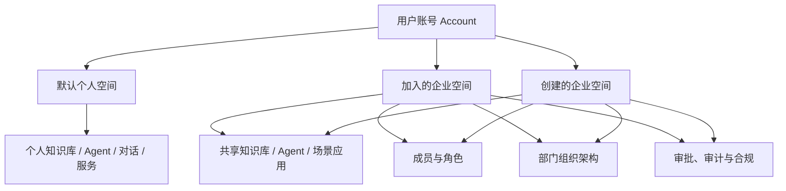

### 5.1 个人版与企业版能力差异

| 能力 | 个人空间 | 企业空间 |
| --- | --- | --- |
| 知识库与文档处理 | 支持 | 支持 |
| AI 知识问答 | 支持 | 支持 |
| 自定义 Agent | 支持 | 支持 |
| Agent 发布 | 按套餐限制 | 支持 |
| Open API | 按套餐限制 | 支持 |
| 成员协作 | 不启用 | 支持 |
| 部门组织架构 | 不启用 | 支持 |
| 菜单权限 | 所有者可见全部已启用菜单，受套餐权益限制 | 按角色、部门和工作空间策略控制 |
| 角色与资源权限 | 所有者权限 | RBAC 与 ABAC |
| 文档审批 | 默认关闭 | 可配置 |
| 工具操作审批 | 用户本人确认 | 可配置审批人或审批流 |
| 审计与合规 | 基础记录 | 完整审计与合规策略 |
| 配额与计费 | 个人套餐 | 工作空间级套餐 |

功能差异应优先通过 `Entitlement` 表达，例如最大成员数、存储空间、可发布 Agent 数量、Open API 是否启用、可使用模型和调用额度。业务代码不应到处判断个人版或企业版。

个人空间和企业空间都需要菜单权限控制，但默认策略不同：个人空间由所有者拥有当前套餐已启用菜单的访问权；企业空间则根据角色、部门、工作空间策略和套餐权益计算菜单范围。两类空间都支持自定义菜单，但自定义只能调整已注册页面的目录、排序、名称、图标和可见范围，不能通过菜单配置新增未注册页面或绕过接口权限。菜单权限只控制页面、路由和操作入口是否展示，不能替代后端的功能权限、数据权限和字段级 ABAC 校验。

## 6. 总体平台架构

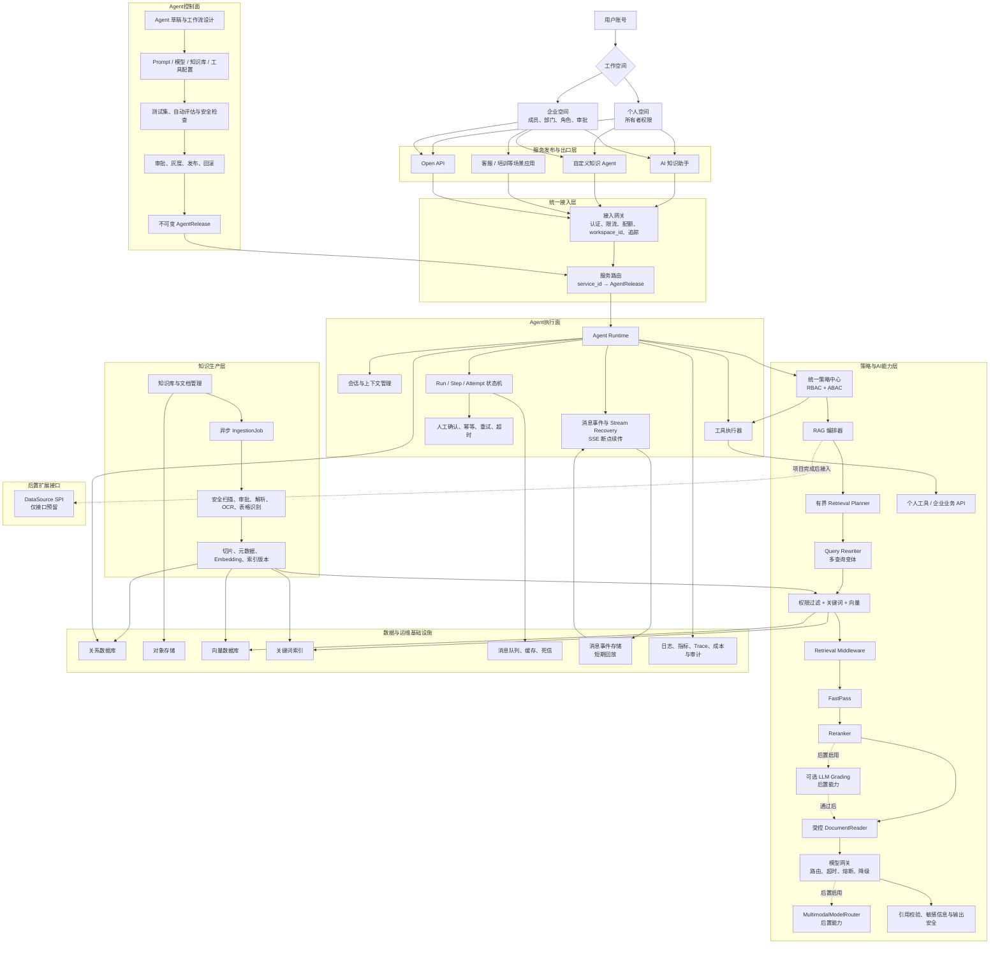

## 7. 分层职责

### 7.1 服务发布与出口层

| 出口 | 职责 | 典型调用方式 |
| --- | --- | --- |
| AI 知识助手 | 平台内通用知识问答 | Web、App、SSE |
| 自定义知识 Agent | 提供特定角色、知识和工具能力 | 独立页面、嵌入组件 |
| 场景应用 | 封装客服、培训、销售、研发等业务流程 | 场景工作台 |
| Open API | 向第三方系统提供程序化访问 | HTTP、SSE、API Key |

服务发布后生成 `Service` 和 `ServiceRoute`，将 `service_id` 固定路由到一个已发布的 `AgentRelease`。

### 7.2 统一接入层

接入网关负责：

- 登录态、Token 和 API Key 认证；
- 解析账号 `user_id`，并在内部统一映射为操作主体 `actor_id`，同时解析 `workspace_id`；
- 校验空间成员关系和服务可用状态；
- 限流、配额、防刷和请求大小限制；
- 统一请求标识、Trace 和访问日志；
- HTTP 和 SSE 连接管理；首期不引入 WebSocket；
- 将请求交给服务路由，不承担资源级权限判断。

### 7.3 Agent 控制面

控制面负责：

- Agent 草稿和工作流设计；
- Prompt、模型参数、知识库和工具配置；
- 测试集、自动评估、越权测试和安全测试；
- 个人所有者审批或企业审批；
- 生成不可变发布快照；
- 灰度、正式发布、停止服务和回滚；
- 管理服务出口及访问策略。

### 7.4 Agent 执行面

Agent Runtime 负责：

- 加载不可变 `AgentRelease`；
- 管理会话、上下文和短期记忆；
- 执行知识检索、模型调用和工具调用；
- 维护 `Run → Step → Attempt` 状态；
- 处理超时、有限重试、取消和人工确认；
- 记录执行过程、成本、策略决策和审计信息。

### 7.5 知识生产层

知识生产层负责：

- 文档上传、版本和审批；
- 文件安全扫描；
- PDF、Word、Markdown、网页等内容解析；
- OCR、表格和结构化内容识别；
- 切片、元数据和权限标签提取；
- Embedding、关键词索引和索引版本管理；
- 异步任务、重试、死信和人工恢复。

### 7.6 检索运行层

检索运行层位于 Agent Runtime 与模型网关之间，负责把一次用户问题转换为受权限约束、可解释、可控制成本的证据集合。它允许有限的自主检索决策，但不引入无限循环或长时间持久化运行模型。

主要组件和职责如下：

| 组件 | 职责 | 当前边界 |
| --- | --- | --- |
| `Retrieval Planner` | 根据问题类型、已有证据和置信度决定是否改写、并行检索、精读或结束 | 最多 2～3 轮，受总耗时、Token、并行数和全文读取量限制 |
| `Query Rewriter` | 对原问题做查询分类、规范化和多查询变体生成 | 只生成有限变体，保留原问题用于审计和引用 |
| `Retrieval Middleware` | 在检索结果进入生成模型前执行去重、过滤、元数据补全、权限复核和上下文压缩 | 采用可插拔链，但每个中间件必须有超时和错误策略 |
| `FastPass` | 对明显高相关候选做快速通道，减少不必要的重排和模型调用 | 只允许在规则和阈值满足时短路，不能跳过权限过滤 |
| `Reranker` | 对关键词和向量候选进行统一相关性排序 | 首期使用可替换的本地或模型重排器 |
| `DocumentReader` | 在候选不足或需要核对上下文时，按权限读取文档原文指定范围 | 必须限制读取页数、字符数、Token 和耗时 |
| `来源策略` | 综合来源权威性、时效性、版本状态和冲突关系 | 首期采用文档元数据和可配置规则，复杂图谱后置 |

检索决策必须是有界的：单次请求设置最大检索轮数、最大候选数、最大全文读取量、最大模型 Token 和最大总耗时。达到任一上限后，系统应停止继续探索，返回当前证据支持的答案或明确的不确定结果。该机制用于提高检索质量，不改变普通 `Run → Step → Attempt` 状态模型。

### 7.7 流式会话与 SSE 断点续传

SSE 断点续传纳入平台架构，用于短时问答和 Agent 运行结果的可靠展示。它解决的是客户端连接中断后的事件恢复问题，不用于承载无限时长或复杂跨系统任务。

流式链路由以下部分组成：

- `Message` 和 `MessageEvent` 持久化：每个事件分配全局唯一且不表达业务顺序的 `event_id`，由会话内单调递增的 `sequence_no` 保证回放顺序，并记录 `conversation_id`、`run_id`、事件类型、增量内容、状态和创建时间。
- `Last-Event-ID` 恢复：客户端重连时携带最后收到的事件 ID，服务端从事件存储补发未确认事件。
- 心跳与连接超时：网关定期发送 SSE 心跳，区分网络断开、服务端结束和业务失败。
- 短期连接路由：优先将同一会话路由到产生事件的实例；跨实例时通过消息队列、共享事件存储或内部转发恢复。
- 快照恢复：原实例不可用时，从已持久化的消息事件和运行快照恢复可展示结果；不能假设内存中的增量仍然存在。
- 同会话并发控制：同一会话只允许一个活动生成流，重连请求不能重复启动生成任务。

建议的恢复优先级为：同实例事件回放、跨实例事件回放、基于消息快照的最终结果恢复。事件保留周期、单次重放上限和过期后的标准错误需要按套餐和合规要求配置。

SSE 事件至少包含：

```text
MessageEvent
├── event_id
├── conversation_id
├── message_id
├── run_id
├── event_type: delta | citation | tool_status | approval | completed | failed
├── sequence_no
├── payload
├── created_at
└── expires_at

StreamCursor
├── conversation_id
├── connection_id
├── last_event_id
├── acknowledged_at
└── expires_at
```

该设计不新增长任务持久化引擎；复杂任务仍按照阶段 4 的普通状态机和明确的取消、超时、重试规则执行。

## 8. 统一策略中心

### 8.1 策略输入与输出

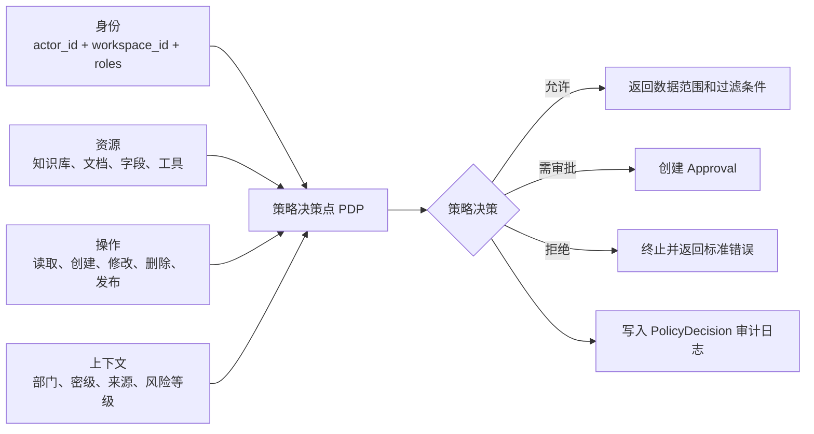

### 8.2 策略规则

- RBAC 负责角色和基础操作权限。
- ABAC 负责部门、资源归属、文档标签、敏感级别和运行上下文。
- 个人空间默认只有所有者角色，但仍执行工作空间隔离校验。
- 企业空间支持成员、部门、角色和条件策略。
- 检索授权结果应转换为向量库、关键词索引或关系数据库可以执行的过滤条件。
- 字段级限制应在返回模型上下文之前生效。
- 工具调用需结合工具、操作、参数、目标资源和风险等级重新判断。

### 8.3 菜单、功能、数据与字段权限

平台权限分为四层，层级逐步收窄：

```text
菜单权限
└── 控制用户能看到哪些目录、页面、路由和操作入口

功能权限
└── 控制用户能执行哪些动作
    例如：文档上传、审批、发布 Agent、创建工作流

数据权限
└── 控制用户能访问哪些资源和数据范围
    例如：指定知识库、部门文档、个人资料

字段权限
└── 控制资源中的哪些字段可以被读取或写入
    例如：薪资、客户电话、身份证号、合同金额
```

菜单计算规则：

```text
最终可见菜单
= 菜单定义
  ∩ 角色菜单授权
  ∩ 功能权限
  ∩ 工作空间策略
  ∩ 套餐权益
```

访问流程：


菜单权限不能作为真正的安全边界。用户即使通过直接访问 URL、调用接口或绕过前端菜单进入页面，后端仍必须执行功能权限、数据权限和字段级 ABAC 校验。

### 8.4 菜单权限实体

```text
Menu
├── id
├── parent_id
├── name
├── route
├── menu_type: directory | page | action
├── resource_id
├── permission_code
├── sort
├── source: system | workspace
└── status

PageResource
├── id
├── page_key
├── route
├── component_key
├── layout_key
├── resource_version
└── status

ApiResource
├── id
├── api_key
├── method
├── path_pattern
├── permission_code
├── risk_level
└── status

MenuApiBinding
├── menu_id
├── api_resource_id
└── action_type: query | mutation | publish | approve

RoleMenu
├── role_id
├── menu_id
├── visible
└── actions

Permission
├── code
├── resource_type
├── action
└── scope

MenuRelease
├── workspace_id
├── version
├── snapshot
└── status: draft | published | rolled_back
```

`PageResource` 和 `ApiResource` 是平台注册的页面与接口资源，管理员不能直接填入任意组件、路由或接口地址。`Menu` 负责组织目录、页面和操作入口，`MenuApiBinding` 将菜单页面与允许调用的接口资源统一绑定，`RoleMenu` 描述角色可见菜单及菜单动作，`Permission` 描述后端真正执行的功能、数据和字段授权，`MenuRelease` 用于菜单变更的草稿、发布和回滚。

### 8.5 菜单管理与接口绑定流程

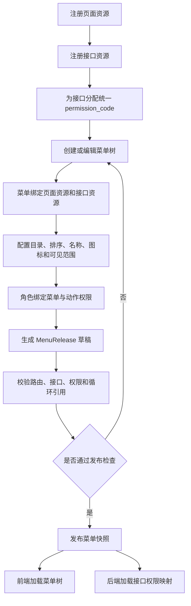

### 8.6 页面与接口统一授权流程

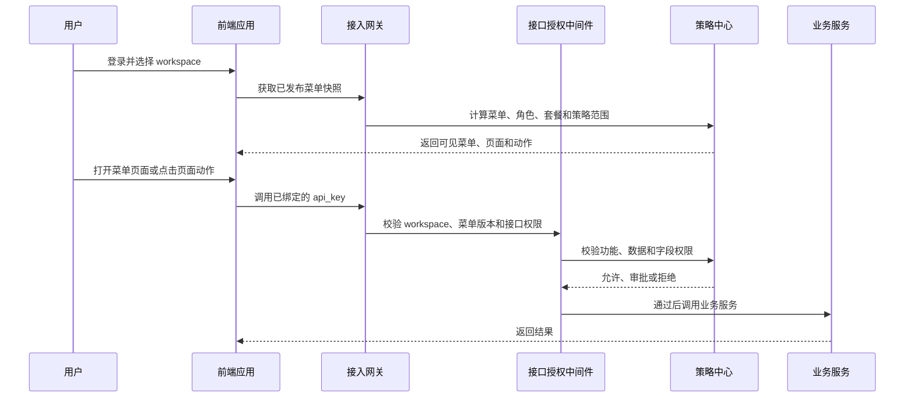

统一绑定规则：

- 页面只能调用其所属菜单或页面资源绑定的接口资源。
- 接口权限以 `permission_code` 为唯一授权标识，前端和后端不得各自定义一套编码。
- 接口仍必须独立校验权限，不能因为菜单可见就默认接口可调用。
- 菜单发布、页面资源变更和接口绑定变更都需要版本化并支持回滚。
- 删除或下线页面、接口时必须先检查菜单引用和 Agent/工作流引用，避免发布后出现悬空路由。

### 8.7 跨进程策略决策接口

当前 Python 模块和未来 Go 接入层、Go 运行层都必须通过同一个策略决策接口完成资源级授权。接入层只处理身份真实性、工作空间识别、限流和基础服务可用性，不能因为入口认证成功就跳过业务模块的资源级校验。

策略请求统一包含：

```json
{
  "schema_version": 1,
  "actor_id": "uuid",
  "workspace_id": "uuid",
  "permission_code": "knowledge.document.read",
  "resource": {
    "type": "document",
    "id": "uuid",
    "attributes": {}
  },
  "context": {
    "department_ids": [],
    "risk_level": "normal",
    "request_id": "uuid",
    "trace_id": "string"
  }
}
```

策略结果统一包含：

```json
{
  "schema_version": 1,
  "decision": "allow",
  "permission_code": "knowledge.document.read",
  "workspace_id": "uuid",
  "resource_scope": {},
  "field_mask": [],
  "policy_version": 12,
  "cache_ttl_seconds": 30,
  "decision_id": "uuid"
}
```

`decision` 只允许 `allow`、`deny` 或 `approval_required`。策略中心不可用、响应无法验证、版本不兼容或超过超时时间时默认拒绝。只有低风险只读结果可以按策略返回的 TTL 短期缓存；敏感字段、发布、审批、删除和工具调用必须实时重新决策。权限变更发布 `policy.changed` 事件，使接入层和运行层按 `workspace_id` 与 `policy_version` 主动失效缓存。

`resource_scope` 和 `field_mask` 由实际读取数据的责任模块执行。Go 接入层作为代理时不得自行拼接数据库过滤条件；未来 Go 运行层只有在整体接管对应数据聚合并通过同一组越权测试后，才可以执行这些约束。

## 9. 知识入库数据流程

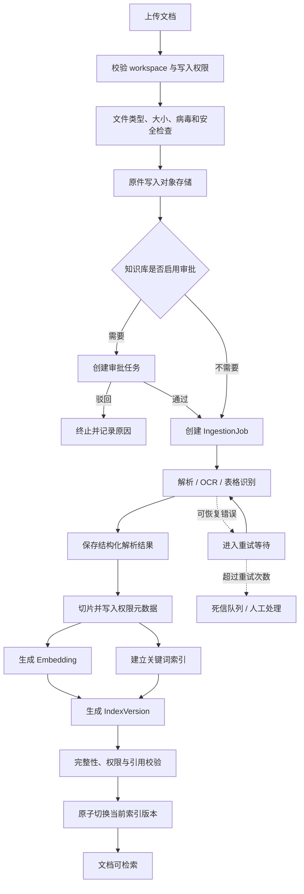

### 9.1 异步任务模型

```text
IngestionJob
├── JobStage
│   ├── SECURITY_SCAN
│   ├── APPROVAL
│   ├── PARSE
│   ├── CHUNK
│   ├── EMBED
│   ├── INDEX
│   ├── VALIDATE
│   └── PUBLISH
└── JobAttempt
```

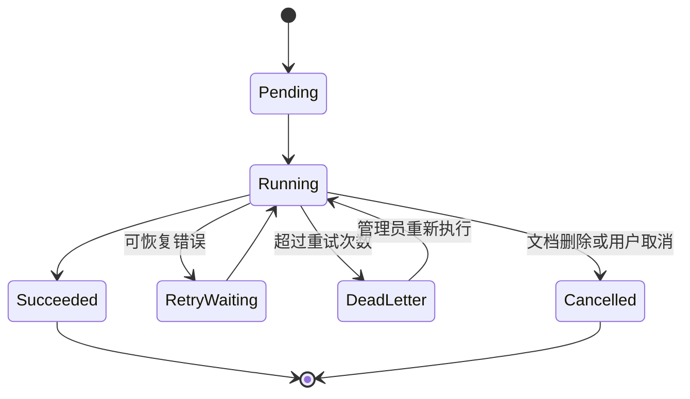

每个阶段必须具备幂等键、超时、最大重试次数、进度、错误码和失败原因。解析 Worker、Embedding Worker 和索引 Worker 可以独立扩缩容。

### 9.2 Chunk 最小元数据

```text
workspace_id
knowledge_base_id
document_id
document_version_id
chunk_id
department_ids
visibility
security_level
source_position
content_hash
index_version_id
```

## 10. 知识问答运行流程

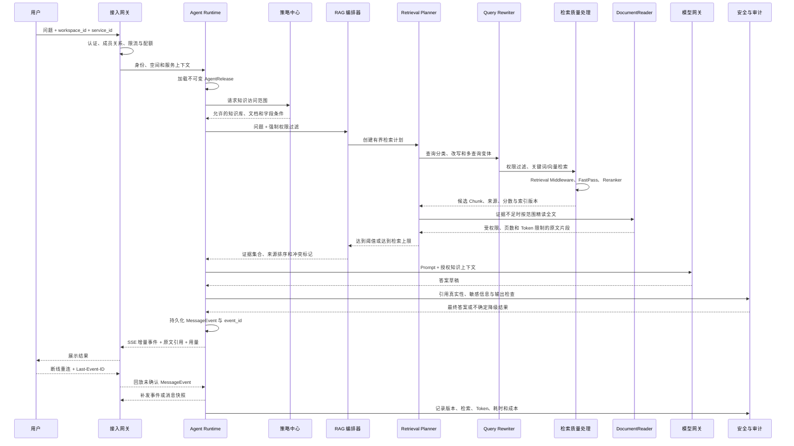

### 10.1 RAG 检索流程

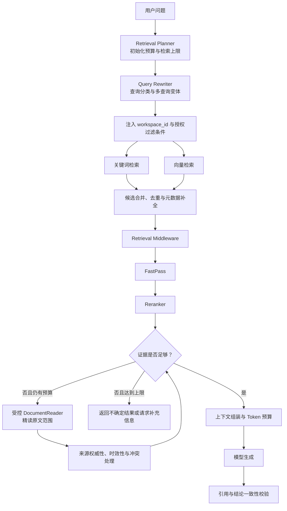

回答必须能够回溯到 `DocumentVersion` 和 `Chunk`。引用不存在、版本失效或引用内容不支持结论时，应删除相关结论或降级为无法确定。检索循环只允许在预算内进行，不能因为模型连续要求检索而无限扩展。

### 10.2 SSE 断点续传数据流程

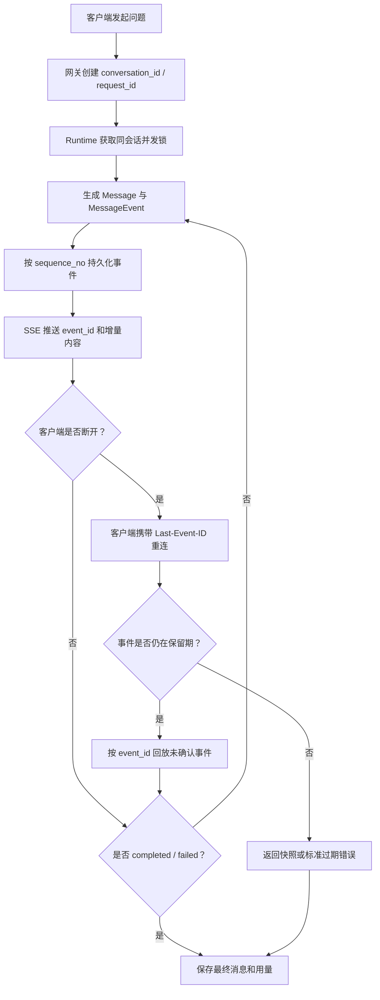

断点续传的事实来源是 `MessageEvent` 和最终 `Message`，不是连接实例内存。生成任务在断线后继续或结束，取决于普通运行状态机的取消策略；重连只负责恢复事件和结果展示，不会重复创建一个新的 `Run`。

## 11. Agent 工具执行流程

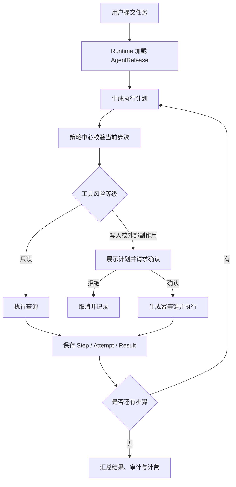

### 11.1 运行实体

```text
Run
└── Step
    └── Attempt
        ├── ToolCall
        ├── PolicyDecision
        ├── Approval
        └── Result
```

### 11.2 执行安全规则

- 工具定义必须包含读写类型、风险级别、参数约束和超时。
- 模型只能提出工具调用意图，实际执行由工具执行器完成。
- 任何具有外部副作用的操作均需幂等键。
- 高风险操作必须由用户或企业审批人确认。
- 工具凭证不得进入 Prompt 或模型上下文。
- 提示词、知识文档和工具返回内容均按不可信输入处理。
- 失败重试只适用于明确幂等或可安全重放的操作。

## 12. Agent 发布流程

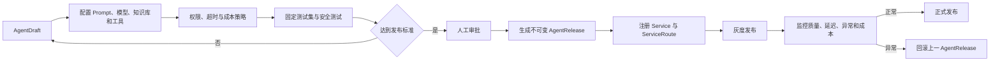

### 12.1 发布快照内容

`AgentRelease` 至少固定以下信息：

- Agent 指令和 Prompt 版本；
- 模型、参数、备用模型和超时策略；
- 知识库和知识范围；
- 工具清单、工具版本和权限策略；
- 工作流定义；
- 输出结构和安全规则；
- Token、费用、并发和执行时间上限；
- 测试集版本和评估结果；
- 创建人、审批人和发布时间。

## 13. 模型网关设计

模型网关统一处理：

- GPT 中转、自定义 OpenAI 兼容接口、国内模型和私有模型适配；
- 按任务、工作空间、套餐和敏感级别路由；
- 请求超时、有限重试和熔断；
- 主模型失败后的备用模型降级；
- Token、费用和延迟统计；
- Prompt 大小和响应大小限制；
- 敏感数据脱敏或禁止外发；
- 模型调用日志与 Trace 关联。

首期目标主生成模型通过 GPT 中转服务接入，采用管理员配置的 `base_url` 和服务端 API Key；未配置真实供应商时由 Mock Provider 支撑平台开发。国内备用模型优先候选为通义千问/阿里云百炼和 DeepSeek 官方 API，智谱 GLM 作为替补，管理员配置后再执行同集评估和路由启用。生成模型、Embedding 和 Reranker 分开配置，Embedding 模型版本锁定后，变更必须触发完整的索引重建流程。

模型网关内部使用统一请求和响应模型，通过 Adapter 消除供应商协议差异：

```text
ModelGateway
├── GPTRelayAdapter
├── OpenAIResponsesAdapter
├── OpenAICompatibleChatAdapter
├── QwenAdapter
├── DeepSeekAdapter
└── PrivateModelAdapter
```

每个模型配置必须声明 `protocol`、`base_url`、`api_key_ref`、`model_id`、上下文上限、流式输出、工具调用、结构化输出、Usage 和多模态能力。供应商声称兼容 OpenAI API 不代表完整兼容，接入时必须分别验证普通请求、流式事件、工具调用、结构化输出、错误码、限流、Usage 和请求 ID。

自定义 `base_url` 仅允许平台管理员配置，生产或真实数据环境必须使用 HTTPS，并执行域名允许列表、DNS 重绑定防护、内网/本机地址拦截和重定向复核。API Key 只能在服务端解密使用，不得进入浏览器、Prompt、模型上下文和普通日志。

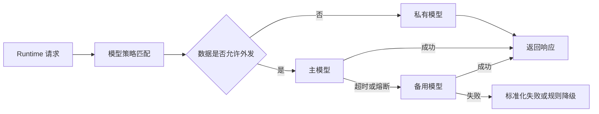

业务模块禁止直接连接模型供应商。

### 13.1 模型供应商管理

GPT 中转、OpenAI 兼容接口和国内模型统一通过平台管理后台配置，不要求在设计文档、部署文件或启动前置问卷中填写。系统菜单增加“系统管理 → 模型供应商”，仅平台管理员可见；工作空间管理员只能选择平台已启用且套餐允许的模型，不能配置任意 `base_url` 或查看供应商密钥。

核心配置实体如下：

```text
ModelProvider
├── id
├── name
├── provider_type: gpt_relay | openai_compatible | qwen | deepseek | private
├── protocol: responses | chat_completions | auto
├── base_url
├── credential_ref
├── status: draft | restricted | active | unhealthy | disabled
└── created_by / updated_by

ProviderModel
├── provider_id
├── model_id
├── display_name
├── aliases
├── model_type: generation | embedding | reranker | multimodal
├── context_window
├── input_price / output_price
└── status

CapabilityProbe
├── provider_id / model_id
├── responses_api
├── chat_completions
├── streaming
├── tool_calling
├── structured_output
├── usage_reporting
├── request_id_reporting
├── checked_at
└── raw_result_ref

ProviderDataPolicy
├── provider_id
├── prompt_retention
├── retention_period
├── training_usage
├── upstream_provider
├── processing_regions
├── deletion_mechanism
├── incident_notice
├── availability_statement
├── evidence_ref
└── review_status: unknown | pending | approved | rejected

ModelRoutePolicy
├── id
├── scope: platform | workspace
├── workspace_id: optional
├── purpose: generation | embedding | reranker
├── primary_model_ref
├── fallback_model_refs
├── maximum_data_classification
├── timeout / retry / circuit_breaker
└── status
```

管理员配置流程如下：

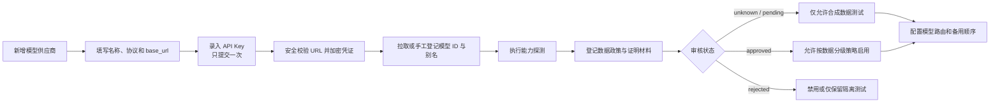

能力字段以最近一次实际探测结果为准，管理员声明只作为初始值。平台提供“测试连接”和“重新探测”操作，使用最小无敏感测试请求分别验证 Responses、Chat Completions、SSE、工具调用、结构化输出、Usage、请求 ID、错误码和限流行为。探测失败只关闭对应能力，不自动删除供应商配置。

数据政策不能通过模型接口可靠推断，必须由管理员根据供应商协议、隐私说明或合同登记，并保存审核人、审核时间和证明材料引用。`review_status` 为 `unknown`、`pending` 或 `rejected` 时，策略中心强制阻止真实、个人或企业敏感内容发送给该供应商。

API Key 保存后不可回显，只显示末四位；更新时整体替换并保留凭证版本和审计记录。配置导出、实例普通备份、日志、错误详情和能力探测结果都不得包含明文 Key。供应商删除前必须检查模型路由、AgentRelease 和索引版本引用；有引用时只能停用，不能直接删除。

首期预置不可删除的 Mock Provider，使系统在没有任何真实模型配置时仍可完成页面、权限、SSE、计量和失败恢复开发。真实供应商只有满足以下规则才可进入路由：`restricted` 只能处理合成数据；`active` 可在数据政策允许的密级范围内使用；`unhealthy` 自动退出主路由并按策略降级；`disabled` 不接受新请求，但保留历史审计和引用。

供应商管理使用以下基础权限编码，并与菜单页面和接口统一绑定：

```text
system.model_provider.read
system.model_provider.create
system.model_provider.update
system.model_provider.test
system.model_provider.probe
system.model_provider.credential.rotate
system.model_provider.policy.review
system.model_provider.route.manage
system.model_provider.disable
```

上述权限默认只授予平台管理员。连接测试、能力探测和模型列表拉取均由后端执行，浏览器不能读取 `credential_ref` 对应的明文凭证。

## 14. 核心数据模型

```text
Account
└── WorkspaceMembership
    └── Workspace: personal | enterprise
        ├── Organization / Department / Role / Policy
        ├── Menu / PageResource / ApiResource / MenuApiBinding
        ├── RoleMenu / Permission / MenuRelease
        ├── Entitlement / Subscription / Quota
        ├── KnowledgeBase / Document / DocumentVersion / Chunk / IndexVersion
        ├── IngestionJob / JobStage / JobAttempt
        ├── Agent / AgentDraft / AgentRelease
        ├── Service / ServiceRoute
        ├── Conversation / Message / MessagePart / MessageEvent / StreamCursor
        ├── Run / Step / Attempt / ToolCall / Approval
        ├── Dataset / EvaluationRun / Feedback / Citation
        └── Usage / CostRecord / AuditLog / PolicyDecision / OutboxEvent

PlatformConfiguration
├── ModelProvider / ProviderModel / CapabilityProbe / ProviderDataPolicy
└── ModelRoutePolicy
```

### 14.1 关键实体说明

| 领域 | 关键实体 | 作用 |
| --- | --- | --- |
| 身份与空间 | Account、Workspace、WorkspaceMembership | 账号、隔离边界和成员关系 |
| 权限治理 | Organization、Department、Role、Policy | 企业组织和资源授权 |
| 菜单与接口 | Menu、PageResource、ApiResource、MenuApiBinding、MenuRelease | 页面目录、接口绑定和菜单版本 |
| 菜单与功能 | RoleMenu、Permission | 菜单可见性和后端功能授权 |
| 套餐计费 | Entitlement、Subscription、Quota | 功能权益、套餐和配额 |
| 知识管理 | KnowledgeBase、Document、DocumentVersion、Chunk | 知识事实和引用来源 |
| 异步入库 | IngestionJob、JobStage、JobAttempt | 文档处理状态与重试 |
| 模型供应商 | ModelProvider、ProviderModel、CapabilityProbe、ProviderDataPolicy、ModelRoutePolicy | 平台级中转配置、模型映射、能力实测、数据政策审核和主备路由；不归属于单个工作空间 |
| Agent 管理 | Agent、AgentDraft、AgentRelease | 草稿和不可变发布版本 |
| 服务发布 | Service、ServiceRoute | 产品出口和运行版本路由 |
| Agent 运行 | Run、Step、Attempt、ToolCall、Approval | 执行过程和人工确认 |
| 流式会话 | Conversation、Message、MessageEvent、StreamCursor | SSE 事件顺序、断点回放和最终结果恢复 |
| 质量评估 | Dataset、EvaluationRun、Feedback、Citation | 发布门禁和质量反馈 |
| 运营审计 | Usage、CostRecord、AuditLog、PolicyDecision | 用量、成本、安全和追溯 |
| 集成事件 | OutboxEvent | 业务事务内记录待发布事件，支持至少一次投递、幂等消费和跨语言演进 |

### 14.2 数据写入权与迁移规则

未来引入 Go 后，数据归属按照业务聚合而不是编程语言划分。一个聚合在任一时刻只能有一个写入责任模块；读取副本、缓存和派生索引不能反向修改事实数据。

| 数据领域 | 当前写入责任模块 | 未来默认归属 | 访问约束 |
| --- | --- | --- | --- |
| 账号、工作空间、组织与成员 | Python 平台 API | Python 业务平台 | Go 通过身份上下文和内部接口读取，不直接修改 |
| 菜单、Permission、RBAC/ABAC 策略 | Python 策略与治理模块 | Python 业务平台 | 统一策略中心对外提供决策接口，其他模块不得复制规则 |
| 工作流定义、审批、知识库与文档 | Python 业务模块 | Python 业务平台 | 由 Python 保持唯一写入权 |
| Agent、AgentDraft、AgentRelease、ServiceRoute | Python 控制面 | Python 控制面 | 运行层只读取不可变发布快照，不修改草稿和发布记录 |
| Conversation、Message | Python 会话模块 | 默认保留 Python；有独立扩缩容需求时整体迁移 | 迁移前由 Python 唯一写入，禁止双写 |
| MessageEvent、StreamCursor | Python 流式模块 | 未来可整体迁移到 Go 接入层 | 以契约和表级所有权一次性切换，PostgreSQL 继续作为恢复事实来源 |
| Run、Step、Attempt、ToolCall | Python Agent Runtime | 运行模型稳定后可整体迁移到 Go 运行层 | 迁移时连同状态机、幂等和写入权一起切换 |
| IngestionJob、Chunk、IndexVersion | Python Ingestion Worker | Python AI 与数据处理模块 | Go 不直接写入知识生产链数据 |
| Usage、CostRecord、AuditLog、PolicyDecision | 对应事实产生模块 | 按事件汇聚，不由单一语言垄断 | 事件写入必须带来源、Trace 和幂等标识 |

数据库 Schema 首期统一由 Alembic 管理。未来引入 Go 后，在共享数据库阶段仍只有一个 Migration 工具和一条升级流水线；不得同时使用 Alembic 与 Go Migration 工具修改同一 Schema。只有某个数据领域完成独立数据库拆分后，新的责任模块才能独立管理其 Schema。

领域迁移采用“停止旧写入、切换路由、启用新写入、验证、回滚窗口结束后清理”的顺序，不采用长期双写。确需短时复制时，复制只用于校验或影子读取，不能同时接受两个实现的业务写入。

### 14.3 跨语言数据类型规范

| 类型 | 统一规则 |
| --- | --- |
| 外部资源 ID | UUID 字符串；不得把数据库自增主键暴露为跨模块契约 |
| 时间 | UTC、ISO 8601、带 `Z` 或明确时区；数据库使用带时区时间类型 |
| 金额 | 整数最小货币单位 + ISO 4217 币种；禁止浮点数 |
| 分页 | 游标分页优先；页码分页仅用于稳定、小规模后台列表 |
| 枚举 | 调用方必须容忍未知新增值；删除或修改语义时升级契约版本 |
| 可选字段 | 明确区分缺失、`null`、空字符串和空集合 |
| 大整数 | 超出 JavaScript 安全整数范围时在 JSON 中使用字符串 |
| 二进制内容 | 使用对象存储引用和受控下载地址，不直接嵌入普通 JSON 事件 |

## 15. 数据与索引隔离等级

| 等级 | 适用对象 | 隔离方式 |
| --- | --- | --- |
| L1 逻辑隔离 | 个人版、普通 SaaS | 共享集群，由平台强制注入 `workspace_id` |
| L2 命名空间隔离 | 中大型企业 | 独立向量 Collection 和关键词索引命名空间 |
| L3 数据库隔离 | 高合规企业 | 独立数据库、对象存储桶和加密密钥 |
| L4 部署隔离 | 金融、医疗、政企 | 独立实例或私有化部署 |

隔离策略由平台根据套餐和合规要求决定。调用方不能自行传入或覆盖隔离条件。

## 16. 质量、成本与审计闭环

每次运行必须记录：

- `workspace_id`、`actor_id`、`service_id`、`agent_release_id`；
- `request_id`、`trace_id` 和触发来源；
- 会话、Run、Step 和 Attempt 标识；
- 检索候选、重排结果、引用 Chunk 和索引版本；
- 模型、参数、Token、延迟和费用；
- 工具调用、策略决策、审批和执行结果；
- 安全检查、异常类型和最终状态；
- 用户反馈和人工纠正结果。

### 16.1 发布门禁指标

建议至少包含：

- 核心测试集通过率；
- 检索召回率和重排质量；
- 引用存在率和引用支持率；
- 越权访问测试通过率；
- 工具误调用率；
- P50、P95 响应时间；
- 单次请求 Token 和成本上限；
- 失败率、超时率和降级率。

用户反馈、线上失败样本和人工修正应进入评估数据集，形成发现问题、补充样本、离线评估、灰度发布和线上验证的闭环。

## 17. 本地运行与部署架构

产品首期采用浏览器访问的 Web 平台形态，不开发原生桌面客户端。平台 API、Worker 和数据依赖通过 Docker Compose 在本地运行，默认只监听 `127.0.0.1`。GPT 中转和国内模型仍通过网络访问，因此“本地运行”不等同于“完全离线运行”。

MVP 采用模块化单体、独立 Worker 和多容器编排：

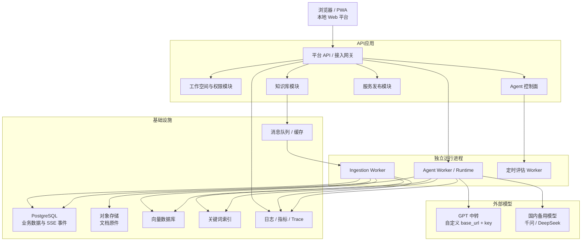

### 17.1 本地操作系统与机器基线

| 环境 | 支持与配置基线 |
| --- | --- |
| macOS | 首要开发环境；正式支持 Apple Silicon，尽量兼容 Intel |
| Linux | Ubuntu 22.04/24.04 LTS；用于服务运行和性能验证 |
| Windows | 首期不提供原生运行支持；后续通过 WSL2 + Docker Desktop 验证 |
| Docker 镜像 | 同时构建 `linux/arm64` 和 `linux/amd64` |
| 最低功能开发机 | 8 核 CPU、16 GB 内存、50 GB 可用 SSD；必须限制数据集、日志和备份规模 |
| 推荐完整开发机 | 8 核以上 CPU、32 GB 内存、200 GB 可用 SSD |
| 后续容量认证机 | 建议 16 核 CPU、64 GB 内存、1 TB NVMe SSD；当前无此资源，不阻塞本地 MVP |
| 独立压测发起机 | 8 核 CPU、16 GB 内存 |

使用外部模型时不要求 GPU；只有后续运行本地模型或进行本地 OCR 加速时再增加 GPU。50 个文档任务表示允许进入系统和队列的并发量，OCR/解析 Worker 根据机器资源限制为约 4～8 个实际并行任务。

验收分为两个独立状态：

- **功能验收**：在当前本地机器上完成个人版、企业版、权限、工作流、知识问答、SSE、备份恢复和安全链路验证，是阶段 1G 的完成门禁。
- **容量认证**：在独立高配环境验证百万 Chunk、20/50 问答并发、500 条 SSE 连接和 100 QPS；当前明确后置，不阻塞阶段 0、功能开发和本地 MVP 发布。

平台维护 `VerificationReport`，将验收拆成 `core_functional`、`provider_integration`、`ai_quality` 和 `capacity_certification` 四个独立维度，状态统一为 `not_configured | not_run | passed | failed`。容量、并发、数据集规模和测试时长通过测试配置文件管理；未来可增加管理页面。报告必须记录机器、供应商、模型、数据集和实际完成值；没有真实模型时只把供应商联调与 AI 质量标记为“未配置”，没有压测机时只把容量认证标记为“未执行”，都不能覆盖已经通过的平台核心功能结论。

### 17.2 一键启动与运行管理

Docker Compose 负责编排多个独立容器，不将 API、Worker、数据库和索引服务合并到单一容器。项目提供统一入口：

```text
./platform start
./platform stop
./platform restart
./platform status
./platform logs
./platform doctor
./platform backup
./platform restore
./platform upgrade
```

`start` 依次检查 Docker、CPU、内存、磁盘和端口，生成本地配置与初始加密主密钥，启动基础设施、API 和 Worker，执行数据库 Migration，等待健康检查通过，最后输出本地访问地址。默认只绑定 `127.0.0.1`；局域网访问必须显式开启，并增加 TLS、防火墙和访问控制。

### 17.3 本地数据与备份目录

数据根目录通过 `AI_PLATFORM_ROOT` 配置，默认使用 `~/.ai-platform/`：

```text
~/.ai-platform/
├── config/
├── secrets/
│   └── master.key
├── data/
│   ├── postgres/
│   ├── objects/
│   ├── vector/
│   └── keyword-index/
├── logs/
├── runtime/
└── version.json
```

备份默认写入独立目录 `~/AIPlatformBackups/`，不得放在数据根目录内部。该默认目录只便于本机误操作恢复，不能防止整盘损坏；里程碑 1G 验收时必须至少再复制一份加密备份到外置磁盘或另一台机器，并实际执行恢复校验。Docker 使用显式宿主机目录挂载，禁止依赖匿名 Volume，以便迁移、检查和恢复。

### 17.4 导出、导入与数据库升级

实例备份用于灾难恢复，包含关系数据库、文档原件、配置快照、版本信息和校验和；工作空间导出用于个人或企业空间迁移，不包含模型凭证和本地加密主密钥。向量与关键词索引属于可重建派生数据，默认不进入完整备份。

```text
backup-package/
├── manifest.json
├── database.dump
├── objects/
├── config-snapshot/
└── checksums.txt
```

每个应用版本携带版本化 Migration 和 `schema_version`。升级前自动校验磁盘空间并创建备份，优先使用事务化、向前兼容的 Migration；升级失败不依赖 Down Migration，而是恢复升级前备份。导入时必须检查应用版本、Schema 版本、校验和、磁盘空间和资源冲突，禁止将新版本备份直接导入旧版本程序。

### 17.5 SSE 事件存储

阶段 1 使用 PostgreSQL 保存 `Message`、`MessageEvent` 和 `StreamCursor`，不引入独立事件数据库。`MessageEvent` 和 `StreamCursor` 默认保留 24 小时；事件按 100～300 ms 合并后持久化，不按单个 Token 写库；`(conversation_id, sequence_no)` 建立唯一约束。

单次最多回放 5,000 个事件或 10 MB，超过限制时返回最终 `Message` 快照。阶段 2 可使用 Redis Streams 或 NATS 处理跨实例实时转发，但 PostgreSQL 继续作为断点恢复的事实来源。

### 17.6 API Key 加密与轮换

本地首次启动生成 32 字节主密钥 `~/.ai-platform/secrets/master.key`，文件权限限制为当前用户可读，并只读挂载给后端容器。业务 API Key 使用 AES-256-GCM 信封加密后写入数据库，界面保存后仅显示末四位，日志统一脱敏 `Authorization` 等凭证字段。

主密钥不提交 Git、不进入普通实例备份，需要单独生成恢复包并由管理员保管。轮换时生成新版本主密钥，重新包裹数据密钥，验证全部凭证可解密后切换当前版本；旧密钥保留至观察期结束后销毁。未来部署 SaaS 时将本地密钥文件替换为 KMS 或 Vault，业务凭证模型保持不变。

### 17.7 模拟企业测试数据

阶段 1 使用全合成数据创建模拟企业空间，不接入真实客户、员工、合同、身份证、手机号或生产凭证。功能验收集约包含 100 个用户、7 个部门和 300～500 份文档；当前本地机器只生成该功能集。10,000 份文档和 1,000,000 个 Chunk 的性能集生成器保留为后续容量认证工具，不作为阶段 1G 必须执行的数据集。

模拟企业至少覆盖总经办、人力、财务、产品、研发、销售等部门，以及企业管理员、部门负责人、普通员工、知识管理员、审批人、外部协作者和停用成员。文档包含公开制度、部门资料、薪资制度、合同、结构化敏感字段、新旧版本冲突和过期内容。所有数据标记 `synthetic=true` 和 `dataset_version`，测试邮箱使用 `example.com`，测试密钥使用明显的 `sk-test-...` 格式。

### 17.8 后续拆分条件

只有满足以下条件之一时再拆分服务：

- 模块需要独立扩缩容，且压测证明当前实现无法通过横向扩展和查询优化达到目标；
- 团队所有权和发布节奏长期不同；
- 故障隔离要求明确；
- 数据合规要求独立部署；
- 单体已经出现可测量的性能或交付瓶颈。

是否引入 Go 还需要满足以下至少一个量化条件，并形成基准报告：

- SSE 活跃连接持续超过 5,000，或当前 Python 接入层在目标机器上无法满足连接稳定性和内存目标；
- 接入网关或模型流式代理的 CPU、内存或 P95 延迟成为已定位的主要瓶颈；
- Agent Runtime 需要与控制面独立扩缩容或故障隔离；
- 已有明确的 Go 模块负责人、运维能力和回滚窗口。

未达到上述条件时，不因为“未来可能需要”而提前引入第二种后端语言。

### 17.9 未来 Go 双语言演进架构

当前 MVP 的接入网关、平台 API 和 Agent Runtime 都由 Python 实现。未来触发 17.8 节条件后，目标形态为 Go 负责高并发接入与运行层，Python 继续负责企业业务治理和 AI 能力：

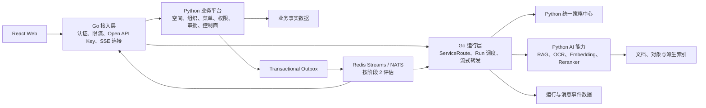

Go 接入层负责连接和通用流量治理，不负责菜单、RBAC、ABAC、审批或知识权限。Go 运行层只执行不可变 `AgentRelease`，并通过策略中心和 Python AI 接口调用业务与 AI 能力。Python 模块不向 Go 暴露内部函数、ORM 实体或数据库连接，而是提供版本化的内部 HTTP 接口和事件。

迁移顺序固定为：

1. Go 接入层以反向代理和影子流量方式接入，所有业务仍由 Python 处理。
2. 迁移请求追踪、限流、Open API Key 校验和 SSE 连接管理；浏览器 Session 保持为不透明凭证，由 Python 身份内省接口验证，Go 不直接依赖 Redis 中的 Session 私有存储格式。
3. 迁移 `MessageEvent` 与 `StreamCursor` 写入权，PostgreSQL 继续作为断点恢复事实来源。
4. 在模型网关接口稳定并有压测收益后，迁移模型流式代理；模型策略和凭证治理仍遵守统一模型配置。
5. 仅当 `Run → Step → Attempt` 状态机稳定后，整体迁移 Agent Runtime 及其数据写入权。
6. 组织、菜单、RBAC/ABAC、工作流定义、审批、知识生产、RAG、OCR、Embedding 和 Reranker 默认保留 Python。

每一步必须支持按路由或功能开关回切 Python，并通过影子流量、契约测试、结果对比和故障演练后再扩大流量。迁移不改变 React 前端契约；前端只依赖同一域名下的公开 REST/SSE 接口。

### 17.10 跨语言契约、事件与错误规范

公开和内部 HTTP 接口统一以仓库中评审并版本化的 OpenAPI 3.1 文档为契约事实来源。FastAPI 实现必须通过契约校验，React 客户端由契约生成类型；未来 Go 只生成服务端桩或客户端，不手工维护另一套模型。SSE 与异步事件使用版本化 JSON Schema，CI 执行破坏性变更检查，禁止三种语言各自定义含义可能漂移的结构。

所有 HTTP 请求统一传递或生成：

```text
workspace_id
actor_id
request_id
traceparent
idempotency_key  # 创建、发布、写入和工具操作必需
```

外部请求中的 `actor_id`、`user_id`、角色和策略版本头一律丢弃，接入层在完成身份验证后重新生成可信身份上下文。当前单进程由 Python 中间件注入；未来 Go 与 Python 之间使用短时效、绑定请求与受众的签名身份令牌，并在非本地部署中结合 mTLS。内部令牌不得转发给浏览器、模型供应商或第三方工具。

错误响应只暴露稳定错误码，不暴露 Python 异常类、Go 错误字符串或内部堆栈：

```json
{
  "error": {
    "code": "POLICY_DENIED",
    "message": "当前操作未获授权",
    "request_id": "uuid",
    "details": {}
  }
}
```

SSE 事件信封固定如下，`event_id` 用于去重与 `Last-Event-ID`，`sequence_no` 用于会话内排序：

```json
{
  "event_id": "uuid",
  "event_type": "message.delta",
  "schema_version": 1,
  "workspace_id": "uuid",
  "conversation_id": "uuid",
  "message_id": "uuid",
  "run_id": "uuid",
  "sequence_no": 18,
  "occurred_at": "2026-08-13T08:00:00Z",
  "trace_id": "string",
  "payload": {}
}
```

跨进程集成事件使用统一信封：

```json
{
  "event_id": "uuid",
  "event_type": "agent.release.published",
  "schema_version": 1,
  "workspace_id": "uuid",
  "aggregate_id": "uuid",
  "aggregate_version": 7,
  "occurred_at": "2026-08-13T08:00:00Z",
  "trace_id": "string",
  "payload": {}
}
```

事实数据变更和 Outbox 事件必须在同一数据库事务内提交。发布过程采用至少一次投递，消费者以 `event_id` 幂等；同一聚合需要顺序消费时使用 `aggregate_id + aggregate_version` 检测缺失、重复和乱序。事件字段只允许兼容性新增；删除、改名或改变语义必须发布新 `schema_version`。Redis 只用于首期唤醒与传输，不能代替 PostgreSQL 中的业务事实和 Outbox 状态。

### 17.11 工程目录与跨语言测试门禁

首期按可演进的单仓库结构组织，但只创建当前实际使用的目录：

```text
apps/
├── web/                       # React 前端
├── api/                       # Python 业务 API、接入和策略中心
└── worker/                    # Python Agent 与文档处理 Worker

packages/
└── contracts/                 # 共享契约的工程消费说明与后续生成代码

contracts/
├── openapi/                   # 公开与内部 HTTP 契约
├── events/                    # 集成事件 JSON Schema
├── sse/                       # SSE 事件 Schema
└── errors/                    # 稳定错误码目录

infra/
├── compose/
├── migrations/
└── observability/

tests/
├── contract/
├── integration/
├── security/
└── performance/
```

可机器校验的事实契约统一放在仓库根目录 `contracts/`，`packages/contracts/` 只承载前端、Python 和未来 Go 的生成代码或消费封装，不能维护另一份分叉 Schema。随着解析和 Agent Runtime 出现独立扩缩容需求，可以在 `apps/worker/` 下按进程入口拆分；达到服务拆分条件后再迁移为独立服务目录，数据写入权和契约不随目录改名而改变。

达到迁移条件时再增加 `services/edge-gateway/` 和 `services/agent-runtime-go/`，不提前创建空目录或空项目。`./platform`、Docker Compose、日志字段、健康检查和 Trace 约定不得依赖具体语言。

阶段 1 必须先建立以下测试，使其成为未来 Python 与 Go 实现共享的替换门禁：

- OpenAPI 请求、响应与兼容性测试；
- SSE 顺序、重连、重复、过期和最终快照测试；
- 事件 Schema、幂等、至少一次投递与乱序测试；
- 标准错误码和未知枚举兼容测试；
- 策略接口、字段掩码、缓存失效和越权测试；
- `workspace_id` 强制隔离和跨工作空间攻击测试；
- W3C `traceparent` 跨 HTTP、任务和事件传播测试；
- 使用语言无关 Golden Fixtures 的结果对比测试；当前验证 Python，未来 Go 必须复用同一数据和断言；
- Migration、数据所有权切换、影子流量和一键回滚演练。

未来 Go 实现只有在同一契约与安全测试全部通过、影子流量无不可接受差异、目标指标有可测量提升且回滚演练通过后，才能取得对应数据领域的正式写入权。

## 18. 建设顺序

建设顺序按依赖关系和风险组织，而不是按页面或模块数量平均拆分。总体原则如下：

1. 先冻结跨模块契约，再建设业务功能，避免后期反复修改 `workspace_id`、`permission_code`、消息事件和发布版本模型。
2. 先完成工作空间隔离、组织和后端授权，再开放菜单、知识检索、工作流和 Agent 能力。
3. 先形成最小纵向闭环，再逐步增强检索质量、可靠性和运营能力。
4. 自定义工作流和多级审批保留在阶段 1，但拆成独立里程碑，并在知识问答闭环完成后进行统一集成验收。
5. SSE 断点续传分两步建设：阶段 1 完成事件持久化和单集群短期回放，阶段 2 完成跨实例恢复。
6. `LLM Grading`、多模态图片问答和具体多源数据连接器不进入当前项目主交付，只提前固定接口与数据扩展点。
7. 为未来 Go 演进只提前建设语言无关契约、唯一数据写入权、Transactional Outbox、统一策略接口和共享测试；当前阶段不开发 Go 接入层或 Go 运行层。

### 18.1 阶段总览

| 阶段 | 核心目标 | 主要交付 | 进入条件 | 完成门禁 |
| --- | --- | --- | --- | --- |
| 阶段 0 | 范围和技术风险收敛 | 产品基线、核心契约、技术验证、验收指标 | 项目启动 | 关键技术验证通过，首期范围冻结 |
| 阶段 1 | 交付本地运行的个人版和企业版 MVP | 一键运行、空间治理、权限菜单、知识问答、工作流审批、基础 SSE | 阶段 0 通过 | 本地端到端安全、功能和质量验收通过 |
| 阶段 2 | 达到生产可靠性 | 可靠入库、跨实例 SSE、观测、数据生命周期 | 阶段 1 通过 | 故障恢复、重建、审计和删除验证通过 |
| 阶段 3 | 交付 Agent 控制面和服务发布 | Agent 草稿、测试、审批、发布、灰度和回滚 | 阶段 1 通过 | 发布版本不可变且可追溯、可回滚 |
| 阶段 4 | 开放受控工具执行 | 普通任务状态机、工具权限、人工确认和幂等 | 阶段 2、3 通过 | 外部副作用可控制、可审计、可取消 |
| 阶段 5 | 规模化与合规 | 质量运营、成本治理、隔离升级和私有化 | 阶段 2、4 通过 | 质量、成本和合规达到目标等级 |
| 条件验收 | 完成容量认证 | 百万 Chunk、20/50 问答并发、500 条 SSE、100 QPS 报告 | 获得合适压测资源 | `capacity_certification=passed`；不影响本地 MVP 状态 |
| 项目后置 | 按价值扩展 AI 和数据来源 | LLM Grading、多模态、具体数据连接器 | 阶段 5 通过且有明确业务指标 | 每项能力独立灰度和验收 |

上述“阶段 5 通过”是默认顺序。若某项后置能力在阶段 5 前已经有明确客户价值、独立团队和可量化验收指标，可以通过单独立项提前实施，但不得进入阶段 1～4 的关键路径，也不得改变已冻结的权限和数据隔离边界。

### 阶段 0：需求基线与技术验证

**目标**：在开发业务模块前锁定产品边界、核心数据契约和高风险技术方案。

**建设内容**：

1. 以第 21 章的实施决策为基线，细化个人空间和模拟企业空间的本地验收方案。
2. 使用已确认的文档格式、文件大小、响应时间和成本目标完成本地技术验证；并发与百万 Chunk 目标保留为后续容量认证基线，不阻塞阶段 0。
3. 将已确认的套餐权益、复杂组织层级、字段级 ABAC 范围、工作流节点和多级审批规则转换为产品配置与验收用例。
4. 冻结第一版领域模型和跨模块契约：`workspace_id`、`actor_id`、`permission_code`、`AgentRelease`、`MessagePart`、`MessageEvent`、`OutboxEvent`、`DataSource`、`RelevanceGrader` 和 `MultimodalModelRouter`。
5. 验证文档解析、OCR、切片、混合检索、重排、全文精读和引用生成效果。
6. 验证主备模型路由、超时、熔断、降级和 Token 计量。
7. 使用 Mock Adapter 验证完整模型网关流程；管理员在平台录入真实中转或国内供应商后，再由能力探测验证 Chat Completions/Responses、流式输出、结构化输出、工具调用、Usage、错误和请求 ID。
8. 验证 SSE 的 `event_id`、`Last-Event-ID`、事件回放和同会话并发控制方案。
9. 建立最小评估数据集、越权访问样本、字段泄漏样本和失败恢复样本。
10. 固定 OpenAPI 3.1、SSE Schema、集成事件 Schema、稳定错误码、跨语言数据类型、数据写入责任表和策略决策接口。
11. 建立契约兼容、Outbox 幂等、Trace 传播和策略越权测试，但不创建或部署 Go 工程。
12. 复核当前项目不建设的能力以及后置能力的启动条件，新增范围必须执行 19.2 节的变更规则。

**交付物**：

- 产品范围说明；
- 领域模型与核心实体定义；
- 接口与事件契约说明；
- 数据写入责任表与迁移规则；
- 策略决策接口与稳定错误码目录；
- 技术选型记录；
- RAG 技术验证报告；
- SSE 恢复技术验证报告；
- 首批评估数据集；
- MVP 验收指标。

**验收标准**：

- 关键文档能够稳定解析并建立索引；
- 测试问题能够返回带原文引用的答案；
- 主模型失败时能够切换备用模型；
- Mock Adapter 可完成模型网关功能验收；已录入的真实供应商必须通过 URL 安全校验和能力探测，未完成数据政策审核时只能处理合成数据；
- SSE 断开后能够按 `Last-Event-ID` 回放测试事件；
- OpenAPI、SSE、集成事件和策略接口可以通过契约兼容性测试；
- Transactional Outbox 能在故障重试下保证至少一次投递且消费结果幂等；
- 越权检索和字段泄漏测试能够被阻止；
- MVP 范围、后置能力和核心契约已完成评审并冻结。

### 18.2 节点交付、文档跟踪与 Git 门禁

阶段 0～5、条件容量认证和项目后置能力全部采用稳定节点 ID 管理。阶段 0 使用 `P0-01` 格式，阶段 1 使用 `P1A-01` 格式，后续阶段依此类推。每个节点必须形成独立 Git 提交，提交信息包含节点 ID 和中文摘要；多个节点即使并行开发，也不得合并为一个无法独立回退和验收的提交。

节点只有同时满足以下条件才算完成：交付物已产生、测试或检查通过、验收证据已记录、相关设计与操作文档已同步、项目进度看板已更新，并已形成独立 Git 提交。代码实现但测试失败、文档缺失或验证未执行时只能标记为“进行中”或“受阻”，不能提前宣布完成。

项目持续维护全局进度看板、各阶段实施计划与验证报告、架构决策记录以及机器可校验的契约目录。每次节点完成后记录测试命令、结果摘要、已知限制和提交 SHA；阶段结束时生成阶段报告并创建可识别标签。具体规则以 `docs/governance/delivery-and-git.md` 为准，实时状态以 `docs/project-progress.md` 为准。

### 阶段 1：工作空间、企业治理与知识问答 MVP

**目标**：形成个人版和企业版均可交付的 MVP，并在首期完整提供复杂组织、字段级 ABAC、自定义工作流、多级审批、菜单与接口统一权限、知识问答和 SSE 断点续传。

阶段 1 不作为一个大版本同时开发，而是依次交付 1A～1G。每个里程碑都必须有可运行版本和自动化验收结果。

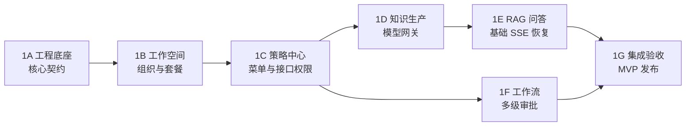

#### 里程碑 1A：工程底座与核心契约

**建设内容**：

- 建立模块化单体、独立 Worker、关系数据库、对象存储、缓存/消息队列和基础可观测设施。
- 建立 Docker Compose 多容器编排和 `./platform` 一键管理入口。
- 建立统一错误码、幂等键、Trace、审计字段、配置管理和数据库迁移规范。
- 固定 `workspace_id` 强制注入、`actor_id`、`permission_code`、资源 ID、版本 ID、事件 ID 和 `sequence_no` 规则。
- 建立 `Account`、`Workspace`、`Conversation`、`Message`、`MessagePart`、`MessageEvent`、`OutboxEvent` 等基础实体。
- 建立 OpenAPI、SSE、集成事件和错误码契约目录，并由契约生成或校验数据模型。
- 建立 Transactional Outbox、至少一次投递、消费者幂等和 W3C Trace 上下文传播基线。
- 搭建持续集成、单元测试、集成测试、契约测试和安全扫描基线。

**完成门禁**：macOS 和 Ubuntu 基线环境可以一键启动、停止和健康检查；请求链路可追踪；所有业务数据模板均包含 `workspace_id` 和审计字段；核心契约有兼容性测试；Outbox 重试不会造成业务副作用重复；任何模块不能越过已声明的数据写入权。

#### 里程碑 1B：工作空间、复杂组织与套餐

**依赖**：1A。

**建设内容**：

- 账号、登录、默认个人空间、企业空间、成员邀请和空间切换。
- 多级组织部门树、成员多部门归属、主部门、岗位、角色和角色继承。
- 个人空间所有者模型和企业空间成员治理模型。
- `Entitlement`、套餐、配额和工作空间级用量统计。
- 工作空间停用、成员离开和跨空间复制的边界规则。

**完成门禁**：个人和企业空间均可独立使用；组织继承关系可计算；任何请求都不能跨 `workspace_id` 访问数据；套餐裁剪可在后端生效。

#### 里程碑 1C：统一策略中心、菜单与接口权限

**依赖**：1B。

**建设内容**：

- 建立 RBAC、数据级 ABAC 和字段级 ABAC 的统一策略决策点。
- 注册 `Menu`、`PageResource`、`ApiResource`、`Permission` 和统一 `permission_code`。
- 建立菜单与页面、接口统一绑定，以及接口授权中间件。
- 支持系统菜单和工作空间自定义菜单的目录、名称、图标、排序和可见范围。
- 支持 `RoleMenu`、个人套餐菜单裁剪、企业角色/部门/策略/套餐联合裁剪。
- 支持菜单草稿、发布快照、版本回滚和悬空资源检查。
- 建立后端功能权限、数据权限和字段权限校验，禁止将菜单可见性作为安全边界。

**完成门禁**：隐藏菜单、直接访问 URL 或绕过前端调用接口均不能越权；字段级 ABAC 能阻止受限字段进入响应；个人和企业空间都能正确生成菜单快照。

#### 里程碑 1D：知识生产链与模型网关

**依赖**：1C。

**建设内容**：

- 知识库、文档、文档版本、来源元数据和字段敏感级别管理。
- 对象存储和基础 `IngestionJob`，支持安全扫描、解析、OCR、切片、Embedding 和关键词索引。
- 将工作空间、部门、可见范围和字段权限写入 Chunk 元数据，并在写入和读取时复核。
- 建立基础任务进度、有限重试、失败原因和人工重新执行。
- 建立模型网关、主备模型、超时、熔断、降级、Token 和成本计量。
- 建立平台级模型供应商管理页面，支持自定义 `base_url`、凭证录入、模型 ID/别名、连接测试、能力自动探测、数据政策登记和审核状态。
- 固定 `DataSource`、`RelevanceGrader` 和 `MultimodalModelRouter` 接口，但不接入具体后置能力。

**完成门禁**：授权文档可稳定入库并生成可切换索引；失败任务可定位和重试；模型调用不能绕过模型网关；派生索引可追溯到事实数据版本；供应商配置和密钥可安全保存，能力探测结果可追溯，未审核数据政策的供应商只能接收合成数据。

#### 里程碑 1E：RAG 问答与基础 SSE 恢复

**依赖**：1D。

**建设内容**：

- `workspace_id`、知识库、文档、部门和字段权限的检索前过滤。
- 有界 `Retrieval Planner`、查询分类、查询改写和有限多查询变体。
- 关键词和向量混合检索、`Retrieval Middleware`、候选去重、权限复核和元数据补全。
- `FastPass`、可替换 `Reranker`、来源权威性/时效性/版本排序和基础冲突标记。
- 受控 `DocumentReader`，限制原文读取范围、轮数、Token 和总耗时。
- AI 知识助手、上下文组装、原文引用、引用一致性校验和不确定结果降级。
- 为系统知识助手生成平台维护、用户不可编辑的最小 `AgentRelease` 和 `ServiceRoute`，Runtime 始终执行不可变快照。
- `MessageEvent` 持久化、SSE 心跳、`event_id`、`Last-Event-ID`、同会话并发锁和保留期内事件回放。
- 问答级 Token、成本、延迟、检索决策、引用和用户反馈记录。

**完成门禁**：答案可追溯到有效 `DocumentVersion`、`Chunk` 和系统 `AgentRelease`；检索严格受预算和权限约束；断线重连不会重复创建生成任务；保留期内可按 `Last-Event-ID` 补发事件。

#### 里程碑 1F：自定义工作流与多级审批

**依赖**：1C；可与 1D、1E 的非集成部分并行，最终集成依赖 1E。

**建设内容**：

- 建立工作流草稿、版本、发布和运行记录。
- 首期支持触发器、条件分支、知识检索、模型、审批和结果节点。
- 建立多级审批定义、审批实例、审批步骤和审批操作。
- 支持按资源类型、风险等级、部门、字段条件和金额等生成审批链。
- 支持通过、驳回、转交、撤回、超时和审计记录。
- 将文档入库、菜单发布、Agent 发布和高风险操作接入统一审批接口；首期按实际场景启用。
- 对工作流节点执行功能、数据和字段权限校验，工作流不得继承创建者的无限权限。

**完成门禁**：工作流版本可追溯；审批链计算稳定；知识检索和模型节点可以安全执行；审批前后状态一致；越权节点和失效版本不能运行。

#### 里程碑 1G：集成验收与 MVP 发布

**依赖**：1E 和 1F。

**建设内容**：

- 完成个人空间和企业空间的端到端场景测试。
- 使用固定版本的全合成模拟企业数据完成端到端测试，不依赖真实客户资料。
- 完成菜单、接口、数据、字段、检索和工作流的联合越权测试。
- 完成文档上传、审批、入库、问答、引用、SSE 重连和反馈闭环测试。
- 完成限流、套餐、基础成本、审计、备份、恢复和灰度发布准备。
- 固化 MVP 运维手册、错误处理手册和验收报告。
- 完成本地备份、恢复、导出、导入和数据库升级演练。
- 生成 `core_functional` 验收报告；容量认证未执行时将 `capacity_certification` 标记为 `not_run`，不影响本地 MVP 功能结论。

**阶段 1 验收标准**：

- 个人版和企业版共用核心实现，空间数据和权限严格隔离。
- 复杂组织、角色继承、字段级 ABAC、菜单管理和页面/接口绑定全部生效。
- 自定义工作流和多级审批达到首期定义的节点、动作和异常处理范围。
- 知识入库、混合检索、来源处理、全文精读、问答和引用形成完整闭环。
- SSE 基础断点续传可用，重连不会导致重复生成或事件乱序。
- 模型、检索、审批和工作流运行均可记录耗时、Token、成本和审计信息。

**阶段 1 明确不建设**：Go 接入层、Go 运行层、具体多源数据连接器、LLM Grading 在线评分、多模态图片问答、Agent 自动写操作、复杂跨系统长任务和大规模微服务拆分。

### 阶段 2：可靠性、数据治理与运营增强

**目标**：把阶段 1 的可用 MVP 提升为可稳定运营、可恢复和可追溯的生产系统。

**依赖**：阶段 1 通过；可与阶段 3 并行，但阶段 2 优先处理可靠性和数据正确性。

**建设内容**：

1. 完整的 `IngestionJob → JobStage → JobAttempt` 状态与运营后台。
2. 解析、OCR、Embedding 和索引 Worker 的独立扩缩容。
3. 超时、重试、死信、取消和人工恢复。
4. 索引版本校验、原子切换、全量重建和一致性巡检。
5. SSE 跨实例事件回放、连接路由和基于消息快照的结果恢复。
6. 审计、用量、配额、基础预算告警和容量监控。
7. 检索召回、引用支持率、延迟、错误率和降级率的分层监控。
8. L1 与 L2 索引隔离策略，以及 L3 数据迁移和独立部署准备。
9. 数据生命周期执行机制：删除、导出、保留期和派生索引清理。
10. 策略缓存失效、权限变更传播、异常访问告警和越权回归测试。
11. 数据库、对象存储、索引和消息事件的备份恢复演练。
12. Transactional Outbox 运营监控、事件积压恢复、Schema 兼容性检查和消费者幂等巡检。
13. 根据 17.8 节指标采集接入层、SSE 和 Runtime 的 CPU、内存、P95 与连接稳定性，仅形成是否需要 Go 的证据，不默认启动改造。

**验收标准**：

- 文档审批、解析和索引全过程可追踪；
- 重复任务不会产生重复文档或索引；
- 可从事实数据完整重建派生索引；
- 审计日志可还原用户、资源、操作和决策依据；
- 任一运行实例不可用时，SSE 能从共享事件存储或消息快照恢复；
- 关键指标可按工作空间和系统知识助手版本聚合；
- 权限变更在约定时间内传播到菜单、接口、检索和字段过滤；
- 删除请求能够覆盖事实数据和全部派生索引；
- 完成一次可验证的备份恢复和索引重建演练；
- Outbox 积压可以恢复，重复投递不会重复产生业务副作用，旧消费者可处理兼容性新增字段。

### 阶段 3：Agent 控制面与服务发布

**目标**：让用户能够配置、测试、发布和回滚自定义 Agent，并通过多种服务出口交付。

**依赖**：阶段 1 通过；可与阶段 2 并行。阶段 1 的 AI 知识助手使用平台维护的内置发布快照，本阶段才开放用户自定义 Agent 的完整控制面。

**建设内容**：

1. 在阶段 1 的系统 `AgentRelease` 基础上，建设用户可管理的 `Agent`、`AgentDraft` 和 `AgentRelease` 生命周期。
2. Prompt、模型、知识库、自定义工作流和只读工具配置。
3. 固定测试集、规则/指标评估和安全测试。
4. 复用阶段 1 的多级审批能力完成发布审批和不可变快照。
5. `Service`、`ServiceRoute`、服务访问策略和状态管理。
6. 自定义知识 Agent、场景应用和 Open API；将阶段 1 的系统知识助手纳入统一服务治理。
7. 灰度发布、正式发布和一键回滚。
8. Agent Release 级质量、延迟和成本监控。
9. 个人空间所有者审批与企业审批策略。

**后置能力边界**：沿用 1A/1D 已固定的 `MessagePart`、`RelevanceGrader` 和 `MultimodalModelRouter` 契约，本阶段不实现 LLM Grading 在线评分和多模态图片问答。阶段 3 的自动评估使用规则、数据集和已有质量指标，不因此新增在线评分模型调用。

**验收标准**：

- Runtime 不能执行 AgentDraft；
- 控制面不可用时，已发布 Agent 仍能运行；
- 每次运行都能追溯到唯一 `AgentRelease`；
- 测试不达标的版本无法发布；
- 发布异常时可以回滚到上一版本；
- `service_id` 能稳定路由到指定发布版本。

### 阶段 4：Agent 工具执行与任务状态机

**目标**：从知识问答扩展到受控的业务任务执行。

**依赖**：阶段 2 的可靠性能力和阶段 3 的不可变 `AgentRelease`、服务路由均已通过验收。

**建设内容**：

1. Run、Step、Attempt 和 ToolCall 状态模型。
2. 工具注册、参数 Schema、版本和风险分类。
3. 每步工具调用的策略校验。
4. 读取与写入工具分开授权。
5. 高风险操作的人工确认。
6. 幂等、超时、有限重试和取消。
7. 工具凭证安全存储和运行时注入。
8. 先接入平台内部或明确授权的业务 API；不在本阶段建设通用多源数据连接器。
9. 工具调用审计、用量和成本统计。

**验收标准**：

- 未授权工具无法执行；
- 有副作用的操作未经确认无法执行；
- 重复提交不会重复产生外部副作用；
- 每个步骤和尝试都有明确状态与结果；
- 工具凭证不会进入模型上下文或日志；
- 任务能够安全取消并保留审计记录。

### 阶段 5：质量运营、合规与规模化

**目标**：提高平台可靠性、可运营性和高合规客户承载能力。

**依赖**：阶段 2 和阶段 4 通过，并且线上已有足够的质量、成本和容量样本。

**建设内容**：

1. 将线上失败样本、用户反馈和人工修正自动沉淀为版本化评估数据集。
2. 建立检索、引用、模型、Prompt、工作流和工具执行的分层评估与发布门禁。
3. 按工作空间、服务和发布版本进行成本归因、趋势分析和优化。
4. 建立精细预算、异常用量、成本预测和自动降级策略。
5. L3 数据库隔离和独立密钥。
6. L4 私有化或独立实例部署。
7. 对阶段 2 的数据生命周期机制补充法规策略、法律保留和合规证明。
8. 根据负载和组织边界拆分必要服务。
9. 仅在 17.8 节触发条件成立时，按 17.9 节顺序灰度引入 Go 接入层或 Go 运行层。

**验收标准**：

- 质量问题能够关联到检索、模型、Prompt 或工具层；
- 成本能够归集到工作空间、服务和发布版本；
- 高合规客户能够选择对应的隔离等级；
- 删除请求能够覆盖事实数据和全部派生索引；
- 平台能够基于指标决定是否拆分服务；
- 若引入 Go，对应模块已通过共享契约、安全、影子流量和回滚门禁，且数据写入权不存在长期双写。

## 19. 阶段依赖关系

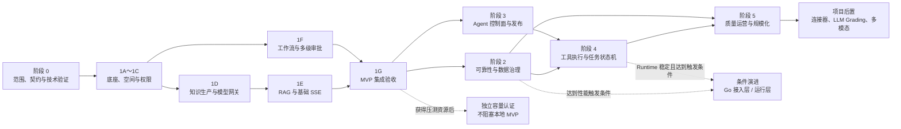

关键路径是阶段 0 → 1A → 1B → 1C → 1D → 1E → 1G。里程碑 1F 在 1C 后即可启动，可以与 1D、1E 的非集成工作并行，但必须在 1G 前完成。阶段 2 和阶段 3 可以并行；阶段 4 必须同时等待阶段 2 和阶段 3，阶段 5 则应在已有真实运行数据后启动。

### 19.1 推荐实施泳道

| 泳道 | 阶段 1 主责 | 可并行内容 | 必须等待的依赖 |
| --- | --- | --- | --- |
| 平台与后端 | 1A、1B、策略中心、模型网关、SSE 事件模型 | 基础设施和业务模块可并行 | 1A 契约冻结后才能扩展实体 |
| 权限与企业治理 | 1B、1C、字段级 ABAC | 菜单后台与策略引擎可并行 | 必须先有工作空间和组织模型 |
| 知识与 AI | 1D、1E | 文档解析、索引和 RAG 评估可并行 | 检索上线前必须接入 1C 权限过滤 |
| 工作流与审批 | 1F | 审批引擎可与知识生产并行 | 工作流知识/模型节点集成等待 1E |
| 前端 | 空间切换、菜单管理、知识库、问答、工作流设计 | 各页面可随对应后端里程碑并行 | 不提前自建权限和接口编码 |
| QA 与安全 | 各里程碑门禁、1G 集成验收 | 测试数据集和越权用例从阶段 0 持续建设 | 1G 必须覆盖全部主链路 |
| 契约与演进治理 | OpenAPI、SSE/事件 Schema、错误码、Outbox、数据写入责任表 | 与各业务里程碑同步维护 | 当前只建设契约与测试，不开发 Go 运行实现 |

### 19.2 范围变更规则

- 阶段 1 新需求只有在不改变核心契约且不阻塞关键路径时才能进入当前 MVP。
- 需要新增外部身份映射、同步任务或第三方权限回查的需求，默认归入多源数据连接器后置范围。
- 需要新增图片存储、视觉模型或图片安全链的需求，默认归入多模态后置范围。
- 需要在线额外调用模型进行候选评分的需求，默认归入 `LLM Grading` 后置范围。
- 未达到 17.8 节量化触发条件的 Go 模块开发默认不进入当前阶段；契约、测试和数据所有权准备属于 1A 基线。
- 任何可能绕过 `workspace_id`、策略中心、菜单/接口绑定或字段级 ABAC 的实现不得以赶工为理由临时上线。

## 20. 推荐 MVP 范围

MVP 等同于完成阶段 1 的 1A～1G，不再单独维护一份容易与建设顺序失真的功能清单。

| 里程碑 | MVP 必须交付 | 不在该里程碑扩展的内容 |
| --- | --- | --- |
| 1A | 模块化底座、核心实体、OpenAPI/SSE/事件契约、Outbox、数据写入责任、审计和测试基线 | Go 工程、微服务拆分、复杂多活部署 |
| 1B | 个人/企业空间、复杂组织、角色继承、套餐与配额 | L3/L4 隔离、私有化部署 |
| 1C | RBAC、字段级 ABAC、菜单管理、页面/接口绑定、统一 `permission_code` | 以菜单可见性代替后端授权 |
| 1D | 知识库、文档版本、解析/OCR/索引、基础 Worker、模型网关 | 具体外部数据源连接器 |
| 1E | 有界检索、查询改写、混合检索、重排、来源策略、全文精读、引用、基础 SSE 恢复 | LLM Grading 在线评分、多模态图片问答 |
| 1F | 自定义工作流、多级审批、权限和审计集成 | Agent 外部写操作、复杂跨系统长任务 |
| 1G | 个人/企业端到端验收、越权测试、恢复测试、基础运维和 MVP 发布 | 未经过阶段门禁的范围追加 |

阶段 1 的文档格式、文件大小、页数和性能验证规模以 21.3 节为准；阶段 0 负责验证，不再重新定义范围。知识图谱、大规模微服务、具体多源连接器、LLM Grading 在线评分、多模态图片问答和 Agent 自动写操作均不属于 MVP。

### 20.1 Go 演进准备范围

| 时间 | 必须完成 | 明确不做 |
| --- | --- | --- |
| 阶段 0 | 冻结 OpenAPI、SSE/事件 Schema、错误码、数据类型、数据写入责任和策略接口 | 不选择 Go Web 框架，不建立 Go 工程，不部署 Go 容器 |
| 里程碑 1A | 实现 Transactional Outbox、幂等消费、Trace 传播和契约测试目录 | 不建设第二套网关、第二套权限或第二套 Migration |
| 阶段 1 | Python 实现通过全部契约、安全和恢复测试，采集基础性能指标 | 不进行 Python/Go 双写，不为了预测负载拆服务 |
| 阶段 2 | 采集接入、SSE、模型代理和 Runtime 的可归因性能证据 | 未达到 17.8 节条件时不开发 Go 模块 |
| 条件触发后 | 按反向代理、通用接入、SSE、模型代理、Runtime 顺序逐项迁移和回滚演练 | 不迁移 Python AI 处理链，不复制 RBAC/ABAC 和审批逻辑 |

当前增加的是契约、测试、Outbox 和数据治理工作，不增加第二套生产运行时。后续是否采用 Go 由指标决定，不构成阶段 1 的验收前置条件。

### 20.2 后续候选能力：多源数据连接器

多源数据连接器暂不纳入当前版本建设，但保留为项目完成后的扩展方向。后续可通过统一的 `DataSource` 接口接入企业文档、个人资料、会议纪要、业务系统和外部 API 等数据源。

后续启动条件：

- 工作空间、菜单、功能、数据和字段权限已经稳定；
- 当前知识库的检索质量和审计链路达到验收标准；
- 能够为每个外部数据源建立独立的身份映射和权限校验；
- 已明确数据源的权威等级、更新时间、生命周期和成本；
- 首个外部数据源具有明确的业务价值和可量化验收指标。

候选扩展接口：

```text
DataSource
├── search(query, scope)
├── get_document(source_id)
├── get_metadata(source_id)
├── check_permission(user_id, resource_id)
└── get_source_policy()
```

### 20.3 后置能力与架构影响评估

本版本的取舍是：检索编排和 SSE 可靠性进入当前主架构；`LLM Grading` 与多模态图片问答只预留接口和数据扩展点；多源数据连接器只保留统一数据源接口，项目主体完成后再接入具体系统。

| 能力 | 本版本处理方式 | 对现有架构的影响 | 主要新增改动 |
| --- | --- | --- | --- |
| `Retrieval Planner`、查询改写、多查询变体 | 阶段 1 实施 | 中 | 增强 Runtime 与 RAG 编排，增加检索预算、轮次和决策审计 |
| `Retrieval Middleware`、`FastPass`、`Reranker` | 阶段 1 实施 | 中 | 增加可插拔检索质量链，不改变知识库事实模型 |
| 来源权威性、时效性、冲突处理 | 阶段 1 实施基础规则 | 低到中 | 补充文档来源元数据、版本状态和排序策略 |
| 受控 `DocumentReader` | 阶段 1 实施 | 中 | 增加原文读取权限、范围和 Token 预算控制 |
| SSE 断点续传 | 阶段 1 协议与事件持久化，阶段 2 跨实例恢复 | 中 | 增加 `MessageEvent`、`event_id`、回放、心跳、连接路由和快照恢复 |
| `LLM Grading` | 1D 固定 `RelevanceGrader` 接口，项目后续按需启用 | 中 | 增加评分模型调用、触发策略、评分缓存、成本和评估记录；不需要重做权限或知识入库 |
| 多模态图片问答 | 1A/1D 固定 `MessagePart` 和 `MultimodalModelRouter` 扩展点，项目后置 | 中到高 | 扩展消息内容、图片对象存储、图片权限和生命周期、视觉模型路由、安全检测、成本统计 |
| 多源数据连接器 | 仅保留 `DataSource` 接口，项目完成后接入 | 高，但延后承担 | 每个连接器需要身份映射、增量同步、权限回查、限流、来源策略和独立故障隔离 |

总体上，这些能力不会推翻现有 `Workspace`、菜单权限、RBAC/ABAC、知识库、Agent 控制面或服务出口。当前真正需要提前固化的是接口边界、事件模型、权限过滤位置、来源元数据和观测字段；后置能力的复杂实现可以在这些契约稳定后独立增加。

#### 20.3.1 LLM Grading 后置接口

```text
RelevanceGrader
├── grade(query, candidates, context)
├── score_schema
├── confidence
├── reason_codes
└── model_version
```

后置启用时，建议只在低置信度、复杂问题或高风险场景触发，并将评分作为排序和是否继续精读的依据。评分服务不能绕过权限过滤，也不能把未授权候选发送给评分模型。

#### 20.3.2 多模态图片问答后置接口

```text
MultimodalModelRouter
└── route(text, images, model_policy)
```

当前消息模型可将内容抽象为 `MessagePart`，首期只启用 `text` 类型；后续增加 `image_ref` 时复用会话、权限、审计和 SSE 事件链，但必须新增图片对象的访问校验、病毒与内容安全检测、缩略图/原图生命周期和视觉模型成本核算。因此后置不会改动平台的权限总原则，但会增加媒体存储和安全处理链。

### 20.4 项目完成后的后续建设顺序

当前项目完成阶段 5 的验收后，再按以下顺序评估后置能力：

1. 先将 `LLM Grading` 用于离线评估，验证收益和成本后，再对低置信度或高风险问题灰度启用在线评分。
2. 再选择一个业务价值明确的 `DataSource`，验证身份映射、增量同步、权限回查、来源策略和故障隔离；不同连接器逐个验收，不批量铺开。
3. 完成图片对象存储、图片权限、安全检测和成本核算后，再启用多模态图片问答。
4. 每项后置能力必须独立设置功能开关、工作空间级配额、审计字段、质量指标和回滚方案。

这样安排不会改变当前项目的核心边界：多源连接器、LLM Grading 和图片问答都不阻塞个人版、企业版、菜单权限、知识问答和 Agent 发布的首期交付。

## 21. 已确认实施决策

本章作为阶段 0 和阶段 1 的实施基线。除明确标记为可配置的配额和阈值外，调整本章内容需要执行 19.2 节的范围变更规则，并同步更新测试数据、验收标准和建设排期。

### 21.1 首发方式与重点验收对象

- 个人版和企业版同步完成技术交付，共用核心实现。
- 首期不部署 SaaS、不开放公测、不接入真实企业客户，以本地运行方式完成产品和技术验证。
- 企业版使用固定的全合成模拟企业空间，重点验收企业知识问答、复杂组织、菜单/接口权限、字段级 ABAC、自定义工作流和多级审批。
- 个人版同步完成所有者权限、套餐菜单裁剪、个人知识问答、工作流和个人/企业空间隔离的全链路回归。
- 本地验证通过后，再单独确定 SaaS 部署区域、真实企业试点和对外发布计划。

### 21.2 首个垂直场景与成功标准

首个垂直场景确定为企业内部制度、办事流程和产品知识问答；个人空间同步提供个人文档问答。

首批知识范围包括：

- 公司制度和办事流程；
- 产品资料、操作手册和常见问题；
- 部门内部文档；
- 用于权限验证的部分人事、财务或合同敏感样本；
- 个人空间中的个人文档。

场景成功标准：核心测试集回答可接受率不低于 85%，引用支持率不低于 95%，越权数据和敏感字段泄漏为 0，用户正向反馈率不低于 80%；证据不足时必须明确返回不确定结果，不能补造结论。

### 21.3 MVP 文档范围与技术规模

MVP 支持以下文档类型：

- 文本 PDF 和扫描 PDF；
- DOCX；
- Markdown；
- TXT；
- PDF、DOCX 中的基础表格；
- 图片仅用于 OCR，不提供多模态图片问答。

MVP 暂不支持 PPTX、复杂 XLSX/公式、网页自动抓取、音视频、邮件和外部系统自动同步。

技术边界和验证规模如下：

| 项目 | 首期基线 |
| --- | --- |
| 单文件大小上限 | 100 MB |
| 单文档页数上限 | 500 页 |
| 本地功能验收规模 | 300～500 份文档，按机器资源限制 Chunk 总量 |
| 后续容量认证规模 | 10,000 份文档、1,000,000 个 Chunk |
| 文件类型、大小、页数和数量限制 | 由 `Entitlement` 和系统配置管理，不在业务代码中写死 |

上述 10,000 份文档和 1,000,000 个 Chunk 是后续容量认证目标，不是本地 MVP 门禁，也不是个人版或企业版的商业套餐额度。本地阶段只验证小规模场景的功能、权限、质量和恢复正确性；并发问答、SSE 连接、文档入队和 API 峰值保留在 21.10 节，获得合适环境后再执行容量认证。

### 21.4 套餐、配额与发布权限

个人版和企业版共用知识库、问答、工作流、Agent 和服务发布的核心实现，通过 `Entitlement` 控制容量、成员、模型、调用次数、并发数、Agent 数量和 Open API。

首期本地验证默认值如下，未来运营可通过配置调整：

| 能力 | 个人版默认值 | 模拟企业默认值 |
| --- | --- | --- |
| 存储空间 | 5 GB | 100 GB |
| 成员数量 | 仅所有者 | 100 人 |
| 知识库数量 | 5 个 | 50 个 |
| 已发布 Agent 数量 | 3 个 | 20 个 |
| 月问答次数 | 2,000 次 | 工作空间级可配置配额 |
| Open API | 默认关闭，满足套餐后可开启 | 企业管理员配置 |
| 发布权限 | 所有者确认 | `permission_code` 校验并进入审批 |

面向外部公开发布默认关闭。个人版和企业版都执行菜单权限和后端接口权限，只是个人版采用所有者权限与套餐裁剪，企业版增加角色、部门、工作空间策略和审批。

套餐存储额度是业务上限，不代表本地磁盘承诺。实例还必须计算安全物理容量，预留数据库、索引、日志、临时文件和备份空间；有效可用额度取套餐剩余额度与实例安全剩余容量的较小值。当前本地开发环境不得因模拟企业配置为 100 GB 就实际占满系统盘，达到安全水位时应停止新上传并给出明确诊断。

### 21.5 字段级 ABAC 首期范围

字段级 ABAC 首期覆盖以下资源：

- `KnowledgeBase`、`Document`、`DocumentVersion` 和 `Chunk`；
- `WorkflowInstance` 和 `Approval`；
- 成员资料中的必要敏感字段。

首期保护内容包括文档正文、Chunk 内容、原文件地址、来源路径/URL、创建人、所属部门、密级、权限标签，以及提取出的电话、证件号、合同金额等结构化敏感字段。

统一采用四级密级：

```text
PUBLIC       公开
INTERNAL     内部
CONFIDENTIAL 机密
RESTRICTED   严格受限
```

策略输入包括 `workspace_id`、角色、部门、资源所有者、密级、来源和当前操作。阶段 1 不支持管理员编写任意脚本作为 ABAC 条件；混合敏感内容应在切片时分别标记或脱敏，禁止依赖生成模型自行隐藏敏感信息。

### 21.6 多级审批首期范围

阶段 1 的审批引擎覆盖：文档发布到知识库、敏感文档导出/删除、菜单发布、工作流发布和高风险配置变更。阶段 3 复用该引擎处理 Agent 发布，阶段 4 复用该引擎处理有外部副作用的工具操作。

首期规则如下：

| 项目 | 首期基线 |
| --- | --- |
| 最大审批层级 | 5 级 |
| 审批顺序 | 层级之间串行 |
| 同级审批 | 支持任意一人通过或全部通过 |
| 审批人来源 | 指定人员、角色、部门负责人、上级负责人 |
| 条件维度 | 资源类型、操作、部门、密级、风险等级；金额条件保留在规则模型中 |
| 提醒时间 | 默认 24 小时，可配置 |
| 超时时间 | 默认 72 小时，可配置 |
| 超时动作 | 升级、转交、驳回或保持等待，可配置 |
| 自己审批自己 | 企业空间默认禁止 |
| 个人空间 | 所有者确认，不强制多级审批 |

金额条件首期保留数据模型和规则能力，但没有实际付款或交易场景时不优先建设专用金额审批页面。

### 21.7 第一批 Agent 只读工具

第一批冻结以下只读工具接口：

```text
knowledge.search
document.read_authorized_range
workflow.get_status
approval.get_status
quota.get_usage
```

其中 `knowledge.search` 和 `document.read_authorized_range` 在阶段 1 先作为平台内部 RAG 能力使用；全部工具在阶段 4 完成工具注册、参数 Schema、运行时权限和审计后，再正式开放给用户自定义 Agent。

首期不允许任意 HTTP 请求、任意 SQL、文件系统访问、企业微信/飞书等外部系统工具，以及修改、发送、删除、付款等写操作。本清单属于 Agent 运行工具，不包含后置 `DataSource` 数据连接器。

### 21.8 模型供应商与中转接入

- 主生成模型通过 GPT 中转服务接入，由平台管理员在“系统管理 → 模型供应商”页面配置自定义 `base_url`、服务端 API Key 和模型映射，不作为部署前置参数。
- 模型网关同时支持 OpenAI Responses API 和 OpenAI-compatible Chat Completions；具体中转服务支持哪些协议，以兼容性测试结果为准。
- 国内备用模型第一候选为通义千问/阿里云百炼，第二候选为 DeepSeek 官方 API，智谱 GLM 作为替补；管理员完成供应商配置后，再由同数据集评估确定最终主备顺序，不阻塞阶段 0 和本地 MVP。
- 生成、Embedding 和 Reranker 分开配置；Embedding 版本锁定后不得静默更换，更换必须创建新索引版本并完成全量重建与切换。
- 中转和国内模型都必须记录平台请求 ID、供应商请求 ID、模型版本、耗时、Usage、限流和标准化错误；供应商未返回 Usage 时使用平台估算值并单独标记。
- 自定义 URL 仅允许平台管理员配置，必须经过 HTTPS、域名允许列表、内网地址拦截、DNS 重绑定和重定向检查。
- API Key 只在服务端解密使用。根据 OpenAI 官方 API 安全建议，Key 不得暴露于浏览器或客户端代码，并应记录请求 ID 便于故障定位；中转服务是否提供同等能力必须单独验证。

模型供应商页面必须注册为 `PageResource`，连接测试、能力探测、凭证轮换、政策审核、启用和停用分别注册 `ApiResource` 与 `permission_code`。个人空间和企业空间用户都不能获得平台级供应商管理权限；工作空间只选择平台已批准的模型和路由策略。

GPT 中转的数据政策也在平台内登记和审核，包括是否记录 Prompt/回答、保留周期、是否用于训练、实际模型上游、数据处理地区、删除机制和故障通知。该信息不需要现在写进文档；未登记或未审核时，系统自动限制为仅发送合成测试数据。

### 21.9 本地运行、数据与部署优先级

- 产品采用浏览器访问的 Web 平台形态，首期通过 Docker Compose 在本地运行，不开发原生桌面客户端。
- 本地正式支持 macOS Apple Silicon 和 Ubuntu 22.04/24.04 LTS，Docker 镜像同时构建 `arm64` 和 `amd64`；Windows 首期不作为正式支持环境，后续验证 WSL2。
- 本地依赖通过 `./platform` 一键启动、停止、诊断、备份、恢复和升级，默认仅监听 `127.0.0.1`。
- SaaS 部署、真实企业试点和商业发布在本地 MVP 验收后另行立项；私有化和 L4 独立实例仍放在阶段 5。
- 对象存储、模型供应商、向量数据库和关键词索引必须通过适配层接入，配置与密钥不得写死，也不得引入无法替换的云厂商业务依赖。
- 数据根目录默认使用 `~/.ai-platform/`，备份默认使用独立的 `~/AIPlatformBackups/`；路径均可通过配置覆盖。
- 实例备份包含 PostgreSQL、文档原件、配置快照、版本和校验和；向量与关键词索引默认重建。工作空间导出不得包含模型凭证和本地主密钥。
- 本机备份只能处理误操作和升级回滚；里程碑 1G 前必须保留一份外置盘或异机加密副本，并完成可验证恢复。
- 本地主密钥由首次启动自动生成，API Key 使用 AES-256-GCM 信封加密；主密钥恢复包独立保管，未来迁移 SaaS 时替换为 KMS 或 Vault。

### 21.10 MVP 容量、SSE、质量与成本阈值

本节同时包含本地功能验收目标和后续容量认证目标。当前没有独立压测机，容量认证状态默认为“未认证”，不阻塞功能开发和本地 MVP；未来执行容量认证时，平台本身使用模拟模型压测，真实模型联调单独验证供应商限流、延迟和主备切换，避免将外部模型瓶颈误判为平台瓶颈。

| 容量指标 | 后续容量认证目标 |
| --- | --- |
| 注册账号数据量 | 5,000 |
| 日活模拟用户 | 500 |
| 同时在线用户 | 200 |
| 问答并发 | 稳态 20，峰值 50 |
| SSE 活跃连接 | 500 |
| 文档上传并发 | 10 |
| 文档任务入队并发 | 稳态 20，峰值 50 |
| API 短时峰值 | 100 QPS |
| 检索数据规模 | 单工作空间 1,000,000 个 Chunk |

本地功能验收使用适配当前机器的小规模合成数据集，必须覆盖相同业务类型、权限组合、失败路径和恢复流程，但不宣称达到上述容量。容量认证可以在后续获得合适机器时独立执行，无需重新开发功能模块。

SSE 运行基线：

| 项目 | 首期基线 |
| --- | --- |
| `Message` 最终消息 | 跟随会话生命周期 |
| `MessageEvent` | PostgreSQL 保存 24 小时 |
| `StreamCursor` | PostgreSQL 保存 24 小时 |
| 心跳间隔 | 15 秒 |
| 事件合并窗口 | 100～300 ms |
| 单次最大回放 | 5,000 个事件或 10 MB |
| 超出回放上限 | 返回最终 `Message` 快照 |

| 指标 | 本地 MVP 功能与质量门禁 |
| --- | --- |
| 引用存在率 | 100% |
| 引用支持率 | 不低于 95% |
| 核心测试集回答可接受率 | 不低于 85% |
| 用户正向反馈率 | 不低于 80% |
| 越权访问阻断率 | 100% |
| 敏感字段泄漏 | 0 |
| SSE 事件丢失或重复生成 | 0 |
| 标准问答平均模型成本 | 不超过 0.15 元/次 |
| 标准问答 P95 模型成本 | 不超过 0.50 元/次 |

| 指标 | 后续容量与性能认证门禁 |
| --- | --- |
| P95 首 Token 时间 | 不超过 3 秒 |
| 普通问答 P95 完整响应时间 | 不超过 15 秒 |
| 复杂全文精读问题 P95 完整响应时间 | 不超过 30 秒 |
| SSE 重连恢复时间 P95 | 不超过 2 秒 |

引用存在率表示答案声明的引用均能定位到有效来源；引用支持率表示引用内容确实支持对应结论。性能和成本验收必须固定模型版本、模型参数、网络区域、文档规模、并发数、缓存状态和测试数据集版本，普通问答与复杂全文精读问题分开统计。模型市场价格变化时可以调整成本阈值，但需要保留调整依据和历史基线。

在当前本地机器上，引用、回答质量、权限、安全、SSE 正确性和成本记录必须完成验收，并记录单用户链路的实际响应时间作为参考值；20/50 并发条件下的 P95、500 条 SSE 连接和 100 QPS 只在容量认证报告中判定。未执行容量认证时，不影响本地 MVP 功能验收结论。

商业售价和套餐最终价格当前不进入设计范围，但模型、OCR、Embedding、Reranker、存储和索引的真实用量与成本必须从阶段 1 开始记录。

### 21.11 技术基线与阶段 0 输入项

产品和架构范围已经确认。阶段 0 默认采用以下技术基线，不再进行无目标的全面选型比较；只有验证结果未达到 21.10 节门槛，或出现明确的兼容性、安全和运维阻塞时，才通过技术决策记录更换组件。

| 领域 | 已确定默认基线 | 选择理由与验证边界 |
| --- | --- | --- |
| 关系数据库 | PostgreSQL 16 | 同时承载业务数据、JSON 元数据和首期 SSE 事件 |
| 对象存储 | MinIO | 本地可运行，并兼容后续 S3 接口迁移 |
| 向量检索 | PostgreSQL + pgvector 起步 | 减少本地依赖；若百万 Chunk、权限过滤或重建性能不达标，再评估 Qdrant/Milvus |
| 关键词检索 | 应用层固定中文分词 + PostgreSQL Full Text Search 起步 | PostgreSQL 原生分词不直接承担中文切词；阶段 0 验证召回和排序效果，效果不足时再接 OpenSearch |
| 缓存与任务分发 | Redis + PostgreSQL 任务事实状态 | Redis 只负责缓存、锁和任务唤醒，任务最终状态保存在数据库；阶段 2 再决定 NATS/RabbitMQ |
| OCR | PaddleOCR | 中文文档优先、本地可运行 |
| 文档解析 | Apache Tika/专用解析器组合 | 统一格式识别，复杂 PDF 与 DOCX 使用专用解析器补充 |
| Embedding | 阶段 0 先验证 BGE-M3；配置供应商 Embedding 后再做同集补充评估 | 兼顾中文、混合检索和可本地化能力，不要求提前提供供应商账号 |
| Reranker | BGE Reranker 系列固定版本 | 与生成模型解耦，支持后续独立替换 |

#### 当前只需落实的本地环境

| 项目 | 当前状态 | 最晚时间 | 未完成时的处理 |
| --- | --- | --- | --- |
| Docker 运行时 | 已采集：Apple M3 Pro（11 核）、18 GB 内存、约 75 GiB 可用磁盘、macOS 26.5.2；当前终端未检测到 Docker CLI | 容器联调前安装 Docker Desktop 或兼容的 Docker Engine + Compose v2 | 不阻塞文档、契约和非容器代码开发，但不能执行完整一键启动与容器集成测试 |

GPT 中转的 `base_url`、API Key、模型 ID/别名、能力和数据政策均在平台建成后由管理员配置，不需要现在提供。没有真实供应商配置时使用 Mock Adapter 完成开发和功能验收；真实供应商联调状态单独显示为“未配置”，不影响本地 MVP。

需要注意：Mock Adapter 只能证明模型网关、页面、权限、SSE 和失败恢复流程正确，不能证明真实回答质量。引用支持率、回答可接受率和真实模型成本在管理员配置至少一个可用供应商后执行；未配置前 `ai_quality` 保持 `not_configured`，不得伪造为通过。

当前约 75 GiB 可用磁盘足以进行小规模本地开发，但必须通过配额和数据集配置限制文档、Chunk、日志和备份规模。若未来执行百万 Chunk 容量认证，再准备外置 NVMe SSD 或独立 Linux 机器；当前不设置压测机采购、准备或交付时间。

#### 由项目组通过阶段 0 验证确定的事项

以下属于技术验证结果，不需要项目发起人提前拍板：

1. 平台完成能力探测机制；管理员配置真实供应商后，自动探测 Responses、Chat Completions、SSE 流式事件、工具调用、结构化输出、Usage、错误码、限流和请求 ID，并生成能力矩阵。
2. 使用同一中文数据集先评估 BGE-M3 与 BGE Reranker，冻结本地候选版本、向量维度和索引升级策略；供应商 Embedding 配置后再加入同集对比，并通过新索引版本切换。
3. 在当前机器上验证 PostgreSQL + pgvector 的正确性、权限过滤和小规模性能；百万 Chunk、联合过滤延迟和索引重建时间改由后续容量认证确定，未认证前不触发专用向量库迁移。
4. 验证应用层中文分词词典版本、PostgreSQL Full Text Search 的关键词召回和排序质量；查询与入库必须使用同一分词版本，不达标时才触发 OpenSearch 评估。
5. 使用 Mock 模型完成小规模本地并发和 SSE 正确性测试；20/50 问答并发、500 条 SSE 连接、100 QPS 和完整文档任务压测进入后续容量认证。
6. 完成 24 小时 SSE 保留、5,000 事件/10 MB 回放上限、备份恢复、主密钥恢复和数据库升级演练。

阶段 0 的本地技术验证必须形成可复现报告，记录测试机器、数据集版本、组件版本、配置、实际指标和结论，但不以未执行容量认证为失败。任何默认组件的替换都需要说明已验证的未达标证据、替代方案影响和回滚方式。

以下内容明确后置，不阻塞阶段 0 和本地 MVP：容量认证及压测机、SaaS 是否建设及部署区域、真实企业试点、正式商业价格、Windows 原生支持、原生桌面客户端和本地大模型部署。

除容器联调前安装 Docker 运行时外，进入阶段 0 和本地 MVP 前没有其他必须由项目发起人提供的外部参数或测试资源。新的功能设想统一进入候选清单，不直接改变阶段 1 范围。

### 21.12 工程实现基线

在没有既有代码和团队技术栈约束的前提下，首期采用以下工程基线。该组合优先降低 AI、OCR、文档解析与模型 SDK 的集成成本，同时通过模块边界、类型检查和测试约束复杂权限与审批逻辑。

| 领域 | 已确定默认基线 | 约束 |
| --- | --- | --- |
| 开发与构建 | Node.js 24 LTS + pnpm、Python 3.12 + uv、Docker Engine + Compose v2 | 通过 `.node-version` 和 `package.json#engines` 固定 Node.js 24，提交锁文件并固定基础镜像摘要；macOS 以 Docker Desktop 为参考运行时，其他兼容运行时需要单独验证 |
| Web 前端 | React 19、TypeScript、Vite、React Router、TanStack Query、Zustand、Ant Design | React Router 承载动态菜单路由，TanStack Query 管理服务端状态，Zustand 只保存会话和界面状态；页面路由和操作点从菜单发布快照生成，前端权限只负责体验，不能作为安全边界 |
| 平台 API | Python 3.12、FastAPI、Pydantic 2 | 模块化单体；业务模块不能直接访问模型供应商、跨工作空间数据或其他模块私有表 |
| 数据访问与迁移 | SQLAlchemy 2、Alembic、PostgreSQL 16 | 所有工作空间业务查询强制注入 `workspace_id`；Migration 只能向前演进并在升级前备份 |
| 异步任务 | Celery + Redis，PostgreSQL 保存任务事实状态 | 采用至少一次投递语义；任务必须幂等，Redis 中的数据不能作为最终业务状态 |
| OCR 与解析 | 独立 Python Ingestion Worker、PaddleOCR、独立 Tika 服务和专用解析器 | 大文件处理不能占用 API 进程；每个阶段记录版本、进度、错误和重试次数 |
| 接口协议 | REST/JSON、OpenAPI 3.1、SSE | 管理与业务接口使用 REST；生成结果使用 SSE；首期不引入 GraphQL 和 WebSocket |
| 浏览器登录 | 本地账号密码 + 服务端 Session + HttpOnly Cookie + CSRF 防护 | 密码使用 Argon2id；Session 存入 Redis；不把长期 JWT 放入浏览器本地存储 |
| Open API 鉴权 | 可撤销、可轮换、仅显示一次的工作空间 API Key | Key 只保存带独立标识的安全哈希，绑定权限范围、过期时间、调用配额和来源限制；模型供应商 Key 则使用 17.6 节的信封加密 |
| 企业身份扩展 | 预留 `IdentityProvider` 接口 | OIDC、SAML、LDAP 和企业通讯录后置，不进入本地 MVP |
| 可观测性 | 结构化日志、OpenTelemetry、Prometheus 指标 | Trace 贯穿 API、任务、检索和模型调用；本地默认轻量运行，完整看板在阶段 2 启用 |
| 测试 | pytest、Vitest、Playwright、Testcontainers | 权限、ABAC、工作流、SSE 恢复和 Migration 必须包含集成测试，关键越权场景不得只靠单元测试 |
| 代码质量 | Ruff、mypy、ESLint、Prettier、依赖与镜像安全扫描 | 持续集成必须阻止格式、类型、测试、安全和 Migration 检查失败的变更进入主分支 |
| 未来 Go 演进 | 当前不选择 Go 版本、Web 框架、ORM 和消息客户端 | 达到 17.8 节量化条件后，根据当时稳定版本和具体迁移模块重新选型；必须复用既有 OpenAPI、Schema、错误码、Trace、策略和测试契约 |

### 21.13 前端 UI/UX 设计基线

前端布局、动态菜单、个人/企业空间导航、响应式断点、可访问性、加载/错误状态和阶段 1 优化清单统一记录在 [`docs/design/ui-ux-baseline.md`](./docs/design/ui-ux-baseline.md)。阶段 0 的运行状态页属于技术验证界面，保留当前临时绿色主题；阶段 1 业务页面齐备后，再统一评审主色调、字体、暗色模式和语义色 Token。UI/UX 变更同样遵循节点验收、文档同步和独立 Git 提交规则。

平台账号、工作空间成员和模型供应商账号是三个不同概念：浏览器登录只识别平台 `Account`，成员权限由 `WorkspaceMembership` 决定，模型凭证只属于平台或工作空间配置，三者不得共用凭证或生命周期。

首期本地账号由首次启动创建管理员，采用用户名/邮箱加密码登录，不强依赖 SMTP。忘记密码通过本机管理命令生成一次性重置令牌；启用 SaaS 或真实企业试点前，再补充邮件验证、MFA、风控、OIDC/SAML 和账号恢复流程。

自定义工作流使用版本化的受限节点模型和普通状态机，不引入通用 BPM 平台，也不恢复已移除的长任务持久化方案。若阶段 1 的节点类型、审批并行度或补偿需求超出 21.6 节边界，再单独评估工作流引擎，不能在业务代码中直接执行用户脚本。

阶段 0 同时生成依赖清单和 SBOM，核对前端组件、OCR、Embedding、Reranker、文档解析器及模型的许可证和商业使用条件。许可证不明确的组件或模型只能用于技术验证，不能进入后续商业发布包。
