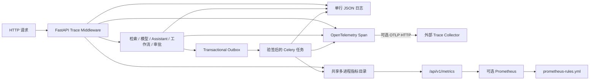

# 可观测性与告警运维手册

## 1. 适用范围

本文档说明阶段 2 `P2-06` 的结构化日志、OpenTelemetry Trace、Prometheus 指标、分层健康事实和告警规则。该基线适用于本地 API、五个 Worker Lane、Scheduler 唤醒链、检索、模型、Assistant、工作流、审批、SSE 和 Transactional Outbox。

PostgreSQL 继续保存业务、任务、审计、Outbox 和 SSE 事实；可观测数据只用于关联、聚合和定位，不能反向覆盖业务状态。默认本地启动不捆绑 Prometheus、Alertmanager 或 Trace 后端，避免在功能开发机上增加常驻服务；指标抓取入口和规则已经可用，只有配置外部 Collector 或 Prometheus 后才产生跨重启历史。

## 2. 数据流



HTTP 边缘只接受有效 W3C `traceparent`，并为当前请求生成新 Span。应用服务自动继承标准 OTel Context；集成事件只有在 HMAC 信封验签成功后才能恢复父 Trace。无效或未验证 Header、Broker 属性和任务载荷均不能成为可信 Trace。

## 3. 字段安全边界

所有平台日志、Span 属性、指标标签和告警字段先通过 [`field-registry.v1.json`](../../contracts/observability/field-registry.v1.json)。注册表采用“未登记即拒绝”，禁止以下数据进入普通可观测通道：

- `Authorization`、Cookie、Session、密码、API Key、Token 和其他凭据；
- 文档、消息、查询、Prompt、模型输入输出、事件 Payload 和字段级 ABAC 受限值；
- 用户、工作空间、文档、资源和 Run 等高基数标识作为 Prometheus 标签；
- 原始异常文本、供应商响应、Broker 地址和数据库连接信息。

平台业务日志包含时间、级别、服务、环境、固定事件名、Trace ID、Span ID，以及可选 Request ID、Task ID、稳定错误码和耗时。Uvicorn、Celery 和第三方库的自由文本日志在容器中统一收敛为 `unstructured_library_log`，不复制原始消息或异常正文。

审计记录不等同于普通日志。审计仍按既有最小安全投影保存主体、资源、操作、策略版本和 Trace；不得为了排障把审计中的资源标识复制为指标标签。

## 4. 本地配置

`.env` 支持以下配置：

| 配置 | 默认值 | 说明 |
| --- | --- | --- |
| `OBSERVABILITY_OTLP_ENDPOINT` | 空 | 可选 OTLP HTTP Trace 入口，应填写完整 `/v1/traces` URL |
| `OBSERVABILITY_OTLP_TIMEOUT_SECONDS` | `2` | 导出超时，允许 `0.1～10` 秒 |
| `PROMETHEUS_MULTIPROC_DIR` | Compose 固定 | 容器内共享多进程指标目录，不由用户修改 |

空 OTLP 地址不会发起外部网络请求。`local/test` 可连接本地 HTTP Collector；其他环境必须使用 HTTPS。字段白名单在导出前执行，因此 Collector 不应收到正文、Prompt、凭据或受限字段。

Prometheus 多进程文件保存在 `.ai-platform/runtime/prometheus`。它不属于业务事实和备份；`./platform start` 或 `restart` 在 Migration 前删除旧 `.db` 文件，再由 API 和 Worker 重建。各容器使用服务/Lane 前缀避免 PID 命名空间碰撞，退出子进程的 live Gauge 会被清理。

## 5. 指标入口

本机抓取：

```bash
curl --fail http://127.0.0.1:8000/api/v1/metrics
```

主要指标：

| 指标 | 含义 | 主要标签 |
| --- | --- | --- |
| `ai_platform_http_requests_total` | HTTP 状态结果数量 | 服务、环境、方法、路由模板、状态码 |
| `ai_platform_http_request_duration_seconds` | HTTP 请求耗时 | 服务、环境、方法、路由模板 |
| `ai_platform_operations_total` | 检索、模型、工作流、审批和 Outbox 操作结果 | 服务、环境、组件、操作、结果 |
| `ai_platform_operation_duration_seconds` | 关键应用操作耗时 | 服务、环境、组件、操作 |
| `ai_platform_tasks_total` | 五个 Worker Lane 任务结果 | 服务、环境、任务名、队列、结果 |
| `ai_platform_task_duration_seconds` | Worker 任务耗时 | 服务、环境、任务名、队列 |
| `ai_platform_dependency_health` | 最近依赖状态，正常为 `1`、降级为 `0` | 服务、环境、依赖 |
| `ai_platform_dependency_check_duration_seconds` | 最近依赖检查耗时 | 服务、环境、依赖 |
| `ai_platform_outbox_pending_events` | 调度开始时未完成 Outbox 数量 | 服务、环境 |
| `ai_platform_outbox_oldest_pending_age_seconds` | 调度开始时最老积压年龄 | 服务、环境 |
| `ai_platform_sse_notifications_total` | SSE 发布、订阅、接收和降级结果 | 服务、环境、通知模式、结果 |
| `ai_platform_sse_wakeup_duration_seconds` | Pub/Sub 唤醒到 PostgreSQL 回查完成耗时 | 服务、环境、通知模式 |
| `ai_platform_sse_active_subscriptions` | 活动跨实例 SSE 订阅数 | 服务、环境 |
| `ai_platform_sse_fallback_queries_total` | 通知不可用或超时时的数据库兜底查询数 | 服务、环境 |

HTTP 指标使用 FastAPI 路由模板，例如 `/workspaces/{workspace_id}/...`，不会使用含真实 UUID 的请求路径。多进程指标在平台重启后从零开始，不代表 PostgreSQL 业务事实被清空。

## 6. 健康与告警

`GET /api/v1/health/ready` 保留兼容的 `checks` 状态映射，并增加：

- `checked_at`：本次 Readiness 快照时间；
- `details.<name>.latency_ms`：单项探测耗时；
- `details.<name>.critical`：是否阻断就绪；
- `details.<name>.reason_code`：稳定降级原因码，不包含原始异常。

告警规则位于 [`prometheus-rules.yml`](../../infra/observability/prometheus-rules.yml)，覆盖关键依赖不可用、HTTP 错误比例、HTTP P95 延迟、Worker 失败、Outbox 最老积压、Outbox 死信和 SSE 通知失败。规则只是可部署基线；本地未运行 Prometheus/Alertmanager 时不会自动发送外部通知，不能把规则文件存在视为告警链已投产。

`critical_trace_coverage_ratio >= 0.99` 需要 Trace 后端或阶段联合验收按 Trace ID 聚合 HTTP、任务、检索、模型、工作流、审批和 Outbox Span。Prometheus 不能证明“同一 Trace 完整覆盖”，因此不能用各组件 Counter 的比值替代该指标。

## 7. 排障顺序

1. 执行 `./platform doctor`，确认 13 项进程和依赖检查。
2. 打开运行状态页，核对降级依赖、最近检查时间和延迟。
3. 查看 `/api/v1/metrics` 的错误、延迟、积压、死信和 SSE 降级指标。
4. 使用 Trace ID 在已配置的 Trace 后端关联 HTTP、应用操作、Outbox 和验签任务。
5. 查看对应 API 或 Worker 的单行 JSON 日志，只使用稳定事件名、错误码、Request ID 和 Task ID 定位。
6. 需要核对主体或资源时查询受控审计事实，不在普通日志、指标或工单中粘贴正文和凭据。

未配置 OTLP Collector 时，Trace 仍在请求内正确传播并写入业务事实、响应头和结构化日志，但进程退出后没有独立 Trace 历史查询界面。该状态应记录为“Trace 传播已启用、持久化后端未配置”，不得冒充完整监控平台已部署。
