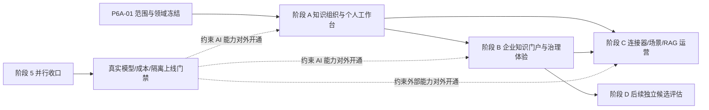

# AI 智能平台参考站式产品化改造计划

> 文档状态：已确认执行
> 计划基线：2026-08-21
> 适用仓库：当前 AI 智能平台 Monorepo
> 总体决策：基于当前项目改造，不重新立项（已确认）
> 参考依据：[参考站个人空间、公司空间与当前项目功能差距分析](./jitknow-feature-gap-analysis.md)
> 当前进度：`P6A-01`～`P6A-06` 与 `P6B-01`～`P6B-04` 已提交完成；下一节点为 `P6B-05`

## 1. 计划结论

本计划沿用当前仓库和模块化单体架构，正式启动“阶段 6：内容工作台与产品化体验”，不重新建立技术项目，不重写已经完成的身份、工作空间、权限、知识入库、RAG、问答、工作流、Agent 和治理底座。产品负责人已于 2026-08-21 确认按推荐方案执行；阶段 6 的主设计、交付规范、阶段计划、阶段报告和进度看板随 `P6A-01` 同步建立。

改造不是一次性把参考站所有页面全部复制过来，而是分为四个可独立验收的产品阶段：

1. **阶段 A：知识组织与个人工作台**。让用户能够通过文件夹、标签、收藏和回收站组织上传文档，完成搜索、解析、索引、下载和 AI 问答；第一版不建设在线文档编辑器。
2. **阶段 B：企业知识门户与治理体验**。把现有企业空间、成员、权限、审批和审计底座整理成可用的企业控制台、分类、团队知识域和企业问答入口。
3. **阶段 C：连接器、场景和运营增强**。建设网页同步、标签/术语、场景配置、RAG 评估、办公 Agent 和运营看板。
4. **阶段 D：后续独立候选评估**。第一版完成后，再分别决定在线编辑器、公开助手、知识广场、实时协作、标准 MCP 出口和支付是否独立立项。

阶段 A+B 已确认作为第一期产品改造，阶段 C 作为第二期候选，阶段 D 不纳入当前关键路径。

截至 2026-08-31，阶段 A 已完成范围冻结、文件夹/标签/收藏/回收站、文件型文档详情与授权下载、个人工作台与全局搜索、AI 助手体验和联合验收六个节点。`P6A-06` 使用冻结的 `p6a06-v1` 合成验收清单，覆盖 12 个组织、发布、解析重试、索引一致性、检索授权、工作台搜索、助手范围、Migration 和跨空间隔离场景；前置与恢复 `./platform doctor`、12/12 PostgreSQL pytest 场景和证据 Schema 校验均通过。阶段 A 的桌面/移动双视口证据复用 P6A-02～P6A-05 已完成的真实合成数据验收，联合验收器本身不冒充自动浏览器测试。临时附件最多 3 个、单个最多 20,000 字节，仅进入当前 Run 上下文，不写入知识库、索引或文档正文；归档时清理附件正文。真实供应商质量、成本和数据政策仍受阶段 5 门禁约束，在线正文、文档 AI 写回和多人实时协作仍不进入第一版。

阶段 B 的 `P6B-01` 已完成企业控制台聚合页。新增服务端聚合接口统一返回成员、知识库、活动/发布文档、处理/失败、存储、近六个月趋势和最近内容，并明确统计时间窗与最终一致性；最近内容按当前主体的资源授权、最高密级和标题/知识库字段遮罩裁剪，不返回正文、对象键或凭证。企业资料描述和 Logo 因当前领域尚无持久化字段保持为空，并明确留给后续企业资料节点，未以假数据冒充已实现。Registry 已升至 29，数据库 Revision 为 `20260831_0076`；完整门禁、真实 PostgreSQL 聚合、Migration 回归、13 项容器诊断及桌面/移动真实合成数据验收均通过。

`P6B-02` 已完成企业团队管理产品页。服务端以单一聚合读模型返回团队摘要、成员、邀请、部门、岗位、自定义角色和低敏审计，并提供邀请撤销、成员原子配置、恢复和移除接口；页面复用既有邀请创建/接受流程，补齐搜索、多维 URL 筛选、有效角色来源、最后活跃、邀请复制/撤销及成员生命周期操作。Owner 永远不可编辑、停用或移除；停用保留组织与直接角色，恢复后重新生效；移除进入 `left` 终态并清除组织和直接角色，重新加入必须创建新邀请。所有写操作继续执行可信 `RequestContext`、目标资源级授权、乐观版本、事务、审计与 Outbox 边界。Registry 已升至 30，数据库 Revision 为 `20260831_0077`；完整门禁、13 项容器诊断、真实状态流转以及桌面/移动真实合成数据验收均通过。

`P6B-03` 已完成企业分类与团队知识域。企业分类支持父子层级、公开/指定部门/私有策略、文档整体绑定替换和归档；团队知识域支持成员、部门、知识库声明范围原子替换、不可变 RAG 策略版本、有效范围解释和归档。两类对象只保存治理关系，不复制文档、版本、对象、解析产物、Chunk 或索引；运行时有效范围固定为声明范围与当前 PDP 授权的交集，空范围、PDP 失败、成员失效和知识域归档均失败关闭。真实页面验收还修复了直接成员错误提交 `account_id` 而不是 `membership_id`，以及活动子分类阻止根分类归档时缺少稳定提示两个流程缺口。Registry 已升至 31，数据库 Revision 为 `20260831_0078`；真实 PostgreSQL、Migration 往返、审计/Outbox、桌面/移动真实合成数据流和统一门禁均通过。

`P6B-04` 已实现企业文档发布审批门户并通过验证，功能提交为 `bddeb28`。企业分类可声明 `approval_required`；发布申请冻结文档版本、内容哈希、分类和治理摘要，复用通用审批引擎完成多级待办、通过、驳回、撤回、超时和转交。最终批准前重新鉴权并复核申请人成员、发布权限、文档版本、索引和治理事实，只有复核成功才在同一事务切换文档与索引发布指针；失败进入 `publish_failed`，旧发布指针保持不变。审批、发布请求、审计和 Outbox 同事务提交。Registry 已升至 32，生命周期 Registry 已升至 21，数据库 Revision 为 `20260831_0079`。完整 `./scripts/verify`、专项测试、13/13 容器诊断及桌面/移动正式合成数据页面验收均通过；下一节点为 `P6B-05` 权限管理与审计页。

## 2. 当前基线与改造边界

### 2.1 可以直接复用的底座

以下能力已经存在，应通过新页面、聚合接口和少量领域扩展复用：

- 账号认证、个人空间、企业空间、空间切换、成员和组织架构。
- `RequestContext`、`workspace_id` 隔离、RBAC/ABAC、字段级权限、菜单发布和审计。
- 知识库、文档元数据、不可变版本、对象存储、解析、OCR、Chunk、Embedding、混合检索和索引 Worker。
- 私有问答、SSE、断点恢复、引用、反馈、取消和模型网关。
- 工作流定义、图校验、审批实例、Agent Release、服务发布、灰度、回滚和工具执行。
- Outbox、用量、配额、数据生命周期、治理控制塔和运行状态页。

### 2.2 本计划明确新增的产品层

- 工作台聚合体验、最近访问、全局搜索和个人统计。
- 文件夹、标签、收藏、回收站和文档组织交互。
- 文件型知识管理体验、解析详情、授权下载、文档移动和现有问答能力产品化。
- 企业控制台、企业知识分类、团队知识域、权限矩阵和审计产品页。
- 面向普通用户的场景配置、RAG 评估、网页连接器和办公 Agent 入口。

### 2.3 第一版明确不纳入

- 在线文档正文模型、富文本编辑器、自动保存、编辑历史和文档 AI 结果写回。
- 实时多人协作、评论、光标和 CRDT/OT。
- 公开助手、知识广场、匿名 AI 对话和完整内容审核生态。
- 标准 MCP 外部服务出口、外部客户端配置和 API Key 生态。
- 微信支付、订阅、Token 充值、订单、退款和发票。
- 多 Agent 自主协作、联网搜索和个人自定义模型。

这些能力在阶段 D 重新做商业价值、安全风险和容量评审后再决定，不因页面相似而自动承诺。

### 2.4 与当前阶段 5 的关系

当前阶段 5 因真实模型质量样本和真实价格输入保持受阻，但这不应阻止产品范围冻结、领域设计、原型、文件夹、文件型知识管理和成员页面等不依赖真实供应商的工作。执行关系如下：

- `P6A-01` 范围冻结和不涉及模型的阶段 A/B 工作可与 `P5-04`、`P5-06` 收口并行。
- AI 助手、AI 企业大脑、场景预览和其他真实模型能力可以完成本地机制与合成数据验证，但对外开通前必须满足对应的质量、成本、数据政策和发布门禁。
- 新产品页面不能用于掩盖阶段 5 的 `not_run`、`not_configured` 或受阻状态，也不能提前关闭阶段 5。
- 若阶段 6 修改了阶段 5 依赖的模型、检索、权限、工具或指标事实，必须重新执行受影响的阶段 5 回归，不能沿用变更前证据。

## 3. 目标产品范围

### 3.1 第一期开通后的个人流程

```text
登录 → 工作台 → 创建文件夹 → 上传文件/上传新版本
                         ↓
             解析详情、索引、移动、标签、收藏、回收站
                         ↓
                  原文件下载、搜索和知识范围选择
                         ↓
                AI 问答 → 引用 → 反馈 → 历史记录
```

### 3.2 第一期开通后的企业流程

```text
切换企业空间 → 企业控制台 → 成员/部门/角色管理
                         ↓
             企业分类 → 团队知识域 → 文档发布审批
                         ↓
                 企业知识问答 → 引用与运营统计
```

### 3.3 数据关系原则

第一期必须先确定领域关系，避免参考站中“文件夹、知识库、企业分类、团队空间”出现双入口不同步：

- `KnowledgeFolder` 是个人或企业空间中的内容组织节点。
- `KnowledgeBase` 是可检索的数据域，允许绑定一个或多个文件夹，但不能与文件夹互相隐式创建。
- `EnterpriseCategory` 是企业治理和权限分类，不复制原文件或解析产物；文档通过明确绑定关联到分类。
- `TeamKnowledgeDomain` 是企业内的协作知识域，必须有唯一归属空间、成员范围、RAG 策略和生命周期。
- 文档原文件、版本和 Chunk 继续由现有知识模块管理；目录、分类、标签和知识域使用关系表表达，不复制文件或 Chunk。

### 3.4 页面交付归属

| 页面/入口 | 交付阶段 | 处理方式 |
| --- | --- | --- |
| 工作台 | 阶段 A | 新增聚合首页，承载最近文档、统计、快捷创建和快捷 AI |
| 知识库 | 阶段 A | 重构现有知识生产页，增加文件夹、标签、收藏、回收站、搜索和视图切换 |
| 在线文档编辑器 | 第一版后评估 | 记录为 `POST-EDITOR-01`；第一版不创建在线正文、不提供编辑路由和自动保存 |
| AI 助手 | 阶段 A | 基于现有知识问答改造知识范围、临时附件、快捷指令和归档体验 |
| 企业控制台 | 阶段 B | 基于空间总览新增企业资料、知识统计、趋势和快捷入口 |
| 团队管理 | 阶段 B | 整合现有成员与组织页面，增加邀请链接、筛选和一体化编辑 |
| 企业知识库 | 阶段 B | 新增企业分类、团队知识域和文档发布审批门户 |
| 权限管理 | 阶段 B | 为现有 Role、PDP 和 Audit API 增加角色矩阵与审计产品页 |
| AI 企业大脑 | 阶段 B | 基于现有 Assistant/RAG 增加企业知识域选择、快捷任务和运营摘要 |
| 场景引擎、RAG 评估 | 阶段 C | 将现有 Agent、Retrieval 和质量能力产品化为普通用户页面 |
| AI 工作流、办公 Agent | 阶段 C | 保留现有治理能力，补模板、低代码体验、任务历史和结果导出 |
| 连接器、术语库 | 阶段 C | 作为知识库二级能力交付，不增加新的一级导航负担 |
| 公开助手、知识广场、在线编辑器、MCP、支付 | 阶段 D | 不进入第一期；第一版完成后按价值、成本和风险独立评估 |
| 服务管理、Agent 运营、治理控制塔、运行状态 | 全阶段保留 | 移入高级管理区，不删除当前项目独有能力，也不面向普通用户平铺 |

## 4. 总体阶段与依赖



阶段 A 和阶段 B 共享基础契约。企业控制台和团队管理可与阶段 A 并行，企业分类、团队知识域和企业问答依赖目录、文档关系及权限稳定；阶段 C 依赖阶段 A/B 的文件夹、权限和统计事实。阶段 D 在第一版 A+B 稳定后即可逐项评估，不必等待阶段 C；其中实时协作仍必须等待在线编辑器稳定。

### 4.1 建议关键路径

| 时间窗 | 主路径 | 可并行工作 | 阶段出口 |
| --- | --- | --- | --- |
| 第 1～2 周 | `P6A-01` 范围、术语、领域关系、ADR 与原型冻结 | 阶段 5 外部输入收口；企业控制台信息架构 | 明确第一版不包含在线编辑器，不再变更首期对象关系 |
| 第 2～5 周 | `P6A-02` 知识组织、`P6A-03` 文件管理产品化 | `P6B-01` 企业控制台、`P6B-02` 团队管理 | 目录、移动、删除恢复、下载和索引边界通过集成测试 |
| 第 4～7 周 | `P6A-04` 工作台与搜索、`P6A-05` 助手体验 | `P6B-03`～`P6B-05` 企业分类、审批、权限和审计 | 个人版文件型知识管理进入内部试用 |
| 第 7～10 周 | `P6A-06` 阶段 A 联合验收 | `P6B-06` 企业大脑 | 个人版试点可开通，AI 能力受阶段 5 门禁约束 |
| 第 9～12 周 | `P6B-07` 企业联合验收 | 数据迁移演练、性能与浏览器回归 | 企业版试点可开通 |
| 第 13 周 | 缺陷收敛、文档同步和第一期发布评审 | 第二期阶段 C 方案细化 | A+B 第一期开通或给出明确阻断结论 |

以上是推荐团队配置下的日历计划，不是固定发布日期。`P6A-01` 完成后应按存量数据规模、页面复杂度和真实接口缺口重新估算一次；在线编辑器不计入本工期。

## 5. 阶段 A：知识组织与个人工作台

### 5.1 目标

完成个人空间的文件型知识管理闭环，使普通用户能从工作台进入知识库，上传和组织文档，查看解析与索引状态，搜索、下载、收藏、删除恢复并使用 AI 问答。第一版不创建或编辑在线正文。

### 5.2 节点计划

| 候选节点 | 交付目标 | 主要工作 | 对应差距项 | 依赖 | 复杂度 |
| --- | --- | --- | --- | --- | --- |
| `P6A-01` | 产品范围与领域关系冻结 | 冻结文件夹、知识库、分类、标签和团队知识域关系；明确第一版只管理上传文件；形成 ADR、术语表和迁移规则 | 第 13 章产品决策 | 当前架构与差距分析；可与阶段 5 并行 | M |
| `P6A-02` | 文件夹、标签、收藏和回收站 | 文件夹树、改名、移动；标签 CRUD/批量绑定；收藏；恢复/永久删除、保留期 Worker、活动任务竞态隔离、确定性对象键、外部对象幂等清理和有限重试；文件夹不承担 RAG 检索边界 | `K-001`、`K-006`、`K-009`、`K-010` | `P6A-01`、现有知识模块 | L |
| `P6A-03` | 文件型文档管理产品化 | 上传首版/新版本、列表/卡片、移动、解析详情、Chunk 状态、授权下载、发布/重试和批量操作 | `K-003`～`K-005`、`K-011`、`K-012` | `P6A-01`、现有知识版本、对象存储和 Worker | M |
| `P6A-04` | 个人工作台与全局搜索 | 最近文档、我的统计、快捷上传、名称/内容搜索、空/错/加载状态 | `P-001`、`P-002`、`P-004`～`P-006` | `P6A-02`、`P6A-03` | L |
| `P6A-05` | AI 助手体验 | 知识库/标签范围、临时附件、快捷指令和会话归档；不包含向文档写回模型结果 | `A-005`～`A-008`、`A-010` | `P6A-02`、`P6A-03`、现有 Assistant/模型网关；对外开通受阶段 5 门禁约束 | L |
| `P6A-06` | 阶段 A 集成验收 | 合成个人数据集、桌面/移动浏览器、权限/恢复/异步任务/索引回归、迁移演练、报告和独立提交 | 阶段 A 全量 | `P6A-02`～`P6A-05` | M |

### 5.3 阶段 A 完成标准

- 创建文件夹和文档后，列表、详情、统计、审计、刷新和重新登录均能读到同一事实。
- 文件夹、标签、收藏、回收站的创建、读取、修改、删除/恢复均有稳定错误码、幂等和审计。
- 永久删除必须先在数据库事务内冻结待清理对象键，再由 Worker 校验工作空间前缀、幂等删除对象并在成功后写消费回执；暂时故障只允许有限重试。
- 回收站文档不得被入库 Worker 新领取；永久删除须拒绝活动解析租约，并在产物键尚未回写时按任务身份推导预期键，避免并发解析留下孤立对象。
- 目录和标签资源级接口必须把路径中的 `folder_id`、`tag_id` 作为 PDP 资源标识，不能回落为工作空间 ID 或只依赖前端隐藏操作入口。
- 上传、解析、索引、发布、重试和下载均展示进行中、成功、失败及可执行下一步，不把失败任务显示为成功。
- 第一版页面、API、契约和 Migration 均不新增在线正文、编辑器自动保存或模型结果写回入口。
- 个人空间、企业空间、部门和匿名主体的越权测试通过；本阶段暂不开放匿名分享。

## 6. 阶段 B：企业知识门户与治理体验

### 6.1 目标

把现有企业空间底座整理成参考站式企业产品：企业控制台、成员和组织操作、企业分类、团队知识域、权限矩阵、审计和企业问答。

### 6.2 节点计划

| 候选节点 | 交付目标 | 主要工作 | 对应差距项 | 依赖 | 复杂度 |
| --- | --- | --- | --- | --- | --- |
| `P6B-01` | 企业控制台聚合页 | 企业资料、Logo/描述、成员数、文档数、存储、知识增长、最近内容和快捷入口 | `O-001`、`O-002` | `P6A-01`、现有空间/用量 API；可与阶段 A 中后段并行 | M |
| `P6B-02` | 团队管理产品页 | 邀请链接、成员搜索筛选、角色/部门/岗位一体化编辑、停用/移除、最后活跃和审计 | `O-003`～`O-006` | `P6A-01`、现有 identity/organization/authorization；可并行 | L |
| `P6B-03` | 企业分类与团队知识域 | 分类 CRUD、公开/部门/私有策略、团队知识域唯一归属、成员范围、RAG 和文档绑定 | `O-007`、`O-008` | `P6A-01`～`P6A-03` | XL |
| `P6B-04` | 企业文档审批门户 | 分类审批开关、提交、待办、通过、驳回、撤回、版本和审计；复用现有审批引擎 | `O-009` | `P6B-03`、现有 workflow | L |
| `P6B-05` | 权限管理与审计页 | 预置/自定义角色、权限矩阵、成员查看、操作详情、导出状态和字段脱敏 | `O-010`、`O-011` | `P6B-02`、`P6B-03`、现有 PDP/audit | L |
| `P6B-06` | AI 企业大脑简版 | 选择企业知识域、企业问答、引用、生成报告模板、调用统计和近期活动 | `O-012`、`O-013` | `P6B-03`、现有 Assistant/RAG；对外开通受阶段 5 门禁约束 | L |
| `P6B-07` | 阶段 B 隔离与治理验收 | 合成多成员/多部门数据、角色矩阵、审批、统计、撤权传播、企业问答和迁移回归 | 阶段 B 全量 | `P6B-01`～`P6B-06` | L |

### 6.3 阶段 B 完成标准

- 企业资料、成员、部门、角色、分类、团队知识域、文档和审计使用统一 `workspace_id` 与唯一归属关系。
- 分类的访问策略由服务端事实源返回，页面标签不允许与授权结果不一致。
- 团队知识域不会通过前端拼接或双写隐式生成普通文件夹；映射关系可追溯、可校验、可迁移。
- 普通成员、部门成员、管理员和停用成员的页面、接口、检索、引用和导出权限均有正反向测试。
- 审批状态、发布版本、企业问答可见范围和审计记录可从同一文档事实追溯。
- 企业控制台与企业大脑调用统计统一事件口径、时间窗和最终一致性说明。

## 7. 阶段 C：连接器、场景和运营增强

### 7.1 目标

在内容和企业治理稳定后，补齐参考站的高频增强能力，但不把外部连接器、个人 Key 和公开生态同时引入关键路径。

### 7.2 节点计划

| 候选节点 | 交付目标 | 主要工作 | 对应差距项 | 依赖 | 复杂度 |
| --- | --- | --- | --- | --- | --- |
| `P6C-01` | 网页连接器定义 | URL 集合、目标知识域、CSS 选择器、状态、凭证和权限模型 | `C-001` | 阶段 A/B、SSRF 威胁评审 | L |
| `P6C-02` | 定时同步与幂等 | Cron/周期调度、抓取、内容摘要、同 URL 幂等、版本替换、重试和告警 | `C-002`～`C-005` | `P6C-01`、Worker/Outbox | XL |
| `P6C-03` | 标签推荐与术语库 | AI 推荐标签人工确认；标准术语、别名、启停、查询扩展版本 | `K-007`、`K-008` | 阶段 A、现有 Retrieval | L |
| `P6C-04` | 普通用户场景引擎 | 场景实体、Prompt、Few-shot、模型/检索参数、基础护栏、预览、草稿和应用快照；长期记忆后置 | `G-001`～`G-005`、`G-007`～`G-009` | 现有 Agent/Release、阶段 A/B；对外模型预览受阶段 5 门禁约束 | XL |
| `P6C-05` | RAG 评估与知识健康度 | 命中测试、阶段 Chunk、Rerank、查询改写、低召回、高频问题和健康度 | `R-001`～`R-005` | 阶段 A/B、现有 Retrieval | L |
| `P6C-06` | 工作流模板与办公 Agent 门户 | 模板复制、现有节点低代码体验、场景卡片、文件输入、运行状态、历史、可取消长任务和直接文件导出；不写入在线文档 | `W-001`～`W-003` | `P6C-04`、现有 Workflow/Agent | L |
| `P6C-07` | 阶段 C 运营验收 | 连接器故障矩阵、RAG 质量、成本、索引一致性、办公 Agent 运行和审计 | 阶段 C 全量 | `P6C-01`～`P6C-06` | L |

### 7.3 阶段 C 完成标准

- 网页连接器完成 SSRF、DNS 重绑定、内网地址、重定向、超大响应和 robots/合规检查。
- 同一 URL 重复同步不产生重复文档；无变化有明确跳过状态，失败可重试且不污染当前发布版本。
- 场景草稿、已应用快照、运行实例和历史版本可追溯；应用失败不改变当前助手。
- RAG 评估和企业问答统计均按 `workspace_id`、主体、时间窗和权限范围聚合。
- 办公 Agent 无正文时禁止显示“导出成功”；运行错误、取消和重试对用户可见。

## 8. 阶段 D：后续独立候选评估

阶段 D 不是当前改造承诺，只作为独立立项闸门。进入前必须完成安全、容量、商业和运维评审。

| 候选节点 | 可能范围 | 进入条件 | 主要风险 |
| --- | --- | --- | --- |
| `POST-EDITOR-01` | 在线正文、富文本编辑、自动保存、历史、导入导出和文档 AI 写回 | 第一版 A+B 已稳定；重新确认使用场景、编辑节点、格式兼容和预算 | 正文版本、冲突、格式损失、索引一致性和用户数据恢复 |
| `POST-SHARING-01` | 只读链接、密码分享、匿名主体 | 阶段 A/B 权限与审计稳定；完成匿名访问威胁模型 | 内容泄露、滥用、爬虫和成本失控 |
| `POST-PUBLIC-01` | 公开问答助手、知识广场、审核 | 有明确商业目标、审核责任人、举报/下架和预算 | 版权、越权、提示注入、内容安全 |
| `POST-COLLAB-01` | 实时协作和评论 | `POST-EDITOR-01` 已建设且稳定；明确协作场景、并发目标和冲突解决方案 | CRDT/OT、在线状态、通知和数据量 |
| `POST-MCP-01` | 标准 MCP 出口 | 完成工具协议、安全边界、API Key、额度和客户端兼容测试 | 工具越权、跨空间数据泄露和外部滥用 |
| `POST-BILLING-01` | 订阅、支付和 Token 包 | 商业方案、支付资质、退款/发票和对账责任明确 | 资金、订单一致性、风控和合规 |

### 8.1 MCP 阻断条件

参考站已经实测 `knowledge_search` 跨空间返回个人文档 Chunk。当前项目在 `POST-MCP-01` 前必须通过：

1. 工具运行时从可信 `RequestContext` 取得 `workspace_id`，不接受客户端覆盖。
2. 检索、文档创建、文档编辑、引用、缓存和审计均带空间、主体和资源级权限。
3. 个人、企业、部门、停用成员和匿名主体的 MCP 越权测试全部通过。
4. 任意跨空间命中、引用或错误回显均阻断整次调用并告警。

## 9. 跨阶段技术设计

### 9.1 API 与契约

- 所有新能力先修改 `contracts/openapi/`、`contracts/sse/`、错误码和领域 Schema，再生成前端类型。
- 列表接口统一游标分页、排序、筛选、搜索和 `workspace_id` 范围；不在页面中拼接权限过滤。
- 上传、解析、索引、连接器、长任务和模型调用使用任务事实与 SSE/轮询状态；在线正文保存契约推迟到 `POST-EDITOR-01` 再设计。
- 匿名分享和公开助手使用独立主体，不复用普通成员 Session。

### 9.2 后端领域与写入权

建议新增或扩展以下模块，保持一个领域一个写入责任：

| 模块 | 主要实体/事实 | 写入责任 |
| --- | --- | --- |
| `knowledge_organization` | `KnowledgeFolder`、标签、收藏、回收站事实 | 目录关系、用户收藏和删除生命周期 |
| `knowledge_connector` | 连接器、调度、运行、游标 | 外部来源定义和同步事实 |
| `enterprise_knowledge` | 企业分类、团队知识域、文档绑定 | 企业知识治理关系 |
| `assistant_scenario` | 场景、策略版本、应用快照 | 普通用户场景配置 |
| `knowledge_analytics` | RAG 评估、健康度和聚合指标 | 只写聚合事实，不存正文或个人标识 |
| `sharing`（阶段 D） | 分享授权、匿名主体、访问记录 | 匿名访问与撤销事实 |

`knowledge_content`、`DocumentContentDraft`、`DocumentContentVersion` 和编辑 revision 不进入第一版数据模型，统一留到 `POST-EDITOR-01` 重新设计，避免第一版为未使用能力承担迁移和维护成本。

### 9.3 Worker 与异步任务

- 文件解析与索引、连接器抓取、回收站清理、通知和办公 Agent 长任务必须异步化。
- 任务至少一次投递；所有命令带幂等键、租约、重试上限、失败码和审计。
- 任务状态必须区分排队、运行、成功、失败、取消、超时和部分成功。
- 失败任务不能让半成品索引、导出文件或统计进入“成功”状态。

### 9.4 前端实现

- React 19、TanStack Query、Zustand、Ant Design 6、Fetch/SSE、UnoCSS 为固定技术边界。
- 页面入口只组合 Query、Mutation、组件和状态；服务端状态不复制到 Zustand。
- Query Key 必须包含影响结果的空间、筛选、分页和版本参数。
- 新页面必须有加载、空、错误、无权限、进行中、成功、失败、重试和移动端状态。
- 参考站页面命名可以作为导航参考，但“场景、助手、Agent、工作流”必须在产品术语表中明确关系。

### 9.5 存量文档兼容与迁移

当前项目已经存在上传文档、不可变版本、发布指针、解析产物和索引。第一版只增加组织关系和产品页面，不引入在线正文，也不进行一次性破坏性重写：

1. 既有上传文档继续按“原文件文档”读取和检索，原有版本 ID、发布事实、引用和审计保持有效。
2. 新增文件夹后，既有知识库和文档先映射到服务端默认根目录，迁移不改变原有可见范围、知识库归属和检索结果。
3. 标签、企业分类和团队知识域使用关系表绑定既有文档，不复制对象文件、解析产物或 Chunk。
4. 索引属于可重建派生数据。迁移先验证授权与发布指针，再按工作空间分批重建，不将“重建完成”冒充文档关系迁移完成。
5. 数据库 Migration 采用兼容性新增和可恢复快照；旧应用在切换窗口内必须仍能读取旧事实。存在阶段 6 数据后如无法安全降级，应明确拒绝 Down Migration，并使用升级前恢复包回滚。
6. 正式迁移前使用全合成数据完成空库、存量库、升级失败恢复、重复执行、部分完成续跑和跨空间校验；生产迁移另行取得授权，不在开发验收中处理真实资料。
7. 第一版不提供“新建在线文档”或“转换为在线文档”，也不预建空正文表；后续是否增加由 `POST-EDITOR-01` 评审决定。

### 9.6 渐进发布与回滚

- 新页面先通过现有菜单草稿和发布快照只对内部测试角色开放，前端隐藏不替代后端授权。
- 新 API 以兼容性新增方式发布，旧知识生产页在阶段 A 试点期间保留；数据核对通过后再切换默认导航，不做一次性“大爆炸”替换。
- 发布顺序固定为数据库兼容扩展、API/Worker、内部菜单、个人试点、企业试点、默认入口切换；每一步都必须有停止和回退点。
- 页面回退只回退入口和读写路由，不删除新事实；数据回退使用不可变版本、发布指针和恢复包，禁止用手工 SQL 抹平状态。
- 模型、连接器、匿名访问和外部工具使用独立开通门禁。任一质量、成本、隔离或安全条件未通过时，只关闭对应能力，不回滚无关的知识组织功能。
- 试点期间至少观察上传/解析失败率、索引积压、下载失败率、问答引用有效率、权限拒绝异常和跨空间告警；阈值由 `P6A-01` 固定后写入阶段报告。

## 10. 测试与验收策略

### 10.1 每个节点必交

1. 契约测试：OpenAPI/SSE/错误码/生成类型无漂移。
2. 领域测试：状态机、幂等、版本、唯一归属和边界条件。
3. 权限测试：正向授权、跨空间、部门范围、停用主体、直接 ID 和字段泄漏。
4. 集成测试：PostgreSQL、Valkey、MinIO、Tika、Worker、Outbox 和索引一致性。
5. 浏览器验收：桌面、390px 移动、加载/空/错误/无权限和核心数据刷新。
6. 文档同步：阶段计划、阶段报告、架构决策、进度看板和验收证据。

### 10.2 第一期开通验收场景

使用全合成数据，至少覆盖：

- 2 个个人空间、1 个企业空间、3 个成员、2 个部门、2 个角色。
- 20 个文档、3 个文件夹、5 个标签、2 个企业分类、1 个团队知识域。
- 文件上传、新版本、移动、解析、索引、下载、收藏、删除恢复、问答、引用和反馈。
- 企业成员邀请、部门范围、角色权限、文档审批、企业问答和审计详情。
- API 直接访问、伪造 `workspace_id`、停用成员、跨空间 ID、过期任务和重复提交。

### 10.3 阶段关闭门禁

- `./scripts/verify` 通过；涉及容器、数据库、Worker 和模型的节点追加 `./platform doctor`、Migration 往返和集成测试。
- 当前项目阶段 5 的质量、成本、隔离和合规阻塞项必须明确标记，不得用产品页面验收掩盖真实供应商质量或容量未完成。
- 每个节点形成独立 Git 提交，提交信息使用 `<type>(<节点 ID>): <中文摘要>`，其中 `<type>` 按 `docs`、`feat`、`fix`、`test` 等仓库规则选择。
- `docs/project-progress.md`、对应阶段计划/报告和 ADR 同步，未执行项明确写 `not_run`、`not_configured` 或“待最终动作验证”。

## 11. 工作量与排期估算

以下是推荐团队配置下的日历工期，不是简单相加的人月；阶段 B 的企业控制台、团队管理和权限页面可与阶段 A 中后段并行。不包含支付资质、真实外部数据采购和大规模历史迁移。

| 范围 | 估算 | 说明 |
| --- | ---: | --- |
| `P6A-01` 范围冻结 | 1～2 周 | 产品术语、领域关系、首期原型、迁移规则和 ADR |
| 阶段 A | 4～7 周 | 文件夹、标签、收藏、回收站、文件型文档管理、工作台、搜索和助手体验 |
| 阶段 B | 5～8 周 | 企业控制台、成员/权限、分类、团队知识域、审批、企业大脑简版 |
| 阶段 C | 7～11 周 | 连接器、场景、RAG 评估、办公 Agent 和运营 |
| 阶段 D 单项评估 | 2～4 周/项 | 只做方案、威胁模型、成本和原型，不承诺开发 |
| A+B 第一期开通 | 9～13 周 | 形成文件型个人知识管理和企业治理主流程，不含在线编辑器 |
| A+B+C 完整产品层 | 16～24 周 | 补连接器、场景和运营，不含在线编辑器、公开生态和支付 |

团队建议：1 名产品/项目负责人、1 名交互/视觉设计、2 名前端、2 名后端、0.5～1 名 Worker/数据工程、1 名测试/安全。A+B 第一期开通约需 14～22 人月的综合投入；若只有 1 名前端和 1 名后端，日历排期约增加 40%～70%。`P6A-01` 完成后的拆分估算优先于差距分析中的早期粗估；`POST-EDITOR-01` 未来单独估算，不占用本预算。

## 12. 风险与应对

| 风险 | 影响 | 应对 |
| --- | --- | --- |
| 文件夹/知识库/团队空间概念重叠 | 页面状态不同步、数据双写 | `P6A-01` 建立唯一关系和迁移规则，禁止前端隐式创建 |
| 在线编辑器重新混入第一版 | 范围和排期再次膨胀 | 第一版不创建正文表、编辑路由或自动保存契约；统一进入 `POST-EDITOR-01` |
| 企业权限只做前端 | 越权、数据泄露 | 所有新接口接入统一 PDP，补跨空间/部门/字段测试 |
| 连接器 SSRF 或同步污染 | 内网探测、错误内容覆盖正式文档 | 独立抓取 Worker、地址校验、内容摘要、版本替换和人工重试 |
| 统计口径不一致 | 企业决策数据不可信 | 统一事件、时间窗、聚合表和最终一致性说明 |
| MCP 跨空间泄露 | 阻断级安全事故 | 阶段 D 前置专项门禁，跨空间命中阻断整次调用并告警 |
| 范围持续膨胀 | 排期失控、底座被破坏 | 每阶段独立验收；公开生态、支付、实时协作单独立项 |

## 13. 需要产品负责人确认的决策

产品负责人已确认“按建议执行”。以下 D1～D14 作为 `P6A-01` 和第一版验收的冻结决策；后续改变任一决策必须执行范围变更并同步计划、测试和排期：

| ID | 决策 | 冻结选择 | 状态 | 对计划的影响 |
| --- | --- | --- | --- | --- |
| `D1` | 产品相似度 | 对齐核心流程、状态与治理能力，不做页面 1:1 复制 | 已确认 | 允许沿用当前架构和设计系统，不承诺参考站缺陷与专属依赖 |
| `D2` | 第一期开通范围 | 阶段 A+B | 已确认 | 形成文件型个人知识管理和企业知识治理完整主流程 |
| `D3` | 知识对象关系 | 接受第 3.3 节关系并执行 `ADR-016` | 已确认 | 文件夹、知识库、企业分类和团队知识域使用显式关系，不复制内容 |
| `D4` | 企业文档审批对象 | 审批“发布动作” | 已确认 | 上传和新版本入库不触发审批，发布请求进入审批链 |
| `D5` | AI 企业大脑知识范围 | 只允许当前企业内获权的团队知识域 | 已确认 | 不读取个人空间、外部公开数据或未授权知识 |
| `D6` | 场景、工作流、Agent 和发布助手关系 | 场景是 Agent 配置入口，工作流是确定性编排，发布后统一为 AgentRelease；发布助手是系统预置 Agent | 已确认 | 不建设第二套模型、工作流或工具 Runtime |
| `D7` | 在线文档编辑器 | 第一版不做，完成后再决定是否启动 `POST-EDITOR-01` | 已确认 | 不新增在线正文、编辑路由、自动保存、历史或文档 AI 写回 |
| `D8` | 多人协作 | 第一版不做，且必须晚于在线编辑器 | 已确认 | 不引入 CRDT/OT、presence、评论和通知体系 |
| `D9` | 第二期范围 | 连接器、术语、场景、RAG 评估和办公 Agent | 已确认 | 阶段 C 独立评审，不阻塞第一版 A+B |
| `D10` | 公开助手与知识广场 | 独立立项 | 已确认 | 匿名访问、审核、举报、下架和成本责任明确后再启动 |
| `D11` | 标准 MCP 出口 | 独立立项且先通过跨空间专项门禁 | 已确认 | 第一版不开放外部 MCP 客户端与 API Key 生态 |
| `D12` | 套餐购买与支付 | 第一版只复用权益和配额，支付独立立项 | 已确认 | 不建设订单、充值、支付、退款、发票和对账 |
| `D13` | 当前项目高级治理能力 | 保留并收纳到高级管理区 | 已确认 | 服务治理、Agent 运营、控制塔和运行状态不删除、不在普通导航平铺 |
| `D14` | 与阶段 5 的关系 | 非模型节点并行建设，AI 对外开通门禁不变 | 已确认 | 不用页面或 Mock 结果掩盖真实质量、成本和隔离阻塞 |

## 14. 首个 30 天执行计划

| 周次 | 主要动作 | 可验收产物 |
| --- | --- | --- |
| 第 1 周 | 确认第 13 章其余决策；盘点存量文档数量与来源；冻结术语和用户流程 | 产品范围记录、术语表、存量数据盘点、首期页面流程图 |
| 第 2 周 | 完成文件夹/知识库/分类/知识域关系和迁移方案评审，冻结第一版页面原型 | ADR 草案、知识关系领域图、OpenAPI 增量草案和迁移规则 |
| 第 3 周 | 建立兼容 Migration、文件夹/标签后端骨架和工作台/知识库页面骨架 | 空库与存量库 Migration 往返、契约生成通过、页面加载/空/错误状态 |
| 第 4 周 | 打通第一个垂直切片：创建文件夹 → 上传文件 → 解析索引 → 搜索/问答引用 → 审计 | 全合成端到端演示、权限反例、失败重试测试和节点报告 |

首月不追求功能数量。第一个垂直切片必须先证明目录、文件、权限、解析索引、问答引用和审计使用同一事实链，再继续扩展企业页面。

## 15. 推荐执行顺序

1. 产品负责人已确认第 13 节 D1～D14，后续按范围变更规则管理。
2. 把正式阶段 6 写入主设计和交付规范，建立阶段计划、报告和进度看板节点，作为 `P6A-01` 首批交付物。
3. 执行 `P6A-01`，产出 ADR、术语表、领域关系图、迁移规则和首期原型，并明确在线编辑器不进入阶段 6 第一版。
4. 按 `P6A-02`、`P6A-03` 建立知识组织和文件管理能力，再并行推进工作台、企业控制台和团队管理；每个节点独立验收和提交。
5. 阶段 A 内部试点后完成阶段 B 分类、审批、权限和企业大脑；企业页面复用现有 API 和 PDP，不复制底层权限逻辑。
6. 阶段 A+B 通过后再评估阶段 C 的连接器、场景、RAG 运营和办公 Agent 投入。
7. 第一版完成后单独评审 `POST-EDITOR-01`；只有确认使用价值、编辑范围和预算后才启动设计与实现。
8. 其他阶段 D 能力只在有明确商业目标、安全负责人和容量预算后按 `POST-*` 节点独立立项。

最终建议：先做阶段 A+B，形成“文件型个人知识管理 + 企业知识治理”的可用产品；第一版不建设在线编辑器，也不同时建设在线协作、公开生态、MCP 和支付。这样既能更快形成可用版本，也能保留当前项目已经验证过的权限、隔离、审计和运行治理能力。
