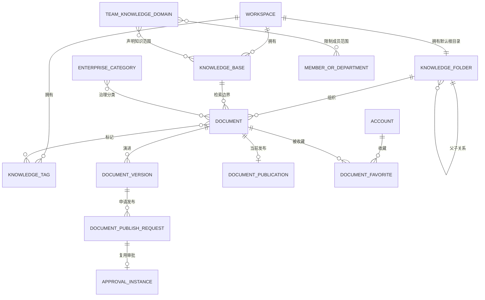
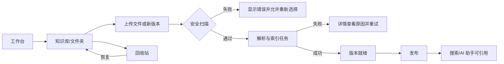
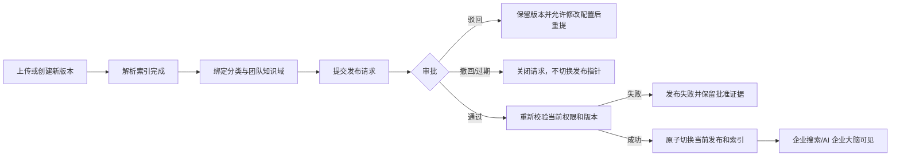

# 阶段 6 第一版范围与信息架构基线

> 节点：`P6A-01`
> 状态：已冻结
> 冻结日期：2026-08-21
> 适用范围：阶段 6 第一版（阶段 A+B）

## 1. 产品结论

第一版基于当前项目改造，目标是形成“文件型个人知识管理 + 企业知识治理”的完整产品，不追求参考站页面和命名的 1:1 复制。现有工作空间、权限、知识版本、解析索引、RAG、审批、Agent 和审计是唯一底座，新页面不得复制这些业务规则。

第一版包含阶段 A 和阶段 B；阶段 C 的连接器、术语、场景、RAG 评估和办公 Agent 仅作为第二期候选。在线文档编辑器、多人协作、公开生态、标准 MCP 出口和支付全部使用 `POST-*` 节点独立评审。

## 2. 已冻结决策

| ID | 决策 | 第一版结论 |
| --- | --- | --- |
| `D1` | 产品相似度 | 对齐核心流程、状态和治理能力，不做页面 1:1 复制 |
| `D2` | 第一期开通范围 | 同时交付阶段 A+B，先内部试点再决定外部开通 |
| `D3` | 知识对象关系 | 采用文件夹、知识库、企业分类、团队知识域四类显式对象，不隐式双写 |
| `D4` | 企业文档审批 | 只审批不可变版本的发布动作，上传、解析和索引不触发审批 |
| `D5` | AI 企业大脑范围 | 只读取当前企业内用户获权的团队知识域，不读取个人空间或外部公开数据 |
| `D6` | 场景、工作流与 Agent | 场景是面向用户的 Agent 配置入口，工作流是可复用确定性编排，发布后统一冻结为 AgentRelease；“发布助手”只是系统预置 Agent，不建立第四套 Runtime |
| `D7` | 在线文档编辑器 | 第一版不做，统一记录为 `POST-EDITOR-01` |
| `D8` | 多人实时协作 | 第一版不做，且必须晚于在线编辑器稳定 |
| `D9` | 第二期范围 | 阶段 C 独立评审，不阻塞第一版 A+B |
| `D10` | 公开助手与知识广场 | 独立立项，完成匿名访问、审核、举报和成本评审后再做 |
| `D11` | 标准 MCP 出口 | 独立立项，跨空间命中阻断与专项安全门禁通过前不开放 |
| `D12` | 套餐购买与支付 | 第一版只复用现有权益和配额，不建设订单、支付、退款和发票 |
| `D13` | 现有高级治理能力 | 保留服务治理、Agent 运营、控制塔和运行状态，收纳到高级管理区 |
| `D14` | 阶段 5 并行关系 | 非模型产品节点继续建设；AI 能力对外开通仍受真实质量、成本和隔离门禁约束 |

## 3. 统一领域语言

领域词汇以仓库根目录 [领域语言](../../CONTEXT.md) 为唯一词汇表。本节只固定对象关系，不重复定义同一术语。



### 3.1 关系基数

| 关系 | 第一版约束 |
| --- | --- |
| 工作空间 → 默认根目录 | 每个工作空间恰好一个，不允许删除、改父级或跨空间移动 |
| 文件夹 → 子文件夹 | 单父树；根目录以下名称在同一父目录内唯一；禁止循环 |
| 文档 → 文件夹 | 每个活动或回收站文档恰好一个主文件夹 |
| 文档 → 知识库 | 沿用现有恰好一个知识库归属；移动文件夹不改变知识库 |
| 文档 ↔ 标签 | 多对多；标签删除只删除绑定，不删除文档 |
| 账号 ↔ 文档收藏 | 按 `workspace_id + account_id + document_id` 唯一 |
| 企业分类 ↔ 文档 | 多对多；绑定不改变文档权限，实际访问仍取 PDP 交集 |
| 团队知识域 ↔ 知识库 | 多对多；运行范围取声明集合与当前授权的交集 |
| 文档版本 → 发布请求 | 同一版本同时最多一个活动请求；历史请求不可覆盖 |

## 4. 模块所有权

| 模块 | 拥有的事实 | 不得直接写入 |
| --- | --- | --- |
| `knowledge` | 知识库、文档、版本、来源、发布、解析与索引关联 | 组织成员、审批 Runtime 私有表 |
| `knowledge_organization` | 文件夹、标签、收藏、回收站保留事实及关系 | 文档版本、对象存储、Chunk、角色授权 |
| `enterprise_knowledge` | 企业分类、团队知识域、成员/部门范围和文档/知识库关系 | 文档内容、组织结构、审批实例 |
| `workflow` | 发布审批策略、实例、层级、指派与动作历史 | 文档发布指针、企业分类 |
| `authorization` | Permission、PDP 决策、数据范围和字段投影 | 业务关系表和前端菜单状态 |
| `assistant/retrieval` | 会话、运行、检索计划、证据与引用 | 组织关系和文档事实，只能读取授权投影 |

跨模块写入必须通过应用端口或版本化事件；同一事务需要切换文档发布指针时，由知识模块持有最终写入权，审批模块只提供可验证的批准事实。

## 5. 第一版页面与动作

### 5.1 个人空间

| 页面 | 主要读取 | 主要动作 | 必须呈现的状态 |
| --- | --- | --- | --- |
| 工作台 | 最近文档、收藏、个人统计、最近会话 | 快捷上传、新建文件夹、进入 AI 助手 | 加载、空、部分失败、无权限 |
| 知识库 | 文件夹树、文档列表、标签、解析/索引摘要 | 新建/改名/移动文件夹，上传/新版本，批量移动/标签/收藏/删除 | 上传、扫描、解析、索引、发布、失败、重试 |
| 文档详情 | 元数据、版本、来源、任务、Chunk/索引摘要 | 下载原件、发布、重试、移动、标签、删除 | 草稿、就绪、已发布、已替代、已删除 |
| 回收站 | 删除时间、原文件夹、到期时间 | 恢复、永久删除 | 可恢复、清理中、已过期、失败 |
| 全局搜索 | 名称命中、内容命中、引用摘要 | 筛选、打开文档、进入问答 | 搜索中、无结果、部分索引未就绪 |
| AI 助手 | 会话、知识范围、引用、反馈 | 选择知识库/标签范围、临时附件、快捷指令、归档 | 生成、取消、降级、失败、引用不可用 |

### 5.2 企业空间

| 页面 | 主要读取 | 主要动作 | 必须呈现的状态 |
| --- | --- | --- | --- |
| 企业控制台 | 企业资料、成员/文档/存储统计、趋势、最近内容 | 更新资料、进入成员/知识/审计 | 数据时间窗、最终一致性、无权限 |
| 团队管理 | 成员、邀请、部门、岗位、角色、最后活跃 | 邀请、编辑归属、停用、移除、撤销邀请 | 待加入、活动、停用、过期、冲突 |
| 企业知识库 | 分类、团队知识域、文档和发布状态 | 分类/知识域 CRUD、成员范围、绑定文档/知识库、提交发布 | 草稿、待审批、驳回、已发布、已撤回 |
| 权限管理 | 预置/自定义角色、权限矩阵、成员绑定 | 创建/修改角色、保存授权、查看影响成员 | 未保存、保存中、冲突、策略故障默认拒绝 |
| 审计 | 操作时间、主体、资源、结果、Trace | 搜索、筛选、查看详情、异步导出 | 处理中、完成、失败、已过期 |
| AI 企业大脑 | 可访问团队知识域、企业问答、引用、调用统计 | 选择知识域、执行快捷任务、生成报告文件 | 范围为空、运行中、取消、失败、质量门禁未开通 |

### 5.3 第一版明确不存在的入口

- “新建在线文档”“编辑正文”“自动保存”“编辑历史”和“AI 写回文档”。
- 匿名分享、公开助手、知识广场、标准 MCP 客户端配置和购买套餐。
- 实时光标、评论、协同编辑、联网搜索和个人自定义模型。

## 6. 页面流程原型

### 6.1 个人文件闭环



### 6.2 企业发布闭环



### 6.3 AI 范围计算

```text
用户选择的团队知识域
    ∩ 团队知识域当前知识库集合
    ∩ RequestContext 当前资源级 PDP 授权
    ∩ 当前已发布且索引已激活的文档
    = 本次检索允许范围
```

任一关系无法验证、跨空间或缓存版本不一致时返回空范围并记录拒绝，禁止回退到整个企业空间。

## 7. 存量迁移规则

### 7.1 迁移前盘点

在目标数据库上按工作空间记录以下只读摘要：

- 工作空间类型与状态、活动/已删除知识库数量。
- 活动/已删除文档数量及其知识库、可见范围和安全级别分布。
- 文档版本、来源、当前发布和当前索引数量。
- 孤儿关系、跨空间外键、发布版本与索引版本不一致数量。

盘点正文、对象键、凭证和真实个人资料不得写入报告；只记录数量、低敏 ID 摘要和校验 Hash。

### 7.2 兼容迁移顺序

1. 新增组织表、复合外键、唯一约束和默认拒绝的 Permission，不改变旧 API。
2. 每个工作空间创建确定性默认根目录；重复执行返回同一事实。
3. 按 `workspace_id, document_id` 稳定批次补齐文档文件夹关系，包括回收站文档。
4. 核对文档、版本、发布、索引、可见性、检索授权与迁移前摘要完全一致。
5. 部署双读兼容代码，开启内部只读页面；确认缺失关系能回退到默认根目录。
6. 开启文件夹、标签、收藏和回收站写入，再按节点逐步开放企业分类与知识域。

### 7.3 回滚与不可逆边界

- 数量、权限、发布指针、索引指针或跨空间校验不一致时立即关闭 Feature Flag，停止新组织写入并从升级前恢复包回滚。
- 在没有新增用户组织数据前，可以回滚应用并删除纯迁移生成的关系。
- 一旦用户创建或修改组织数据，不执行 Down Migration；旧应用只保持旧知识视图可读，恢复需要使用升级前完整快照或受控前向修复。
- 对象存储、文档版本和 Chunk 不因组织关系迁移而复制、移动或删除。

## 8. 合成验收数据

第一版联合验收至少使用以下全合成数据，不使用参考站账号资料或真实企业信息：

- 1 个个人工作空间，3 个文件夹、5 个标签、20 份文档、3 个失败入库任务和 4 个回收站文档。
- 1 个企业工作空间，8 个成员、3 个部门、4 个角色、2 个企业分类、2 个团队知识域和 6 条发布审批链。
- 1 个无权成员、1 个停用成员、1 个跨部门成员和 1 个跨空间攻击主体。
- 同名文件夹、循环移动、失效标签、原文件夹已删除后恢复、审批期间撤权、缓存版本漂移和跨空间关系等反例。

## 9. 非功能门禁

- 任何新接口必须从可信 `RequestContext` 取得 `workspace_id`，路径参数只能与可信上下文比对，不能覆盖它。
- 列表、搜索、导出、引用和统计均执行资源级权限与字段投影；前端隐藏不构成授权。
- 桌面 `1440×900`、移动 `390×844` 至少覆盖加载、空、错误、无权限、长名称和进行中状态。
- 组织关系变更写入审计与 Outbox；跨模块事件不包含正文、对象键、凭证或真实个人资料。
- 第一版 AI 页面可以完成本地机制和合成数据验证，但对外开通必须通过阶段 5 的真实质量、成本和隔离门禁。
