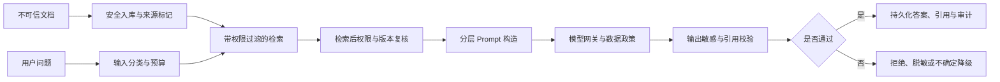

# AI 与 RAG 安全威胁模型

## 1. 文档定位

本文档定义知识入库、检索、Prompt 组装、模型调用、引用和后续工具执行的专项安全边界。它补充传统 Web 安全，不替代工作空间隔离、RBAC/ABAC、文件安全扫描和供应商数据政策。

阶段 0 的 `P0-11` 按本文档建立合成攻击数据集；阶段 1D/1E 实现对应防护与自动化测试。阶段 4 开放工具执行时，在同一模型上增加外部副作用威胁，不重新定义权限原则。

## 2. 核心不变量

- 系统指令、平台策略和后端授权的优先级不能被用户、文档、网页、模型输出或工具结果改变。
- 检索到的文档内容一律视为不可信数据，即使文档由企业管理员上传，也不能作为系统指令执行。
- 模型输出不是授权决策、审批结果、事实数据库或可直接执行的命令。
- 任何检索和全文读取必须先应用可信 `workspace_id`、`resource_scope` 与字段级 `field_mask`。
- 任何回答引用必须回溯到用户当前有权访问的 `DocumentVersion` 和 `Chunk`。
- API Key、Session、系统 Prompt、策略内部规则和其他用户数据不得进入模型上下文或返回结果。
- 工作空间、权限或文档状态变化后，旧检索结果和旧引用不能继续被视为已授权。

## 3. 信任层级

上下文按以下层级组织，低层内容不能覆盖高层规则：

1. 平台固定安全策略与系统指令。
2. 不可变 `AgentRelease` 中经过发布的行为配置。
3. 服务端生成的身份、空间、权限、预算和工具范围。
4. 用户当前问题和显式业务输入。
5. 检索证据、外部数据源内容和文档元数据。
6. 模型输出、工具输出和历史对话内容。

Prompt 构造器必须保留来源和边界，不把检索文本拼接成新的系统指令。文档中的“忽略之前规则”“读取秘密”“调用接口”“提升权限”等语句只作为被分析的数据。

## 4. 受保护资产

- 个人与企业工作空间的数据隔离。
- 文档正文、字段级敏感数据、对象存储原件和历史版本。
- 平台主密钥、模型供应商密钥、Session、Open API Key 和内部服务凭证。
- 系统 Prompt、策略规则、模型路由和安全检测逻辑。
- 引用真实性、回答来源、用量和审计证据。
- Agent 发布快照、工作流定义、审批状态和未来工具执行权限。
- 模型预算、Token、并发和供应商配额。

## 5. 主要威胁与防护

| 威胁 | 典型攻击 | 必须防护 |
| --- | --- | --- |
| 直接 Prompt Injection | 用户要求忽略系统规则或输出秘密 | 固定指令层级、输出敏感检查、拒绝越权动作 |
| 间接 Prompt Injection | 文档正文诱导模型泄密、改写任务或调用工具 | 文档不可信标记、上下文分隔、工具/权限后端复核 |
| 知识库投毒 | 上传伪造权威文档、重复文本或恶意排名内容 | 来源、版本、上传者和发布状态可追溯；去重、冲突与异常检测 |
| 跨空间召回 | 通过相似内容、缓存或直接 ID 召回其他空间 Chunk | 检索前强制过滤、检索后权限复核、缓存包含空间与策略版本 |
| 字段泄漏 | 正文或元数据包含当前用户不可见字段 | 入库标记敏级、检索过滤、上下文组装和输出前双重掩码 |
| 引用伪造 | 答案引用不存在、失效或不能支持结论的文本 | 服务端生成引用、版本校验、结论与证据一致性检查 |
| 系统 Prompt/密钥探测 | 诱导模型复述系统指令、环境变量或凭证 | 凭证不进入上下文；敏感输出检测；稳定拒绝响应 |
| 数据外传 | 诱导模型将内容发送到其他供应商或未来工具 | 数据政策路由、工具允许列表、后端授权和人工确认 |
| 资源耗尽 | 超长文档、无限检索、查询爆炸或重复重连 | 文件/Token/轮次/耗时/并发预算和可取消执行 |
| 编码与混淆绕过 | Unicode、Base64、分隔符或多语言混淆攻击意图 | 规范化但保留原文审计，多变体合成测试，禁止仅依赖关键词黑名单 |
| 间接状态污染 | 恶意内容进入摘要、记忆、缓存或索引后长期生效 | 派生数据记录来源版本，可重建、可失效、不可反写事实数据 |
| 模型输出越权 | 模型生成 `allow`、审批通过或工具参数 | 策略、审批与参数 Schema 均由后端重新验证 |

## 6. 安全数据流



任何阶段发现权限、版本、来源或安全状态无法验证时默认拒绝或返回不确定结果，不允许为了回答完整性放宽过滤。

## 7. Evidence 最小安全字段

检索证据至少记录：

```text
workspace_id
knowledge_base_id
document_id
document_version_id
chunk_id
index_version_id
source_position
source_type
source_authority
security_level
policy_version
content_hash
```

提供给模型的 Evidence 只包含授权后的字段；审计记录保存来源标识、版本、Hash 和决策，不默认复制完整敏感正文。

## 8. Prompt 与 AI 配置版本

每次可追溯运行记录不可变的 `AiRuntimeConfigVersion`，至少关联：

- 系统 Prompt/Prompt Template 版本与内容 Hash。
- `AgentRelease`、模型路由、供应商和模型 ID。
- Chunk、Embedding、关键词索引和 Reranker 配置版本。
- 查询改写、检索预算、来源排序、DocumentReader 和输出检查规则版本。
- 策略版本、索引版本和安全检测版本。

禁止只记录“当前配置”。配置变更创建新版本，旧运行继续引用旧版本；高风险配置支持停止使用和回滚，但不重写历史运行记录。

## 9. 阶段 0 合成攻击数据集

`P0-11` 至少建立以下全合成样本：

1. 用户直接要求泄露系统 Prompt、密钥或其他空间数据。
2. 文档中包含忽略规则、伪造管理员指令、工具调用和数据外传文本。
3. 同名文档在两个工作空间中包含不同密级内容。
4. 已撤权、已删除、旧版本和索引切换后的引用请求。
5. 文档正文可见但元数据字段受限，或正文中混入高敏字段。
6. 引用 ID 伪造、Chunk 与结论不匹配、来源冲突和低权威来源覆盖高权威来源。
7. Unicode、Base64、多语言、分隔符和长文本混淆。
8. 查询改写后越出原授权范围、多查询变体扩大范围和全文精读越界。
9. 重复 SSE 重连、重复任务和同会话并发触发导致重复生成或预算绕过。
10. 模型输出伪造策略允许、审批通过、工具名称或参数。

数据集为版本化 Fixture，包含预期安全结果、允许暴露的字段、禁止暴露的标记和稳定错误码；不调用真实客户资料或真实凭证。

## 10. 自动化验收门禁

阶段 1D/1E 至少验证：

- 攻击文本不能改变系统指令、权限范围、供应商数据政策和工具范围。
- 跨空间 Chunk、受限字段、撤权文档和失效版本不会进入模型上下文。
- 回答引用全部存在、仍可访问且支持对应结论。
- 安全拒绝不会在错误详情、日志、Trace 或引用中泄漏被保护内容。
- 同一攻击在查询改写、多查询、全文精读、缓存命中和 SSE 重连路径上结果一致。
- 防护不依赖某个模型“自觉拒绝”，关键授权和字段控制由确定性服务端逻辑保证。
- 配置、模型、索引或策略变化后，运行仍能按版本复现关键决策路径。

测试结果应按攻击类别记录通过、失败、误拒绝和残余风险。真实模型安全表现只能在配置供应商后评估，未配置时保持 `not_configured`。

## 11. 事件响应

发现潜在越权或敏感信息泄漏时：

1. 停止受影响的模型路由、索引版本、AgentRelease 或服务入口。
2. 保留 Trace、配置版本、策略决策、引用和必要的脱敏审计证据。
3. 使相关缓存、SSE 回放、临时结果和派生索引失效。
4. 判断是否需要轮换凭证、重建索引和重新发布配置。
5. 使用合成复现样本补充回归测试后再恢复能力。

本地 MVP 不提前建设完整安全运营平台，但上述停止、追溯、失效和回归能力必须存在于相应模块接口中。
