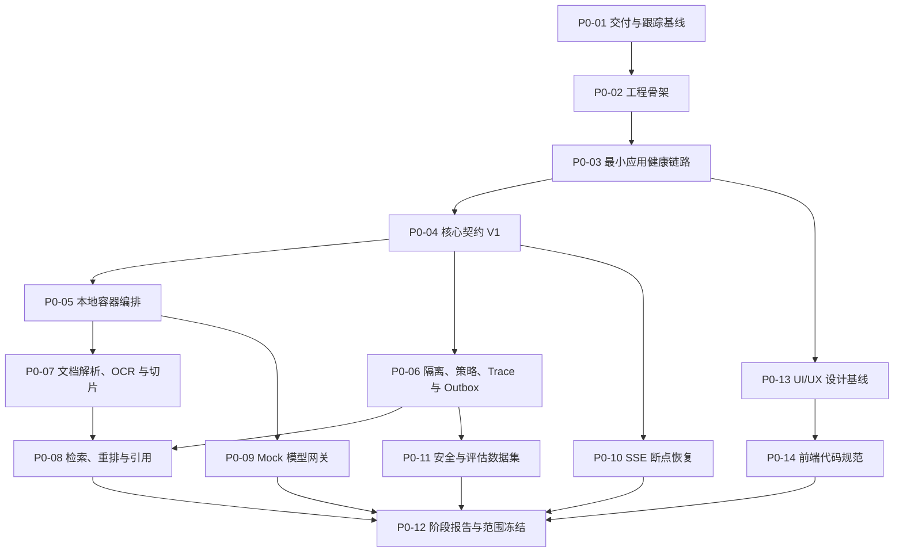

# 阶段 0 实施计划

## 1. 阶段目标

阶段 0 用于冻结产品边界、核心契约和高风险技术方案，并形成可进入阶段 1 的本地工程与验证基线。阶段 0 不交付完整业务 MVP，也不建设 Go 运行时、真实多源连接器、LLM Grading 在线评分和多模态图片问答。

## 2. 建设顺序

## 3. 节点交付与门禁

| 节点 | 主要交付物 | 完成门禁 |
| --- | --- | --- |
| `P0-01` | Git/文档规范、项目看板、阶段计划 | 文档链接有效，节点、状态和提交规则一致 |
| `P0-02` | Monorepo 目录、Node 24/Python 3.12 约束、基础配置 | 工具链与配置检查通过，无凭证进入仓库 |
| `P0-03` | React Web、FastAPI API、Worker 健康端点 | 测试、类型检查和构建通过 |
| `P0-04` | OpenAPI、SSE、事件、错误码、领域类型和策略接口 | Schema 可机器校验，兼容性测试通过 |
| `P0-05` | PostgreSQL、Redis、MinIO、Tika、应用服务和 `./platform` | 一键启动、诊断、状态和停止通过 |
| `P0-06` | 工作空间边界、策略接口、W3C Trace、Transactional Outbox 骨架 | 越权请求被阻止，重复消费不重复产生副作用 |
| `P0-07` | 文档解析、OCR、切片验证实现和报告 | 固定样本可复现，失败原因可定位 |
| `P0-08` | BGE-M3、关键词检索、Reranker、全文精读与引用验证 | 测试答案可定位到有效原文和版本 |
| `P0-09` | Mock Provider、主备路由、超时、熔断、降级和 Usage | 失败矩阵和计量测试通过 |
| `P0-10` | SSE 事件存储、`Last-Event-ID`、回放上限和会话锁 | 断线回放无丢失、乱序和重复生成 |
| `P0-11` | 合成评估集、越权、字段泄漏和失败恢复样本 | 数据全部标记为合成，安全用例自动化通过 |
| `P0-12` | SBOM、许可证清单、阶段 0 报告和冻结决策 | 必需节点均完成，剩余项明确后置，阶段报告通过 |
| `P0-13` | UI/UX 基线、响应式断点、动态菜单壳层约束和阶段 1 优化清单 | 文档完整，现有页面视口检查通过，后置事项和验收门禁明确 |
| `P0-14` | Web 前端目录、职责、类型、状态、接口、样式、测试和质量门禁规范 | 与当前技术栈和仓库契约一致，参考规则的采用与排除边界明确，阶段 1 落地顺序可执行 |

## 4. 节点输出文档

阶段 0 持续更新以下输出：

- `docs/project-progress.md`：实时状态和 Git 提交索引。
- `docs/stages/stage-0-report.md`：环境、验证命令、指标、限制和结论。
- `docs/decisions/`：组件替换、契约边界等关键决策。
- `docs/design/ui-ux-baseline.md`：前端布局、导航、响应式、可访问性和视觉变更基线。
- `docs/governance/frontend-code-standards.md`：Web 前端代码结构、工程规则和质量门禁。
- `contracts/`：可机器校验的接口和事件契约。
- `tests/fixtures/`：仅包含合成数据的固定测试集。

每个节点验收后先同步文档，再使用节点 ID 创建独立提交。详细规则见 [交付、文档与 Git 管理规范](../governance/delivery-and-git.md)。

## 5. 阶段结束条件

阶段 0 必须满足架构设计第 18 章的验收标准。真实模型质量和容量认证分别保留 `not_configured` 与 `not_run` 状态，不影响阶段 0 关闭；但不得把 Mock Provider 或小规模测试结果描述为真实模型质量或容量认证通过。
