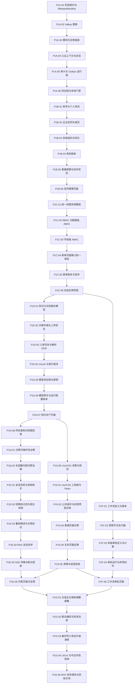

# 阶段 1 实施计划

## 1. 阶段目标

阶段 1 交付可在本地 Docker 环境运行的个人版与企业版 MVP。两类空间共用核心实现，并完整覆盖复杂组织、字段级 ABAC、自定义菜单、页面与接口统一权限、自定义工作流、多级审批、知识入库、RAG 引用和 SSE 断点续传。

本阶段不建设 SaaS、Go 接入或运行层、Channel Gateway、Durable Run、真实多源数据连接器、LLM Grading 在线评分、多模态图片问答、Agent 自动写操作和大规模微服务拆分。真实供应商未配置时，模型相关节点先使用 Mock Provider 完成功能门禁；涉及真实供应商能力的结论保持 `not_configured`。

## 2. 交付规则

- 严格按节点依赖实施；每个节点完成实现、专项验收、文档同步后形成一次独立 Git 提交。
- 每个节点开始和完成时更新 [`项目进度看板`](../project-progress.md)，验证事实持续写入 [`阶段 1 验证报告`](./stage-1-report.md)。
- 测试数据只使用版本化合成数据；不得提交真实个人资料、企业资料、API Key 或供应商密钥。
- 前后端分别执行现有代码规范，统一门禁为 `./scripts/verify`；涉及容器和数据库的节点追加 `./platform doctor`、Migration 和集成测试。
- 当前没有 Linux 验收机时，Linux 结论保持 `not_run`，不得使用 macOS Docker 结果代替。

## 3. 建设顺序

## 4. 里程碑 1A：工程底座与核心契约

| 节点 | 交付目标 | 完成门禁 |
| --- | --- | --- |
| `P1A-01` | 冻结阶段 1 核心实体与接口增量，建立 `ReleaseManifest` Schema、兼容矩阵和生成骨架 | OpenAPI/SSE/事件/错误码兼容测试通过；Manifest 可复现且能拒绝不兼容组合 |
| `P1A-02` | 按 `ADR-001` 将 Redis 7.4 替换为固定 Valkey 8.x | Compose、健康检查、协议、持久化/重建、API、Worker 与 SSE 基线回归通过 |
| `P1A-03` | 建立正式模块化单体目录、依赖装配、统一错误映射和 Migration 基线 | 架构反例门禁生效；空库升级和回滚检查通过 |
| `P1A-04` | 建立账号认证、可信 `RequestContext`、本地会话与 API Key 加密边界 | 伪造身份、跨空间上下文和失效会话被拒绝；密钥不以明文落库或进入日志 |
| `P1A-05` | 建立审计事实、Outbox 发布调度、幂等消费和 Trace 跨 HTTP/任务/事件传播 | 事务回滚、重复投递、故障恢复和 Trace 链路集成测试通过 |
| `P1A-06` | 固定契约生成器、Secret Scanner、镜像扫描策略和发布级供应链门禁 | 本地可执行项通过；未配置扫描明确失败或标记，不允许静默跳过；Linux 保持独立验收状态 |

## 5. 里程碑 1B：工作空间、复杂组织与套餐

| 节点 | 交付目标 | 完成门禁 |
| --- | --- | --- |
| `P1B-01` | 注册、登录、默认个人空间和个人空间所有者模型 | 新账号只产生一个默认个人空间；非所有者不能访问 |
| `P1B-02` | 企业空间、成员邀请、加入、离开、停用和空间切换 | 生命周期状态与审计一致；跨空间访问全部失败关闭 |
| `P1B-03` | 多级部门树、成员多部门归属、主部门和岗位 | 环检测、层级移动、停用和继承范围测试通过 |
| `P1B-04` | 空间角色、部门角色、成员角色和确定性继承计算 | 冲突、撤权、成员离开和缓存失效后结果正确 |
| `P1B-05` | `Entitlement`、个人/企业套餐、配额、用量和空间状态 | 超额与停用由后端阻止；前端裁剪不作为安全边界 |
| `P1B-06` | 个人/企业空间切换、成员、组织和套餐管理页面 | 桌面与移动关键流程可完成，加载、空、错误和无权限状态齐全 |

## 6. 里程碑 1C：统一策略、菜单与接口权限

| 节点 | 交付目标 | 完成门禁 |
| --- | --- | --- |
| `P1C-01` | 建立 `Permission`、`Menu`、`PageResource`、`ApiResource` 和统一 `permission_code` 注册表 | 重复、悬空、未绑定和非法资源在发布前被检测 |
| `P1C-02` | 实现 RBAC、资源/数据级 ABAC 和统一策略决策点 | URL 直访与接口绕过不能越权；策略不可用时默认拒绝 |
| `P1C-03` | 实现字段级 ABAC、响应字段掩码和敏感级别规则 | 受限字段不能进入序列化响应、日志、检索或模型上下文 |
| `P1C-04` | 实现自定义菜单与页面、接口统一绑定 | 每个业务页面纳入菜单资源；前后端使用同一权限码且后端独立授权 |
| `P1C-05` | 菜单草稿、校验、发布快照、审批接口和版本回滚 | 发布快照不可变；失败发布不污染当前版本；可回滚到已验证版本 |
| `P1C-06` | 实现 React 动态应用壳层、路由生成和个人/企业菜单裁剪 | 刷新、深链、移动导航、无权限和菜单版本切换行为一致 |

## 7. 里程碑 1D：知识生产链与模型网关

| 节点 | 交付目标 | 完成门禁 |
| --- | --- | --- |
| `P1D-01` | 知识库、文档、文档版本、来源和敏感字段事实模型 | 工作空间、版本、删除与发布状态约束通过 Migration/集成测试 |
| `P1D-02` | S3 Adapter、对象上传、类型/大小校验和安全扫描接口 | 越权对象键、伪造类型、超限和扫描失败均阻止入库；MinIO 保持可替换 |
| `P1D-03` | `IngestionJob`、解析、中文 OCR Adapter、有限重试和失败定位 | MVP 格式合成集稳定解析；中文 OCR、表格、页码和失败码验收通过 |
| `P1D-04` | 权限元数据 Chunk、Embedding、关键词索引和索引版本切换 | 索引可重建、可追溯、原子切换；撤权与旧版本不会继续可见 |
| `P1D-05` | 模型供应商配置、自定义 `base_url`、加密 Key、能力探测和数据政策 | SSRF、明文密钥和未审核真实数据外发被阻止；无真实配置时保持 `not_configured` |
| `P1D-06` | 主备模型网关与不可变 `AiRuntimeConfigVersion` | Mock 故障矩阵、预算、熔断、用量、成本和版本追踪通过；扩展接口只冻结不实现 |
| `P1D-07` | 知识库、文档、入库任务和模型配置页面 | 上传到发布的状态可追踪；失败可定位并按权限重新执行 |
| `P1D-08` | 补齐系统所有者知识读取与入库权限种子，并回填现有空间 | 新注册个人空间、企业空间和历史系统所有者均可按统一 PDP 使用知识生产；Migration 往返不制造权限真空 |

## 8. 里程碑 1E：RAG 问答与基础 SSE 恢复

| 节点 | 交付目标 | 完成门禁 |
| --- | --- | --- |
| `P1E-01` | 会话、消息、`MessagePart` 和系统知识助手不可变发布快照 | 消息与运行可追溯到工作空间、模型配置和系统 `AgentRelease` |
| `P1E-02` | 权限前过滤、查询分类/改写、有限多查询和混合检索 | 检索预算有上限；跨空间、部门、文档和字段候选在模型前被剔除 |
| `P1E-03` | FastPass、Reranker、来源排序、受控全文精读和引用验证 | 引用绑定有效版本与原文；伪造、撤权、过期和冲突证据按规则降级 |
| `P1E-04` | 接入阶段 0 安全集的 Prompt Injection、投毒、泄漏和外发防护 | `p0-11-v1` 对应确定性安全断言通过，模型不能覆盖后端授权结果 |
| `P1E-05` | HTTP SSE、心跳、事件持久化、`Last-Event-ID` 和 24 小时回放 | 重连不重复生成，序号严格递增，跨空间游标、过期和预算超限失败关闭 |
| `P1E-06` | 问答、来源查看、流式状态、重连和反馈页面 | 桌面/移动端完成问答闭环；加载、取消、错误、恢复和引用交互完整 |

## 9. 里程碑 1Q：注释可维护性治理

该节点位于 `P1D-08` 与 `P1E-01` 之间，只提升代码可读性和自动治理，不改变业务行为、接口、数据库或运行架构。完成后所有后续节点直接执行增强注释规范。

| 节点 | 交付目标 | 完成门禁 |
| --- | --- | --- |
| `P1Q-01` | 采用 `digitizing` 的分层阅读思路，强化前后端文件职责、公开接口、字段语义和复杂流程注释，并完成当前手写源码治理 | TypeScript/Python AST 注释门禁与反例测试接入 `./scripts/verify`；当前手写源码全量通过；原有测试、类型检查和构建无回归 |
| `P1Q-02` | 建立 30/60/100 有效代码行分级规则，强化长函数内部重要阶段注释并治理当前源码 | AST 门禁能区分纯声明/排版与业务逻辑，拒绝缺少阶段说明、编号断裂和无保留原因的超长函数；当前源码和原有门禁全部通过 |

## 10. 里程碑 1F：自定义工作流与多级审批

| 节点 | 交付目标 | 完成门禁 |
| --- | --- | --- |
| `P1F-01` | 工作流草稿、不可变版本、发布和运行事实模型 | 非法图、循环、悬空节点和失效版本不能发布或运行 |
| `P1F-02` | 触发器、条件、知识检索、模型、审批和结果节点执行器 | 每类节点执行权限与预算复核；不执行用户脚本或外部写操作 |
| `P1F-03` | 多级审批定义及按资源、风险、部门和字段条件计算审批链 | 相同输入结果稳定；无审批人、冲突和越权条件失败可定位 |
| `P1F-04` | 审批实例、步骤、通过、驳回、转交、撤回、超时和审计 | 并发操作幂等，状态转换合法，审批前后业务与 Outbox 保持同事务 |
| `P1F-05` | 工作流设计、发布、运行、待办和审批页面 | 键盘与移动端可操作；无权限动作不展示且接口仍独立拒绝 |

## 11. 里程碑 1S：UnoCSS 样式治理

该轨道与 `P1E-01`～`P1E-05` 的后端能力建设可以并行，但必须在新增问答页面 `P1E-06` 和工作流审批页面 `P1F-05` 前完成，避免新页面继续积累待迁移 CSS Modules。

| 节点 | 交付目标 | 完成门禁 |
| --- | --- | --- |
| `P1S-00` | 接受 `ADR-003`，同步 UnoCSS 样式规范、UI/UX 基线、阶段计划和总体设计 | 文档互相引用且无冲突；明确 UnoCSS、Token、Ant Design 和保留 CSS 的职责边界 |
| `P1S-01` | 接入 UnoCSS Vite 插件、Wind 预设、`cn()`、语义 Token、项目断点和扫描门禁 | Preflight 关闭；开发/生产构建样式一致；未迁移页面无视觉变化 |
| `P1S-02` | 迁移公共组件和动态应用壳层 | 桌面侧栏、折叠、顶部栏、移动抽屉、焦点和无权限状态通过多视口验收 |
| `P1S-03` | 迁移登录、状态、概览、成员和组织页面 | 页面功能、表格、表单、空/错状态和现有测试无回归；对应 CSS Module 可删除 |
| `P1S-04` | 迁移知识生产和模型治理复杂页面 | 双栏、表格、弹窗、动态表单、移动布局和 Ant Design 局部覆盖通过验收 |
| `P1S-05` | 清理无引用样式并完成全页面视觉、响应式和可访问性验收 | 无无效 CSS/类名；六类视口、生产构建、前端测试和统一门禁通过；保留 CSS 有明确原因 |

迁移期间允许 UnoCSS 与 CSS Modules 共存。节点不能为了删除 CSS 文件改变页面业务行为、权限状态、路由、接口或主色调；每个页面验收通过后才删除对应旧样式。

## 12. 里程碑 1G：集成验收与 MVP 发布

| 节点 | 交付目标 | 完成门禁 |
| --- | --- | --- |
| `P1G-01` | 固定约 100 用户、7 部门、300～500 文档的版本化合成企业数据集 | 数据可重复生成、无真实标识、覆盖个人/企业主流程与异常状态 |
| `P1G-02` | 个人/企业端到端、联合越权、SSE、审批、恢复和模型故障验收 | 核心场景与 `p0-11-v1` 全部通过；失败项有稳定错误码和 Trace |
| `P1G-03` | 本地备份、恢复、导出、导入和数据库升级/回滚演练 | 加密备份可恢复到干净环境；校验和、Schema 与对象引用一致 |
| `P1G-04` | 全业务 UI/UX、响应式、可访问性和主色调评审 | 关键桌面/移动视口无溢出和遮挡；焦点、对比度、状态和导航门禁通过 |
| `P1G-05` | 运维手册、MVP 报告、ReleaseManifest、阶段关闭提交与标签 | `./scripts/verify`、容器诊断和端到端门禁通过；未执行项如实记录 |

## 13. 阶段状态口径

阶段 1 只有在全部必需节点完成、`core_functional=passed`、阶段报告给出通过结论、相关提交可追溯且 `stage-1-complete` 标签创建后才能关闭。容量认证、真实供应商质量和 Linux 宿主机验收没有对应环境时分别保持 `not_run` 或 `not_configured`，不影响本地 MVP 的功能结论，但不得被描述为生产容量或真实 AI 质量通过。
