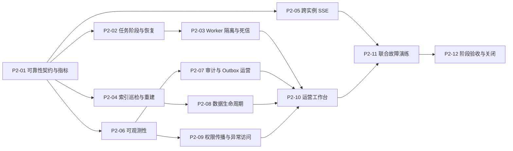

# 阶段 2 实施计划

## 1. 阶段目标

阶段 2 将阶段 1 已通过的本地个人版与企业版 MVP 提升为可稳定运营、可恢复、可追溯的数据与运行平台，重点完成任务可靠性、索引重建、跨实例 SSE、可观测性、Outbox 运营、权限传播和数据生命周期。

阶段 2 继续使用 React + Python 模块化单体 + Worker + PostgreSQL + Valkey + MinIO + Tika，不因为可靠性建设提前引入 Go、微服务或新消息中间件。`P2-05` 已按 [`ADR-005`](../decisions/ADR-005-cross-instance-sse-wakeup.md) 选择 Valkey Pub/Sub 无正文唤醒与 PostgreSQL 有界轮询兜底，不采用 Valkey Streams；PostgreSQL 始终保留 SSE 和业务事实写入权。

## 2. 继承基线

- 阶段 1 `core_functional=passed`，标签为 `stage-1-complete`。
- 数据库基线 Revision 为 `20260815_0035`，契约主版本、错误目录、权限注册表和 ReleaseManifest V1 继续兼容演进。
- 任务、索引、审计、Outbox、SSE 和本地恢复已经具备 MVP 事实模型；阶段 2 在此基础上增加运营状态、巡检、恢复与删除证明，不另建重复事实源。
- 阶段 1 的合成企业数据集 `p1g01-v1`、安全集 `p0-11-v1` 和联合验收清单继续作为回归基线；阶段 2 新增的故障数据必须保持全合成、可重复和不依赖外部网络。
- 真实供应商、AI 质量、Linux、镜像漏洞扫描和条件容量认证继续独立记录；未配置项不能由 Mock 或小规模可靠性测试替代。

## 3. 依赖顺序

## 4. 建设节点

| 节点 | 交付目标 | 完成门禁 |
| --- | --- | --- |
| `P2-01` | 冻结可靠性不变量、SLO/保留期/传播时限、故障分类、指标契约和版本化故障注入数据集 | 每项指标有事实来源、测量窗口和失败口径；超时、重复、乱序、部分失败和恢复场景可重复执行，不用平均值掩盖尾部失败 |
| `P2-02` | 完成 `IngestionJob → JobStage → JobAttempt` 运营事实、超时、取消、有限重试和人工恢复 | 重复投递不重复写事实或对象；取消与超时有稳定终态；历史 Attempt 不可变，恢复操作可审计 |
| `P2-03` | 隔离解析、OCR、Embedding、索引队列与 Worker 资源，建立死信、租约回收和安全并发调整 | 单类任务耗尽或故障不阻塞其他队列；过期租约和死信可恢复；并发重放不产生重复发布或索引 |
| `P2-04` | 建立索引版本一致性巡检、全量重建、差异修复和原子切换 | 只从事实数据重建完整派生索引；旧索引在切换前可服务；失败构建不可见且可清理，文档/Chunk/发布引用一致 |
| `P2-05` | 建立跨实例 SSE 通知、连接路由和消息快照恢复，保持 PostgreSQL 事件事实 | 任一 API 实例中断后客户端可连接其他实例继续回放；不重复创建 Run、不丢序号、不跨空间，不把通知层当事实库 |
| `P2-06` | 建立结构化日志、OpenTelemetry Trace、Prometheus 指标和分层健康/告警基线 | HTTP、任务、检索、模型、工作流和审批可按 Trace 关联；关键延迟、错误、积压和降级可观测；日志不泄漏凭据、正文或受限字段 |
| `P2-07` | 建立审计、用量、配额和 Transactional Outbox 的运营查询、积压恢复、重放与幂等巡检 | Outbox 积压可有界恢复；重复投递无重复副作用；审计可还原主体、资源、操作、策略版本和 Trace，用量可对账 |
| `P2-08` | 建立工作空间数据导出、删除、保留期执行和派生数据清理证明 | 删除覆盖业务事实、对象、索引、缓存和可删除事件；法定或安全审计保留项最小化且有依据；导出完整性和删除结果可校验 |
| `P2-09` | 建立策略缓存失效、权限变更传播、越权回归和异常访问告警 | 撤权在 `P2-01` 固定时限内同步到菜单、接口、检索和字段投影；缓存/通知故障时失败关闭；异常访问不暴露受限内容 |
| `P2-10` | 建设任务、索引、Outbox、指标、生命周期和恢复操作的受控运营工作台 | 页面只调用登记 API；危险操作具有权限、确认、幂等和审计；桌面/移动、加载、空、错误和无权限状态通过 |
| `P2-11` | 完成数据库、对象、索引、Valkey、Worker、API 实例、SSE 和 Outbox 联合故障演练 | 备份恢复、索引重建、实例切换、积压恢复和重复投递均产生可重复证据；恢复后权限、引用和对象校验一致 |
| `P2-12` | 完成阶段 2 端到端验收、运维更新、ReleaseManifest、阶段报告、关闭提交与标签 | `./scripts/verify`、容器诊断、可靠性清单和浏览器门禁通过；未执行外部项如实记录；创建 `stage-2-complete` 标签 |

## 5. 全局门禁

每个节点继续执行：

- 中文文档和中文高价值注释规范，30/60/100 行长函数门禁。
- UnoCSS 完成态、React/Python 架构边界、OpenAPI/事件/错误码兼容和生成产物无漂移。
- 可信 `RequestContext`、工作空间隔离、后端 PDP、字段级 ABAC、唯一写入权、审计与 Outbox 同事务。
- Ruff、mypy strict、pytest、Prettier、ESLint、TypeScript、Vitest、生产构建和风险相称的 PostgreSQL/Valkey/MinIO/Tika 集成测试。
- 每个节点独立验收、同步阶段报告和进度看板，并形成独立 Git 提交。

## 6. 范围边界

阶段 2 不建设 SaaS 部署、Go 接入层或运行层、Channel Gateway、Durable Run、用户自定义 Agent 控制面、真实多源连接器、LLM Grading、多模态图片问答或 Agent 自动写操作。Agent 控制面属于阶段 3，受控工具副作用属于阶段 4，质量运营和私有化属于阶段 5。

小规模故障和持续运行测试用于验证正确性，不冒充条件容量认证。百万 Chunk、20/50 问答并发、500 条 SSE 和 100 QPS 仍由独立 `CAP-*` 节点在合适机器上验收。

## 7. 阶段关闭口径

阶段 2 只有在 `P2-01`～`P2-12` 全部完成、阶段可靠性结论为 `passed`、数据恢复/重建/删除/权限传播证据可追溯且 `stage-2-complete` 标签创建后才能关闭。真实供应商、AI 质量、Linux、镜像扫描和容量状态继续独立披露；它们不应被错误改写，但正式生产发布仍受既有供应链门禁约束。
