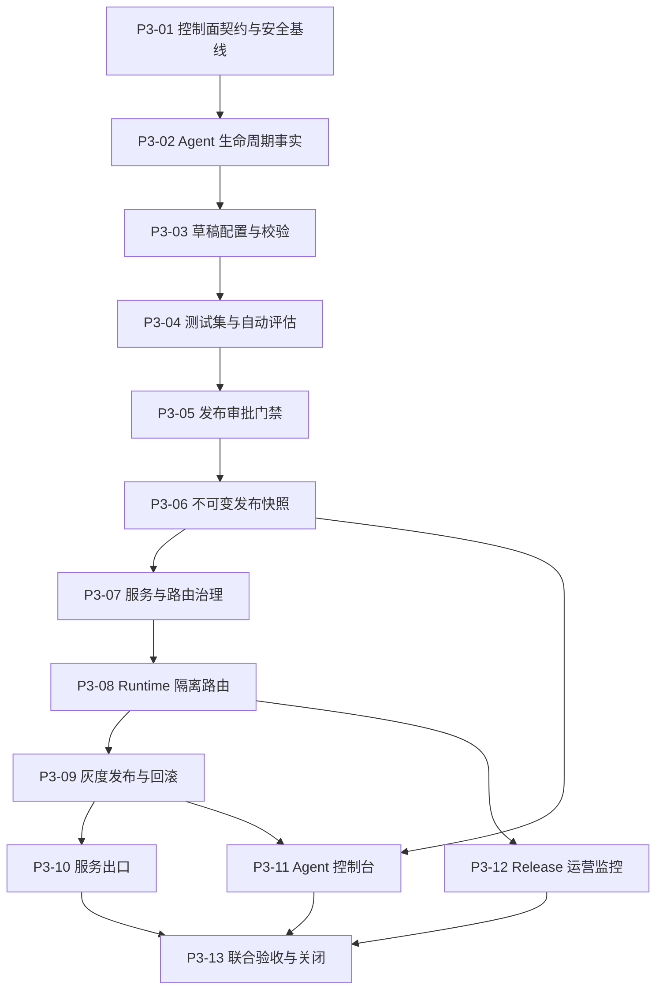

# 阶段 3 实施计划

## 1. 阶段目标

阶段 3 在阶段 1 的知识问答 MVP 和阶段 2 的可靠性底座上，交付用户可管理的 Agent 控制面与统一服务发布能力。个人空间和企业空间均可配置、测试、审批、发布、灰度和回滚 Agent；两类空间继续共用核心实现，通过权限、审批策略、菜单发布和配额区分治理方式。

本阶段只允许不可变 `AgentRelease` 进入 Runtime。`AgentDraft`、未通过测试的发布候选和未完成审批的版本均不能被服务路由引用；控制面不可用时，已有发布快照和服务路由仍须保持可运行。

## 2. 继承基线

- 阶段 1 `core_functional=passed`，由标签 `stage-1-complete` 冻结；阶段 2 可靠性结论为 `passed`，由标签 `stage-2-complete` 冻结。
- 当前数据库基线 Revision 为 `20260816_0049`；阶段 2 本地可靠性版本仍为 `0.2.0`，ReleaseManifest 摘要为 `17ae80ee…7b245d`。
- 继续复用阶段 1 的工作空间隔离、统一 RBAC/ABAC、字段过滤、自定义菜单与接口绑定、自定义工作流、多级审批、模型网关、知识检索、SSE 断点续传、审计、用量和 Transactional Outbox。
- 继续复用阶段 2 的 Worker 隔离、权限传播、可观测性、运营查询、备份恢复和故障演练能力，不建立重复事实源。
- 测试数据只使用版本化合成数据；真实模型供应商、AI 质量、Linux、镜像漏洞扫描和条件容量认证继续独立记录。

## 3. 核心不变量

1. `AgentDraft` 永远不能成为 Runtime 的执行输入，Runtime 只按唯一 `agent_release_id` 装载不可变快照。
2. `AgentRelease` 创建后不得原地修改；任何配置变化必须产生新草稿、新测试证据、新审批上下文和新发布版本。
3. 每次 Run 必须记录唯一 `service_id`、`service_route_version` 和 `agent_release_id`，历史运行不随当前路由变化漂移。
4. 发布快照必须固定 Prompt、模型与参数、知识范围、工作流、只读工具、输出约束、预算、测试集、评估结果和审批事实的版本或摘要。
5. 控制面写入、查询或审批故障不能阻断已经发布的服务；服务路由和发布快照不得依赖读取可变草稿才能运行。
6. 测试未达标、审批未通过、快照校验失败或路由前置条件不满足时一律失败关闭。
7. 灰度、正式切换和回滚只改变版本化路由事实，不修改既有 `AgentRelease`；并发发布必须有明确胜者且可审计。
8. 个人空间由所有者执行发布审批，企业空间按既有多级审批策略执行；菜单隐藏不构成安全边界，接口和资源授权继续由后端统一策略执行。
9. 阶段 3 工具配置仅允许登记并选择阶段 1 已授权的只读工具，不实现外部写操作、凭证直传或阶段 4 的工具执行状态机。
10. 自动评估只使用固定数据集、确定性规则和现有质量指标，不调用 LLM Grading 在线评分，也不实现多模态图片问答。

## 4. 建设顺序

截至 2026-08-16，`P3-01`～`P3-09` 已完成并通过独立验收，当前按依赖顺序实施 `P3-10` 服务出口。

## 5. 建设节点

| 节点 | 交付目标 | 完成门禁 |
| --- | --- | --- |
| `P3-01` | 冻结 Agent 控制面领域模型、状态机、计划 OpenAPI Operation/事件增量边界、错误码、权限菜单标识、安全不变量和版本化合成验收集 | 契约能拒绝草稿执行、越权发布、可变快照和未登记配置；个人/企业、测试失败、审批拒绝、灰度和回滚场景均有可重复合成样本；计划标识不提前进入活动注册表；同主版本兼容检查通过 |
| `P3-02` | 建立工作空间隔离的 `Agent`、`AgentDraft`、发布候选和 `AgentRelease` 生命周期事实 | 草稿并发更新受版本控制；历史版本可追溯；发布快照更新/删除由数据库约束拒绝；跨空间读写失败关闭；审计与 Outbox 同事务 |
| `P3-03` | 建立 Prompt、模型参数、知识范围、自定义工作流和只读工具的草稿配置、引用与发布前校验 | 配置只引用当前工作空间可用且已发布的资源版本；凭证不进入草稿或 Prompt；失效引用、越权知识和写工具被拒绝；配置摘要稳定可复算 |
| `P3-04` | 建立固定测试集、规则/指标评估、安全测试、阈值策略和不可变测试运行结果 | 同一快照与数据集结果可重复；失败、超时和跳过样本进入结论；越权、提示注入、引用和输出结构测试必需且不能被普通质量分抵消；未达阈值不能申请发布 |
| `P3-05` | 复用既有工作流和多级审批引擎完成发布审批 | 个人空间所有者审批和企业多级审批均可配置并验收；审批绑定候选摘要、测试结果和策略版本，配置变化后旧审批自动失效；越权、自审限制和超时动作按既有策略执行 |
| `P3-06` | 生成可验证、不可变且绑定测试与审批证据的 `AgentRelease` | 单事务写入发布快照、来源证据、审计和 Outbox；重复请求幂等；快照摘要可复算，数据库与应用双层拒绝变更；失败生成不留下可路由半成品 |
| `P3-07` | 建立 `Service`、版本化 `ServiceRoute`、访问策略、启停状态和系统知识助手迁移 | `service_id` 只路由到有效 `AgentRelease`；服务状态和访问策略受统一权限约束；阶段 1 系统助手行为与历史会话保持兼容；路由变更可追溯 |
| `P3-08` | 建立 Runtime 发布快照装载、唯一版本绑定、缓存失效和控制面故障隔离 | 任一 Run 固定唯一发布版本；草稿或可变配置不能通过旁路执行；控制面数据库查询故障时已发布服务继续运行；缓存损坏时从发布事实安全恢复而不回退草稿 |
| `P3-09` | 建立灰度、正式切换、一键回滚、并发发布控制和发布前置门禁 | 灰度分配稳定且可解释；正式切换原子生效；异常版本可回滚上一有效 Release；并发操作不产生分叉当前路由；在途 Run 不漂移，新 Run 按新路由执行；基于运行指标的异常自动阻断由 `P3-12` 建设 |
| `P3-10` | 交付自定义知识 Agent、场景应用和 Open API 服务出口 | 三类出口复用同一服务路由与访问策略；Open API Key Scope 只能收窄权限；HTTP/SSE 契约一致、限流和配额生效；不存在 Channel Gateway 或未授权外部写操作 |
| `P3-11` | 建设 Agent 列表、编辑、测试、审批、服务管理、灰度和回滚页面 | 所有页面进入自定义菜单管理，菜单和接口统一绑定；个人/企业按权限看到可执行操作；失败时清空陈旧敏感状态；桌面与移动端无页面级溢出并满足现有可访问性基线 |
| `P3-12` | 建立 `AgentRelease` 级质量、延迟、错误、降级和成本运营视图及告警 | 指标可按服务和 Release 聚合且不泄漏 Prompt、正文或高基数敏感标识；灰度与上一版本可比较；阈值异常可阻断晋级并为人工回滚提供证据，不使用 LLM Grading 冒充质量结论 |
| `P3-13` | 完成个人/企业联合验收、控制面故障演练、发布报告、ReleaseManifest、阶段关闭提交与标签 | Runtime 不执行草稿、控制面故障不影响已发布 Agent、每个 Run 唯一追溯 Release、测试失败无法发布、异常版本可回滚、`service_id` 稳定路由六项核心门禁全部通过；统一门禁、容器、浏览器和阶段报告完成后创建 `stage-3-complete` 标签 |

## 6. 验收证据要求

- 每个节点至少执行对应的单元、契约、安全和真实 PostgreSQL 集成测试；涉及 Migration 时验证空库与非空库升级，并保持阶段 1、阶段 2 发布兼容。
- 涉及 Runtime、SSE、Worker 或路由时追加容器链路与 `./platform doctor`；涉及控制台页面时追加 `1440×900` 和 `390×844` 浏览器验收。
- `P3-08`、`P3-09` 和 `P3-13` 必须覆盖控制面不可用、并发发布、在途 Run、路由切换、回滚和跨空间攻击，失败与超时样本不得从统计结果中剔除。
- 自动评估明确区分 `core_functional`、`provider_integration`、`ai_quality` 和 `capacity_certification`；Mock Provider 只能证明功能链路，不能替代真实供应商或 AI 质量结论。
- 所有节点在 `./scripts/verify` 通过、验证报告和进度看板同步后独立提交；提交 SHA 可由下一次文档提交回填，阶段关闭前必须全部核对。

## 7. 明确后置范围

阶段 3 不建设 SaaS、Go 接入或运行层、真实多源数据连接器、LLM Grading 在线评分、多模态图片问答、Channel Gateway、Durable Run、Agent 外部写操作、复杂跨系统长任务或大规模微服务拆分。

阶段 4 才引入受控工具执行、写操作确认、幂等和任务状态机；阶段 5 再完成真实模型质量运营、合规和规模化。多源数据连接器只保留既有接口边界，不在本阶段实现具体连接器。

## 8. 文档与提交规则

- 节点开始、受阻和完成时同步 [`项目进度看板`](../project-progress.md) 与 [`阶段 3 验证报告`](./stage-3-report.md)。
- 关键数据写入权、发布路由、故障隔离或协议主版本发生变化时，先按 [架构决策管理规范](../governance/architecture-decisions.md) 形成 ADR。
- 每个节点按 [交付、文档与 Git 管理规范](../governance/delivery-and-git.md) 独立验收和提交，不合并多个节点制造不可追溯的大提交。
