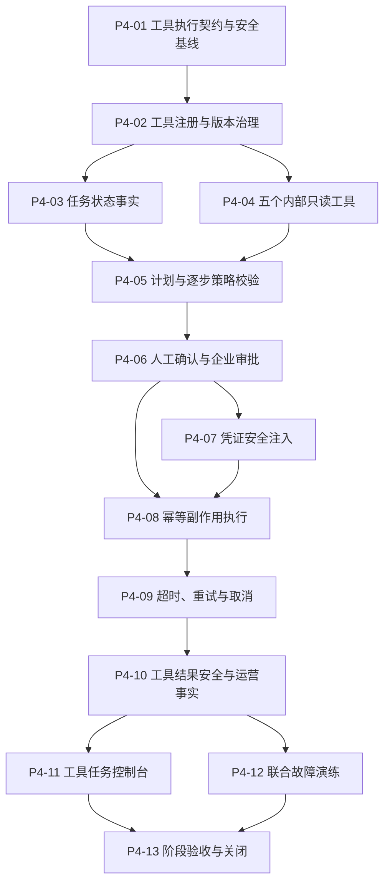

# 阶段 4 实施计划

## 1. 阶段目标

阶段 4 在阶段 2 的可靠任务底座和阶段 3 的不可变 AgentRelease、ServiceRoute 与统一服务出口上，交付受控工具执行和普通任务状态机。个人空间和企业空间都可以让已发布 Agent 调用已登记工具；读取、写入和高风险操作使用不同权限与确认策略，任何外部副作用都必须可追溯、可幂等重放、可取消且不能由模型直接执行。

本阶段只正式开放 `knowledge.search`、`document.read_authorized_range`、`workflow.get_status`、`approval.get_status` 和 `quota.get_usage` 五个内部只读工具。写操作通过全合成、明确授权的内部 Adapter 验证确认、审批、幂等和恢复机制，不接入真实客户系统，不开放任意 HTTP、SQL、文件系统、付款、发送、删除或供应商专属工具。

## 2. 继承基线

- 阶段 1 `core_functional=passed`、阶段 2 可靠性为 `passed`、阶段 3 Agent 平台为 `passed`，分别由 `stage-1-complete`、`stage-2-complete` 和 `stage-3-complete` 标签冻结。
- 当前数据库基线 Revision 为 `20260816_0057`；阶段 3 本地 Agent 平台版本为 `0.3.0`，ReleaseManifest 摘要为 `60e5d17d…73e7c81`。
- 继续复用可信 `RequestContext`、工作空间隔离、RBAC/ABAC、字段过滤、自定义菜单与接口绑定、多级审批、凭证加密、Transactional Outbox、Worker Lane、SSE 恢复、审计、用量和 Trace，不建立第二套权限、审批、密钥、事件或任务事实源。
- Runtime 继续只加载不可变 AgentRelease；工具配置必须来自 Release 冻结的允许列表，草稿、模型输出或请求参数不能临时扩大工具权限。
- 测试数据只使用版本化合成数据；真实外部 API、真实凭证、真实客户资料、真实供应商质量和生产容量继续独立记录。

## 3. 核心不变量

1. 只有不可变 AgentRelease 中冻结且当前仍获授权的工具版本可以执行；草稿、模型意图和客户端输入都不能新增工具。
2. 模型只能提出结构化工具调用意图，参数 Schema 校验、策略决策、确认、凭证注入和真实调用全部由确定性 Runtime 完成。
3. 工具定义必须版本化并固定读写类型、风险级别、参数/结果 Schema、超时、重试和凭证需求；已被 Release 引用的版本不得原地修改或删除。
4. 每个 Step 和 ToolCall 执行前都使用当前可信上下文重新执行统一策略；高风险操作不得使用过期授权缓存。
5. 读取、写入和管理权限必须分离；只读权限不能推导写权限，菜单或按钮隐藏不构成安全边界。
6. 有副作用的 ToolCall 必须先生成绑定 Run、Step、工具版本、规范参数摘要和策略版本的确认或审批事实；拒绝、过期、撤回或参数变化后不得执行。
7. 外部副作用发生前必须持久化稳定幂等身份；相同键和相同请求只返回原结果，相同键改变请求必须失败关闭。
8. 工具凭证只以 `credential_ref` 进入加密存储，并在 Adapter 调用边缘短时注入；不得进入 Prompt、模型上下文、事件、日志、审计正文或 API 响应。
9. 重试只允许明确幂等或可安全重放的操作，且必须有次数和时间上限；取消、超时和租约失效后，迟到结果不能覆盖当前事实。
10. Run、Step、Attempt、ToolCall、确认/审批、审计和 Outbox 按各自事务边界保持一致；队列至少一次投递不能造成重复外部副作用。
11. 工具返回内容按不可信输入处理，经过大小、结构、敏感字段和 Prompt Injection 边界检查后才能进入后续模型上下文。
12. 本阶段不允许任意 HTTP、SQL、文件系统或用户脚本，不建设真实多源连接器、供应商专属写工具或复杂跨系统长任务。

## 4. 建设顺序

截至 2026-08-16，阶段 2 和阶段 3 依赖已经通过并冻结，`P4-01`～`P4-07` 已完成并通过各自门禁，当前节点为 `P4-08` 合成内部副作用 Adapter 与幂等提交协议。

## 5. 建设节点

| 节点 | 交付目标 | 完成门禁 |
| --- | --- | --- |
| `P4-01` | 冻结工具定义、Run/Step/Attempt/ToolCall、确认、幂等、取消、错误码、权限菜单、事件和版本化合成场景契约 | 契约能拒绝草稿工具、未登记版本、越权调用、未确认副作用、重复副作用、凭证泄漏和迟到结果；个人/企业、只读/写入、取消和故障场景可重复 |
| `P4-02` | 建立工作空间可用工具目录、平台工具注册、不可变版本、参数/结果 Schema、风险和凭证需求治理 | 已引用版本不可变；读写/风险/超时/重试字段完整；工作空间权益和权限只能收窄；跨空间、未知字段和任意执行入口失败关闭 |
| `P4-03` | 建立普通任务 Run、Step、Attempt 和 ToolCall 状态事实、租约与唯一写入权 | 状态转换、当前 Attempt、终态、版本绑定和顺序由应用与数据库约束；重复投递、并发认领、迟到结果和跨空间攻击不改变已提交事实 |
| `P4-04` | 接入五个冻结内部只读工具及统一 Adapter 接口 | 参数与返回严格匹配版本 Schema；沿用原资源模块 RBAC/ABAC 和字段过滤；工具结果不泄漏未授权正文；无真实连接器或任意 HTTP |
| `P4-05` | 建立模型工具意图解析、执行计划冻结、每步预算和当前策略复核 | 模型输出只能形成候选意图；Release 允许列表、参数、预算、工具状态和当前 PDP 全部通过后才生成 Step；失败不调用 Adapter |
| `P4-06` | 复用审批引擎建立个人确认、企业高风险多级审批、拒绝、撤回和超时 | 确认绑定规范调用摘要与策略版本；个人由所有者确认，企业按风险策略执行；配置或参数变化使旧确认失效；未确认副作用为零 |
| `P4-07` | 建立工具凭证引用、授权、轮换与调用边缘短时注入 | 明文只存在于受控 Adapter 调用边缘；Prompt、模型、日志、审计、Outbox、SSE、异常和测试快照均无凭证；撤销或轮换立即失败关闭 |
| `P4-08` | 建立合成内部副作用 Adapter、稳定幂等身份和执行前提交协议 | 相同请求重放只产生一次副作用；同键异载荷拒绝；确认、幂等、调用结果、审计和 Outbox 可追溯；故障点不会产生无法判定的重复写入 |
| `P4-09` | 建立 Worker 执行、租约、超时、有限重试、取消、死信与人工恢复 | 只重试安全操作；取消和超时阻止新 Attempt，尽力传播到底层 Adapter；迟到成功不能覆盖取消/超时；恢复代际有上限且可审计 |
| `P4-10` | 建立工具结果安全处理、SSE 进度、审计、用量、成本和低基数观测 | 工具结果先执行结构、大小、敏感字段和注入检查；Run/Step 进度可恢复；日志指标不含参数正文、凭证或高基数主体；成本和失败样本不被剔除 |
| `P4-11` | 建设工具目录、执行计划、确认/审批、任务进度、取消和历史详情页面 | 所有页面和动作进入菜单/API 统一权限；个人/企业看到各自可执行动作；危险操作确认清晰；失败时清空陈旧状态；桌面与移动端无页面级溢出 |
| `P4-12` | 完成重复投递、Adapter 超时、响应丢失、凭证撤销、审批过期、取消竞态、Worker 重启和跨空间联合演练 | 同一入口执行固定合成场景，前后容器诊断通过；重复副作用为零；所有失败、超时和取消样本进入证据；本地最小证据不含参数正文或凭证 |
| `P4-13` | 完成个人/企业端到端验收、发布报告、ReleaseManifest、阶段关闭提交与标签 | 六项阶段验收标准全部通过；统一门禁、容器、浏览器、联合演练和阶段报告完成后创建 `stage-4-complete` 标签 |

## 6. 验收证据要求

- 每个节点至少执行对应单元、契约、安全和真实 PostgreSQL 集成测试；涉及凭证、Worker、SSE、策略、审批、Migration 或外部副作用时追加真实依赖与故障测试。
- 所有副作用测试使用版本化合成内部 Adapter 和合成数据，并断言副作用计数；不以 Mock 只返回成功替代幂等、响应丢失和恢复验证。
- `P4-03`、`P4-08`、`P4-09`、`P4-12` 和 `P4-13` 必须覆盖并发、重复投递、超时、取消、迟到结果、Worker 重启和跨空间攻击。
- 涉及页面时追加 `1440×900` 与 `390×844` 浏览器验收；涉及任务进度和确认时追加 SSE 断点恢复及陈旧确认失效。
- `provider_integration`、`ai_quality` 和 `capacity_certification` 继续独立记录；合成工具验收不能替代真实外部系统、真实模型质量或生产容量结论。
- 所有节点在 `./scripts/verify` 通过、验证报告和进度看板同步后独立提交；提交 SHA 可由下一次文档提交回填，阶段关闭前必须全部核对。

## 7. 明确后置范围

阶段 4 不建设 SaaS、Go 接入或运行层、真实多源数据连接器、LLM Grading、多模态图片问答、Channel Gateway、Durable Run、任意 HTTP/SQL/文件系统、真实企业微信/飞书等外部工具、付款或复杂跨系统长任务。

阶段 5 再处理真实模型质量运营、成本治理、隔离升级、合规和私有化。具体多源连接器和高级 AI 能力继续按项目后置边界独立立项，不进入阶段 4 关键路径。

## 8. 文档与提交规则

- 节点开始、受阻和完成时同步 [`项目进度看板`](../project-progress.md) 与 [`阶段 4 验证报告`](./stage-4-report.md)。
- 工具执行写入权、确认协议、幂等提交协议、凭证边界或状态机发生关键变化时，先按 [架构决策管理规范](../governance/architecture-decisions.md) 形成 ADR。
- 每个节点按 [交付、文档与 Git 管理规范](../governance/delivery-and-git.md) 独立验收和提交，不合并多个节点制造不可追溯的大提交。
