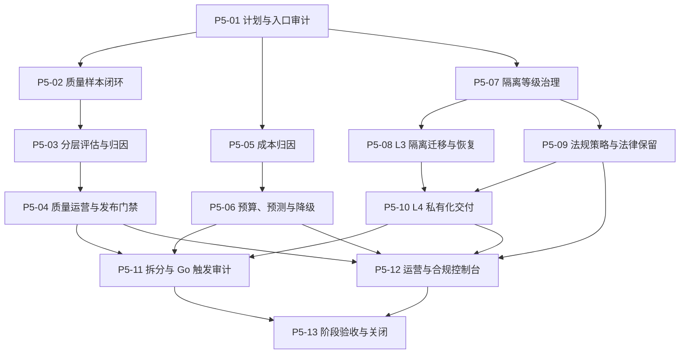

# 阶段 5 实施计划

## 1. 阶段目标

阶段 5 在阶段 2 的可靠性与数据治理、阶段 3 的不可变发布和阶段 4 的受控工具执行基础上，建设质量运营、成本治理、隔离升级、合规证明和私有化交付能力。平台需要把问题定位到检索、引用、模型、Prompt、工作流或工具层，把成本归集到工作空间、服务和发布版本，并为 L3 数据隔离与 L4 独立部署提供可迁移、可恢复、可审计的确定性边界。

本阶段不以本地 Mock Provider 替代真实模型质量或真实价格认证，不以单机功能测试替代容量认证，也不把尚未提供的客户法规、KMS/Vault、对象存储、域名证书或供应商数据政策视为已经配置。

## 2. 进入条件与当前事实

- 阶段 2 已由 `stage-2-complete` 标签冻结，可靠任务、数据生命周期、观测和联合故障演练基线可复用。
- 阶段 4 已由 `stage-4-complete` 标签冻结，标签指向关闭提交 `add5219`；P4-13 正式联合验收十五场景 `15/15`、前后两轮 13 项诊断、最终镜像、桌面/移动浏览器和统一门禁均已通过，本地受控工具执行入口为 `passed`。
- `P5-01` 计划基线提交为 `9088801`，入口审计完成提交为 `9647339`；`P5-02` 已完成版本化质量样本闭环，`P5-03` 已在提交 `f006c52` 完成六层评估与归因并通过统一门禁。`P5-04` 本地机制提交为 `e821801`，Responses 接入修复为 `c91b42b`，知识问答组件、证据密级和完成态来源复核续修为 `d464ccc`、`07d03b4`、`e941fc3`；真实供应商现已启用，政策 V11 已批准 `INTERNAL`、禁止训练、保留 3650 天且能力探测通过。首次真实 Run 绑定旧 V5 并因 2 秒 Attempt 超时进入规则降级；V6 已固定 `gpt-5.6-sol`、60 秒单次/总超时和单路由一次尝试。一次经用户授权的 V6 Run 已在单次 Attempt 内成功，但系统助手检索把目标 PDF 与另一份未在本次授权范围内的 `INTERNAL` 文档同时送入模型上下文，因此不能作为单 PDF 或真实质量通过证据，发现后未再次调用供应商。自定义 Agent 的检索现按 Run 绑定的不可变 Release 知识库范围与 PDP 授权取交集；系统助手仍保持工作空间级兼容语义，单文档复验必须使用只含目标 PDF 的独立知识库和绑定该知识库的自定义 Agent。固定网络区域、窗口和足量质量样本仍未形成，因此节点保持受阻。`P5-05` 已在 `eaa58fa` 完成本地成本归因机制，真实价格与供应商账单仍保持 `not_configured`。`P5-07` 已在 `06a7e25` 完成四级隔离控制面，`P5-08` 已在 `bd54bae` 完成 L3 迁移恢复，`P5-09` 已在 `44b6ede` 完成法规策略与法律保留，`P5-10` 已在 `36838d8` 完成 L4 独立实例交付。`P5-11` 已在 `fe0a946` 逐项审计九个拆分/Go 条件并决定保留模块化单体；`P5-12` 已在 `e2ac430` 完成五域只读治理控制台、Revision `20260817_0069`、Registry `v24`、最终镜像、13 项 doctor、双视口浏览器验收和统一门禁。当前 P5-13 前置审计因 P5-04 与 P5-06 的真实输入依赖受阻；后续仍不得绕过各自真实质量、价格、法域或目标环境门禁。
- Release 知识范围与历史消息因果顺序续修提交为 `09fda4c`，正式范围绑定入口实现提交为 `c5e75da`。Agent 控制台现可通过正式草稿更新接口检索并选择知识库，在同一事务内复核可见性、冻结不可变范围版本并替换草稿引用；列表回读只返回范围身份与知识库标识，不返回文档或检索正文。首次发布的 v1 Release `da5a60f7-499b-4e48-8bc9-8429112861dd` 实际绑定知识库 `ee0f2b61-e5ba-426e-972e-04e7f4bedcf1`，后续交叉审计确认该库同时包含目标 PDF 和“前端面试题”，因此不能用于单 PDF 隔离复验。2026-08-20 已通过正式 UI 把草稿 `r3` 改绑到隔离知识库 `edf6a10a-d877-4232-9edb-ada5b2caab74`，范围版本为 `a383ae74-634b-52f9-b4e6-82900e426a50`，并在确定性测试 `5/5`、个人所有者审批通过后发布 v2 Release `89b32a81-03e3-49cd-892f-0c76a1ea3f26`。用户于 2026-08-21 再次明确授权限定字段的 PostgreSQL 只读审计，但审批服务仍以 `503 Service Unavailable` 在命令启动前拒绝，尚不能把 UI 结果提升为数据库快照和 Run 计数结论；本轮没有访问 Docker、数据库或供应商。
- 2026-08-21 已确认用户级配置为 `approvals_reviewer = "user"`，官方配置语义会把审批提示交给用户；当前任务仍保留启动时的 `auto_review`，因此只读 Docker 预检在进程创建前再次被自动审核服务 `503` 拒绝，请求 ID 为 `081234b6-d1b3-49fd-80fc-6bf1e944e4ce`。该任务内不热加载用户级审批配置，后续必须在重启 Codex 或新任务中重试原始只读审计，不能通过包装命令或其他通道规避审批。
- 隔离复验的只读数据库审计已确认版本 4 的系统 Release/V6 在 `2026-08-20 07:54–08:22 UTC` 形成 8 次成功 Invocation，均单次 Attempt、无降级，输入/输出 Token 合计 `51,238/1,462`；该 Release 没有冻结知识范围，8 次调用中 7 次引用范围外文档，因此全部不能计入隔离质量样本。调用数量已经超过“单次问答”的字面范围，当前授权禁止重跑。
- 真实 Responses 供应商当前为 `configured`，模型 `gpt-5.6-sol` 的政策审核和能力探测已通过，单次验收配置 V6 已发布；真实线上质量、固定网络区域/窗口、足量样本、价格、限流样本和供应商账单仍为 `not_run/not_configured`。Mock Provider、本地确定性 Adapter 和合成数据仍只用于机制验证。
- 容量认证仍为 `not_run`，镜像扫描仍为 `not_configured`；两者按既有治理分别记录，不得混入质量或私有化通过结论。
- 私有化目标客户、适用法域、法律保留规则、外部 KMS/Vault、生产对象存储和证书体系尚未配置，相关生产适配结论保持 `not_configured`。

## 3. 核心不变量

1. 线上失败、用户反馈和人工修正只能形成版本化、可追溯且经过字段投影的评估样本；Prompt、回答正文、凭证和受限字段不得进入不必要的运营事实。
2. 质量结论必须关联工作空间、服务、AgentRelease、运行配置、测试集和评估器版本；样本不足、版本漂移、跳过或超时一律不能判定通过。
3. 检索、引用、模型、Prompt、工作流和工具层分别记录可解释原因码；总分不能抵消越权、泄漏、引用无效或工具误调用等硬失败。
4. `LLM Grading` 继续保持项目后置接口；阶段 5 的必需质量闭环使用确定性规则、固定测试集、人工反馈和已审核供应商真实运行事实，不提前启用在线评分模型。
5. 成本事实使用整数最小货币单位和 ISO 4217 币种，保留供应商报告值与平台估算值的来源差异；不得使用浮点金额或静默合并不同币种。
6. 成本必须归集到工作空间、服务、AgentRelease、模型、检索、OCR、Embedding、Reranker 和工具执行；失败、超时、降级和重试样本不能被剔除。
7. 预算、异常检测、预测和自动降级只能收窄能力；任何自动动作都必须版本化、可解释、可审计、可撤销，并保留人工恢复路径。
8. 隔离等级只能由平台根据套餐、合规策略和已批准迁移计划决定；客户端、模型输出和业务模块不得自行选择或覆盖 L1～L4。
9. L3 必须具有独立数据库、对象存储桶和加密密钥，迁移过程不得长期双写；失败回滚后工作空间只能有一个权威写入位置。
10. L4 私有化或独立实例必须复用相同契约、权限、审计、Migration、备份恢复和发布清单，不得维护行为不同的私有分支。
11. 法律保留只能阻止已批准范围内的数据删除，不能扩大读取权限；保留、解除、删除和证明均由独立权限、审计和不可变事实约束。
12. 服务拆分与 Go 演进只在设计文档 17.8 节量化条件成立后实施；未达到条件时输出不拆分结论，不为阶段完成制造第二套运行时。
13. 自定义 Agent 检索必须使用 Run 绑定的不可变 Release 知识库范围与当前 PDP 授权的交集；系统助手的工作空间级范围不能被当作单知识库或单文档授权，空范围、损坏快照、未知范围和跨空间引用均失败关闭。

## 4. 建设顺序

`P5-01` 已完成范围、事实源、门禁和外部条件冻结。`P5-02` 已完成版本化质量样本闭环，`P5-03` 已完成六层确定性评估，`P5-04` 已完成本地机制、真实供应商能力探测、与 `INTERNAL` 数据相容的政策审核、按实际证据密级执行外发、完成态来源复核、自定义 Agent Release 知识库范围修复和正式范围绑定入口；后续只读审计确认隔离复验实际仍使用没有冻结知识范围的系统 Release，8 次成功调用中 7 次混入授权范围外的同空间文档，因此全部不能计入隔离质量样本。首次自定义 Release 也错误绑定了包含两份文档的旧知识库；正式 UI 已把草稿 `r3` 改绑到隔离知识库并发布 v2 Release `89b32a81-03e3-49cd-892f-0c76a1ea3f26`，但其数据库只读审计尚未执行成功，不能提前声称范围和零 Run 已由 PostgreSQL 证明。真实质量完成门禁仍等待该审计、另行授权的有界复验、固定网络区域/窗口与足量样本。`P5-05` 已完成成本归因机制，真实价格结论继续未配置；`P5-07`～`P5-10` 已完成隔离控制面、L3 迁移恢复、本地法规失败关闭和 L4 独立实例交付。`P5-11` 已在没有已验证触发项时形成不拆分决策，`P5-12` 已完成只读运营与合规控制台，当前进入 `P5-13` 前置审计。需要真实质量、真实价格、适用法域或目标环境结论的节点仍必须等待对应审核配置和足够样本，不能由本地机制、用户外传授权或单次能力探测替代真实验收。

`P5-03` 冻结以下实现边界：评估层固定为 `retrieval`、`citation`、`model`、`prompt`、`workflow`、`tool`；每层至少 2 个样本并使用整数基点分数阈值；失败、超时、跳过、样本不足、身份漂移和批次污染统一失败关闭；`unauthorized_access`、`restricted_field_leakage`、`invalid_citation`、`unauthorized_tool_call` 为不可被平均分抵消的安全硬失败。运行、层和样本事实只保存状态、整数指标、低基数原因码、固定数据集/服务/AgentRelease/运行配置/评估器身份和 SHA-256 摘要，`LLM Grading` 保持关闭。

`P5-04` 冻结以下实现边界：运营来源固定为 `offline`、`canary`、`online_feedback`，发布阶段按离线、离线加灰度、全部三来源递增门禁；引用存在率必须为 `100%`，引用支持率、回答可接受率和正向反馈率分别不得低于 `95%`、`85%`、`80%`，越权、字段泄漏和未授权工具调用必须为零。窗口固定工作空间、P5-03 运行、数据集、服务、AgentRelease、运行配置及其内容摘要、供应商版本、模型、参数摘要、网络区域和时间范围；证据正文只计算 SHA-256，不持久化。自定义 Agent 的检索范围从 Run 冻结 Release 快照中的 `knowledge_scope_version_ids` 解析，复核 Release 摘要、运行配置身份、范围版本和范围摘要后，与当前 PDP 授权取交集；空范围返回空计划，未知、损坏和跨空间范围失败关闭。正式 Agent 草稿入口只接受当前账号可见的知识库集合，范围版本创建、草稿 revision 更新、候选失效、审计和 Outbox 必须同事务提交；列表查询批量回读范围版本，缺失或损坏引用失败关闭。系统助手保留工作空间级兼容行为，不提供单文档隔离承诺。`core_functional`、`provider_integration`、`ai_quality`、`capacity_certification` 四维状态独立记录，Mock 或全合成证据只能得到 `not_configured/not_run` 和阻断结论。

`P5-05` 冻结以下实现边界：成本组件固定为 `model`、`retrieval`、`ocr`、`indexing`、`embedding`、`reranker`、`tool`，同一来源 Attempt 可按不同 `meter_key` 记录多个计量项，失败、超时、降级和重试逐条入账。金额使用整数最小货币单位并按账本条目向上取整，同时保存平台估算、供应商报告、最终确认金额和金额来源；窗口绑定工作空间、Service、AgentRelease、运行配置摘要、价格版本、价格目录摘要、币种、区域和时间范围。供应商账单差异只允许固定白名单原因，证据正文仅计算 SHA-256；合成价格与未提供账单分别保持 `not_configured/not_run`，不得形成真实成本目标结论。

`P5-07` 冻结以下实现边界：Identity 保持工作空间和套餐写入权，Isolation 只读取最小权威事实，并以不可变策略版本、单一活动迁移计划和只追加路由版本治理 L1～L4。无已完成路由时确定性解析为 L1；L2 只改变按工作空间精确绑定的搜索命名空间；`rollback_required` 未收口时不得创建第二个计划。数据库拒绝未批准路由、跨空间 L2 命名空间、迁移历史删除和 P5-08/P5-10 前的 L3/L4 路由；真实目标环境、生产 KMS/Vault 和恢复结论继续为 `not_configured/not_run`。

`P5-08` 冻结以下实现边界：L3 资源档案只保存服务端路由键、资源身份摘要、独立密钥指纹和配置摘要，不保存连接凭证或密钥材料。物理执行器在短事务外按工作空间复制 PostgreSQL 事实和 MinIO 对象，目标写入在路由切换前保持关闭；检查点固定为源快照、数据库复制、对象复制、派生索引重建、第三资源备份恢复和删除传播。六项全部通过且源/目标摘要一致后，数据库才允许 L3 路由与计划完成状态原子提交；失败恢复先验证工作空间归属，并以只追加恢复事实收口。真实客户环境、生产 KMS/Vault、生产对象存储和容量继续为 `not_configured/not_run`。

`P5-09` 冻结以下实现边界：策略只能从受信 `RegulatoryPolicySource` 发布，生产默认源始终返回 `not_configured`，浏览器不能提交法域或外部审核结论。活动法律保留阻止 `purge` 与 `retention`，但不增加读取权限，也不阻止原本已经授权的导出；未配置法域阻止破坏性操作，导出仍记录 `not_configured` 证明。同一幂等键绑定原裁决，策略变化或解除后必须使用新键；工作空间事务锁与数据库 Trigger 串行化保留、解除和破坏性操作。策略、保留、解除和证明只追加且不进入普通导出/清除，证明只保存身份、摘要、原因码和计数。真实适用法域、法务复核与监管认证继续为 `not_configured/not_run`。

`P5-10` 冻结以下实现边界：L4 复用同一 Compose、OpenAPI、权限、审计、Alembic、ReleaseManifest 和加密恢复包，不维护私有分支。升级前必须创建恢复包，回滚通过恢复最近升级前快照完成，不依赖 Down Migration；新版本恢复包不能导入旧程序。`synthetic_local` 使用本机 PostgreSQL、Valkey、MinIO、Tika 和文件密钥，可在镜像预置后离线运行；真实模型联网、客户环境、生产 KMS/Vault、证书、对象存储、镜像扫描和容量分别保持 `not_configured/not_run`。部署档案和验收证据只保存版本、状态与摘要；应用恢复密钥只加密进入 `.aiprb`，恢复包加密密钥必须包外保管。

`P5-11` 冻结以下实现边界：服务拆分五项条件和 Go 演进四项条件必须按设计文档 17.8 节完整审计；`not_run/not_configured` 只能阻止迁移授权，不能解释为性能通过或条件已触发。当前容量、生产负载画像、团队所有权和 Go 运维能力没有合法输入，九项均无 `triggered` 事实，决策为 `retain_modular_monolith`。仓库不创建 Go 服务目录、第二套 Migration 或长期双写；未来触发后必须先有 ADR、通过的可归因基准、共享契约、影子流量、安全回归、单一写入切换和 Python 路由回滚。

`P5-12` 冻结以下实现边界：控制台只通过 `operations.control_tower.read` 和工作空间级只读 API 投影质量、成本、隔离、法规与私有实例五个治理分区；`blocked`、`not_configured`、`not_run` 必须按来源事实原样展示，前端和调用方不能提交或推断通过状态。危险操作仅展示二次确认、专用权限和后端重新授权要求，不新增执行或绕过接口；响应、日志和页面不包含业务正文、凭证、密钥或外部连接信息。Revision `20260817_0069` 只追加 Owner 默认读取授权、API 绑定和 Registry `v24` 菜单发布，存在自定义授权或后续发布时降级失败关闭。

`P5-13` 当前前置审计固定为失败关闭：P5-04 必须提供已审核真实供应商、固定模型/参数/网络区域和达到下限的授权样本，P5-06 必须提供已审核真实价格并完成预算、预测与降级节点。两项均完成前，不生成阶段 5 ReleaseManifest，不运行通过态联合验收，不形成阶段关闭提交，也不创建 `stage-5-complete` 标签；本地统一门禁、13 项 doctor 和 P5-12 控制台通过不能替代这些依赖。

真实供应商接入准备允许 `chat_completions` 与 `responses` 两种显式协议；CC Switch/Clash 类本地环境可在域名白名单之外显式允许 `198.18.0.0/15` Fake-IP，但该例外仅限 `local/test`，不会放宽生产 SSRF 边界。协议适配、配置创建或本地网络放行只表示具备后续验收入口，成功探测、数据政策审核、固定运行参数、价格和足够质量样本仍须分别提供事实。

## 5. 建设节点

| 节点 | 交付目标 | 依赖 | 完成门禁 |
| --- | --- | --- | --- |
| `P5-01` | 冻结阶段 5 范围、事实源、节点依赖、验收契约、外部条件和明确后置项 | 用户启动指令、阶段 2 基线 | 中文计划与报告完成；阶段 4、真实供应商、容量和私有化外部条件状态准确；不得把 Mock 或未配置项记为通过 |
| `P5-02` | 将失败样本、用户反馈和人工修正沉淀为版本化质量数据集 | `P5-01`、阶段 4 关闭 | 样本来源、授权投影、去重、版本、状态和删除传播可追溯；跨空间、敏感正文和无授权修正失败关闭 |
| `P5-03` | 建立检索、引用、模型、Prompt、工作流和工具的分层评估与问题归因 | `P5-02` | 固定评估器版本和原因码；样本不足、跳过、超时与身份漂移失败关闭；安全硬门禁不可被平均分抵消 |
| `P5-04` | 建立离线评估、灰度观察、线上反馈回流和发布质量门禁 | `P5-03`、已审核真实供应商与足够样本 | 固定模型、参数、网络区域、数据集和窗口；质量问题可定位到具体层；真实引用、回答、反馈和工具误调用指标达到冻结目标 |
| `P5-05` | 建立跨模型、检索、OCR、索引和工具的工作空间/服务/Release 成本归因 | `P5-01`、阶段 4 关闭 | 整数金额、币种、价格版本和估算来源完整；失败与重试纳入；账本、聚合与供应商账单差异可解释 |
| `P5-06` | 建立精细预算、异常用量、成本预测和自动降级 | `P5-05`、已审核真实价格 | 预算原子扣减且不超卖；异常和预测有固定窗口与样本下限；降级只收窄能力并可恢复；标准问答成本目标使用真实价格验证 |
| `P5-07` | 建立 L1～L4 隔离等级策略、资格、迁移计划和路由约束 | `P5-01`、阶段 4 关闭 | 客户端不能覆盖隔离等级；策略、套餐和迁移状态一致；跨等级访问、错误路由和未批准升级失败关闭 |
| `P5-08` | 建立 L3 独立数据库、对象存储桶、密钥的迁移、校验、切换与回滚 | `P5-07` | 合成高合规工作空间完成迁移和恢复；无长期双写；源/目标摘要、派生索引重建、备份恢复和删除传播一致 |
| `P5-09` | 建立法规策略、保留期、法律保留、解除和合规证明 | `P5-07`、法域与策略配置 | 法律保留不扩大读取权限；删除、导出和保留冲突有确定规则；审计与证明不含受限正文；未配置法域保持 `not_configured` |
| `P5-10` | 建立 L4 私有化/独立实例部署档案、配置校验、升级、备份恢复和离线依赖清单 | `P5-08`、`P5-09` | 独立本地实例用合成数据完成安装、升级、回滚和恢复；外部依赖与联网要求显式；生产 KMS、证书和客户环境分别记录 |
| `P5-11` | 依据量化指标决定是否拆分服务或引入 Go，并形成决策与回滚证据 | `P5-04`、`P5-06`、`P5-10` | 17.8 节触发条件逐项有数据；未触发时明确不拆分；触发时先 ADR、共享契约、影子流量、安全和回滚门禁，禁止长期双写 |
| `P5-12` | 建设质量、成本、隔离和合规运营控制台 | `P5-04`、`P5-06`、`P5-09`、`P5-10` | 菜单/API/字段权限统一；样本不足和未配置状态可见；危险操作二次确认；桌面与移动端无页面级溢出且无敏感字段泄漏 |
| `P5-13` | 完成联合验收、发布报告、ReleaseManifest、阶段关闭提交和标签 | `P5-11`、`P5-12` | 必需节点全部完成；统一门禁、Migration、隔离迁移恢复、私有化恢复、浏览器和联合演练通过；创建 `stage-5-complete` 标签 |

## 6. 验收证据要求

- 每个节点执行与风险匹配的单元、契约、安全和真实 PostgreSQL 集成测试；涉及 Valkey、MinIO、Worker、SSE、Migration、备份、恢复或容器时必须使用对应真实本地依赖。
- 质量与成本证据必须同时记录数据集、模型、参数、价格、网络区域、窗口、样本数、失败口径和估算来源；任一关键维度未知时结论为 `not_run` 或 `not_configured`。
- 真实模型质量和成本验收不得使用 Mock Provider 替代；Mock 只验证路由、计量、错误和预算机制。
- L3/L4 验收先使用明确标记的合成企业数据；生产客户、外部 KMS/Vault、生产证书和监管审查没有配置时单独保留未执行状态。
- 法律保留、数据删除和隔离迁移必须覆盖权限绕过、并发、失败回滚、重复投递、派生索引、对象和密钥；证明文件不得包含业务正文或凭证。
- 涉及前端的节点执行 `1440×900` 与 `390×844` 浏览器验收，检查权限裁剪、未配置/样本不足/失败状态、危险确认、局部滚动和控制台错误。
- 每个实现节点完成专项门禁后仍须执行 `./scripts/verify`，同步计划、报告和进度看板并形成独立提交；阶段关闭时核对全部 SHA 与 ReleaseManifest。

## 7. 明确后置与条件范围

- `LLM Grading` 继续只保留 `RelevanceGrader` 接口，在线或离线评分模型的接入均在阶段 5 完成后独立立项。
- 多模态图片问答、具体 `DataSource` 连接器、企业微信/飞书等真实外部工具、任意 HTTP/SQL/文件系统和复杂跨系统长任务保持项目后置。
- SaaS 商业发布、真实企业试点、监管认证、生产 KMS/Vault、正式证书、跨地域容灾和真实客户私有化上线不由本地合成验收代替。
- 20/50 问答并发、500 条 SSE、100 QPS 和百万 Chunk 继续属于独立容量认证；没有合适压测环境时保持 `not_run`。
- Go 接入层或运行层不是默认交付。只有 17.8 节量化条件成立并完成 ADR 后，才能在 `P5-11` 启动对应迁移节点。

## 8. 文档与提交规则

- 节点开始、受阻和完成时同步 [`项目进度看板`](../project-progress.md) 与 [`阶段 5 验证报告`](./stage-5-report.md)。
- 隔离等级、法律保留、部署方式、服务拆分、跨语言运行时、密钥或数据写入权发生变化时，先执行 [架构决策管理规范](../governance/architecture-decisions.md)。
- 每个节点按 [交付、文档与 Git 管理规范](../governance/delivery-and-git.md) 独立验收和提交。实现已提交但外部门禁未通过时保持“进行中”或“受阻”，不得通过文档措辞提前完成。
