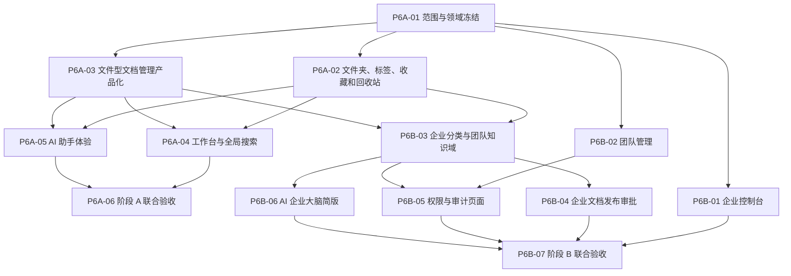

# 阶段 6 实施计划

## 1. 阶段目标

阶段 6 在现有本地智能平台底座上完成面向普通用户的产品化改造。第一版由阶段 A“知识组织与个人工作台”和阶段 B“企业知识门户与治理体验”组成，形成文件上传、组织、解析索引、发布、搜索、问答、成员治理、企业分类、发布审批和企业知识问答的完整闭环。

本阶段基于当前仓库改造，不重新立项，不重写身份、工作空间、权限、知识、检索、审批、Agent、Worker 和治理底座。在线文档编辑器、正文 AI 写回和多人实时协作不进入第一版。

## 2. 进入条件与并行关系

- 阶段 1～4 已完成并由对应标签冻结，现有本地功能底座可以复用。
- 阶段 5 的真实模型质量和真实价格节点仍受外部输入阻塞，但不阻塞范围、目录、文件、成员、企业分类、审批页面和合成数据机制建设。
- AI 助手与 AI 企业大脑可以实现本地机制和合成数据验收，对外开通仍受阶段 5 质量、成本、隔离和数据政策门禁约束。
- 参考站功能差距、个人/企业实测和改造计划已形成中文基线，测试数据不保留参考站凭证或真实资料。

### 当前执行状态（2026-09-05）

P6A-01～P6A-06 与 P6B-01～P6B-07 已全部完成。P6B-07 使用冻结的 `p6b07-v1` 全合成企业清单完成联合验收：前置与恢复 `./platform doctor` 均 13/13 通过，12/12 PostgreSQL 场景覆盖统计裁剪、成员生命周期、知识域交集、审批原子性、权限审计、企业大脑、撤权失败关闭、Migration 和跨空间攻击；最终原样 `./scripts/verify` 的 Web 122/122、Python 1082/1082 及全部工程门禁通过。桌面 `1440×900` 与移动 `390×844` 证据复用 P6B-01～P6B-06 的真实合成数据验收，联合验收器本身不驱动浏览器。P6B-07 独立提交为 `5b50d82`，阶段 6 第一版 A+B 已关闭并由 `stage-6-complete` 标签冻结。

## 3. 核心不变量

1. `KnowledgeBase → Document → DocumentVersion → DocumentPublication` 继续是内容、版本和发布的唯一事实链。
2. 文件夹、标签、收藏、企业分类和团队知识域只建立显式组织关系，不复制文档、来源、对象、解析产物、Chunk 或索引。
3. 所有新表、查询、缓存、任务、导出和引用以可信 `RequestContext.workspace_id` 和资源级 PDP 授权为边界；跨空间命中阻断整次操作并告警。
4. 文档上传、新版本、扫描、解析和索引不触发企业审批；只有把就绪版本切换为当前发布版本时才进入审批。
5. 删除进入回收站后立即退出普通列表与检索；恢复和永久删除必须可审计，永久删除复用数据生命周期清理链。
6. AI 企业大脑只读取当前企业中用户获权的团队知识域；空范围或范围验证失败时不得回退到全企业检索。
7. 场景是面向用户的 Agent 配置入口，工作流是确定性编排，发布后统一冻结为 `AgentRelease`；不建立第二套模型或工具 Runtime。
8. 第一版不创建在线正文表、编辑 revision、自动保存契约、编辑路由、文档 AI 写回、评论、光标或 CRDT/OT。
9. 新页面必须完整覆盖加载、空、错误、无权限、处理中、成功、失败、取消和重试等与业务相关的状态。
10. 非模型节点不得掩盖阶段 5 的 `not_run`、`not_configured` 或受阻事实；受影响的检索、权限和模型回归必须重新执行。

## 4. 建设顺序

`P6B-01` 和 `P6B-02` 可在 `P6A-02`～`P6A-05` 期间并行，但企业知识域、发布审批和企业大脑必须等待知识组织关系稳定。当前按顺序完成独立节点，不为了并行而把多个节点合并成一个提交。

## 5. 建设节点

| 节点 | 交付目标 | 完成门禁 |
| --- | --- | --- |
| `P6A-01` | 冻结第一版范围、术语、对象关系、模块所有权、页面流程和迁移规则 | D1～D14 全部确认；主设计、ADR、领域语言、阶段计划/报告和看板一致；明确在线编辑器后置；文档、链接、敏感信息和统一门禁通过 |
| `P6A-02` | 实现文件夹树、标签、收藏、回收站和保留期清理 | 空库/存量库 Migration、循环/跨空间/同名反例、目录/标签 PDP 资源标识、批量绑定、恢复、永久删除、活动任务竞态、已删除文档不再领取、审计、Outbox、确定性对象键、对象键前缀隔离、幂等物理删除、有限重试、成功后消费回执和桌面/移动页面通过 |
| `P6A-03` | 产品化上传、新版本、移动、解析详情、Chunk/索引状态、授权下载、发布、重试和批量操作 | 文件、版本、任务、发布和索引同一事实链；失败状态可见；下载失败关闭；权限与跨空间测试、契约、Worker 和页面验收通过 |
| `P6A-04` | 建设个人工作台、最近访问、统计和全局搜索 | 聚合口径固定；名称/内容搜索只返回获权且已发布内容；加载、空、错误、部分索引未就绪和响应式页面通过 |
| `P6A-05` | 增强 AI 助手知识范围、临时附件、快捷指令和会话归档 | 范围只收窄不扩大；临时附件生命周期明确；取消、失败、引用和归档可追溯；真实模型开通状态原样展示 |
| `P6A-06` | 完成阶段 A 联合验收 | 全合成个人数据完成创建、移动、删除恢复、解析索引、发布、搜索、问答、引用和审计闭环；迁移演练、统一门禁和浏览器回归通过 |
| `P6B-01` | 建设企业控制台聚合页 | 企业资料、成员/文档/存储统计、趋势和最近内容使用统一口径；数据时间窗、最终一致性和无权限状态明确 |
| `P6B-02` | 建设邀请、成员、部门、岗位和角色一体化团队管理 | 邀请、加入、撤销、过期、编辑、停用、移除和最后活跃完整；Owner 不可移除与撤权传播测试通过 |
| `P6B-03` | 实现企业分类、团队知识域、成员范围和文档/知识库绑定 | 唯一企业归属、PDP 交集、无隐式文件夹/内容复制；部门、成员、停用、跨空间、缓存漂移和 Migration 测试通过 |
| `P6B-04` | 将企业发布请求接入现有审批引擎 | 提交、待办、通过、驳回、撤回、过期和审批期间撤权完整；仅批准且复核通过时切换发布指针 |
| `P6B-05` | 建设角色权限矩阵和审计产品页 | 权限保存冲突、影响成员、字段脱敏、策略故障默认拒绝、筛选、详情和异步导出状态通过 |
| `P6B-06` | 建设只读当前企业知识域的 AI 企业大脑简版 | 知识域范围、引用、报告文件、调用统计和近期活动可追溯；不得读取个人空间；真实模型对外开通受阶段 5 门禁约束 |
| `P6B-07` | 完成阶段 B 隔离与治理联合验收 | 多成员/部门/角色、审批、撤权、统计、企业问答和跨空间攻击场景通过；统一门禁、迁移、浏览器和阶段报告完成 |

`P6A-02` 不实现参考站的文件夹 RAG 开关。根据 `ADR-016`，`KnowledgeBase` 是唯一检索边界，`KnowledgeFolder` 只承担内容组织；提供一个不参与真实检索和索引决策的开关会制造失真状态。后续如需更细粒度范围，应通过显式知识库绑定或团队知识域策略设计，不改变文件夹职责。

`P6A-03` 延续同一边界：详情聚合只读取当前获权文档的不可变版本、来源、解析任务和最新索引状态，不返回对象键、解析产物键或正文；原文件下载使用独立 `knowledge.document.download` 权限和文档 ID 资源级授权，通过同源服务端代理返回 Blob。对象读取前后分别执行短事务复核，成员、空间、知识库、文档、版本或来源关系发生变化时失败关闭。列表/卡片只是同一读模型的两种表现，移动、标签、收藏、删除和批量操作继续调用 `P6A-02` 的组织关系接口，不建立第二份页面状态事实。

`P6B-01` 的企业控制台聚合只在企业空间和可信浏览器 Session 中开放，要求路径与 Header 当前空间一致、活动成员、`workspace.overview.access` 与工作空间级完整授权。成员、知识库、文档、处理状态、存储、趋势和最近内容使用同一时间窗；文档统计按最高授权密级裁剪，最近内容还必须通过标题与知识库名称字段遮罩，无法显示字段时不发起对应查询。接口不返回正文、对象键、解析产物键、账号、Cookie 或 Token；企业描述和 Logo 在没有持久化事实前明确返回空值，不以页面占位冒充资料编辑能力。

`P6B-02` 使用团队单一聚合快照承载成员、邀请、部门、岗位、自定义角色、有效角色来源和治理审计，页面不得拼接多个可能漂移的权限事实。所有写操作要求可信浏览器 Session、路径与 Header 当前企业空间一致、活动 Owner 和当前目标资源级授权；成员配置以乐观版本原子替换组织、岗位与自定义直接角色，并与成员版本、审计、Outbox 在同一事务提交。Owner 不可编辑、停用或移除；停用保留配置但撤销有效角色，恢复只允许 `disabled → active`；移除进入 `left` 终态并清理组织和直接角色。角色事实提交后若 PostgreSQL `role_version` 与 PDP 见证短暂不一致，团队查询只对服务端明确标记可重试的 `POLICY_UNAVAILABLE` 执行 500/1000/2000/4000 ms 有限退避；拒绝、冲突和其他依赖错误不重试，不扩大权限。

`P6B-03` 的企业分类和团队知识域继续属于治理关系，不成为新的内容事实源。分类允许父子层级、文档绑定和公开/部门/私有策略；知识域允许成员、部门、知识库声明范围及不可变 RAG 策略版本。直接成员统一使用企业 `membership_id`，不能混用账号 ID。运行时范围解释必须计算“声明范围 ∩ 当前 PDP 授权”，空范围、PDP 故障、成员失效和知识域归档全部失败关闭，禁止回退到全企业。所有写操作继续要求可信浏览器 Session、路径与 Header 当前企业空间一致、目标资源级授权和乐观版本，并在同一事务内提交领域事实、审计和 Outbox。

`P6B-04` 将发布申请限定为就绪的不可变文档版本和就绪索引，不阻塞上传、解析和索引。申请冻结内容哈希、版本、分类和治理摘要并复用通用审批引擎；最终批准前必须重新鉴权并复核申请人成员状态、发布权限、文档、版本、索引与治理事实。只有批准且复核成功时才在同一事务切换文档与索引发布指针，并提交审批、发布请求、审计和 Outbox；复核或发布失败进入稳定失败状态且旧指针不变。前端只展示服务端授权后的就绪候选，过滤已有待审批的相同版本，不以按钮隐藏替代服务端边界。

`P6B-06` 复用现有 Assistant、RAG、SSE、模型网关、引用和反馈事实，但通过 `conversation_kind='enterprise_brain'` 建立独立产品边界。创建会话冻结知识域和 RAG 策略版本；每次提问重新计算团队知识域声明范围与当前文档 PDP 授权的交集并冻结到 Run，空范围、知识域归档、成员停用或依赖失败均关闭失败。报告只从自己的已完成回答显式生成不可变 Markdown，引用数来自当前授权 Retrieval Evidence，不通过模型正文推断；来源详情每次读取仍重新鉴权。全局菜单使用低敏平台管理员资格接口做体验裁剪，管理员模型配置业务接口的服务端授权不变。

## 6. 验收证据要求

- 每个后端节点至少通过 Ruff 格式与 Lint、mypy strict、单元和真实 PostgreSQL 集成测试；涉及 Worker、SSE、对象存储、审批、权限或 Migration 时追加对应真实依赖和故障场景。
- 每个前端节点至少通过组件/Hook 测试、类型检查、生产构建，以及 `1440×900` 和 `390×844` 的 Playwright 验收；动态内容不得引起布局跳动或页面级横向溢出。
- 合成数据必须覆盖个人/企业、Owner/管理员/普通/停用成员、跨部门、跨空间、空/错/处理中/冲突/重试和缓存版本漂移。
- 数据迁移必须在空库和存量库验证前向升级、可重跑、摘要核对和恢复路径；存在用户新增组织数据后不声称支持破坏性 Down Migration。
- AI 合成验收只证明机制，不替代真实质量、成本、供应商数据政策或容量结论；相关状态使用 `not_run`、`not_configured` 或 `blocked`。
- 每个节点在 `./scripts/verify`、文档同步和独立 Git 提交后才能标记完成。

## 7. 明确后置范围

- `POST-EDITOR-01`：在线正文、富文本、自动保存、编辑历史、格式导入导出和文档 AI 写回。
- `POST-COLLAB-01`：评论、实时光标、多人协作和通知；必须等待 `POST-EDITOR-01` 稳定。
- `POST-SHARING-01`、`POST-PUBLIC-01`：匿名分享、公开助手、知识广场、审核和举报。
- `POST-MCP-01`：标准 MCP 出口、API Key 和外部客户端；跨空间泄露专项门禁通过前禁止开放。
- `POST-BILLING-01`：套餐购买、订单、支付、退款、发票和对账。
- 阶段 C：网页连接器、术语、场景引擎、RAG 评估、工作流模板和办公 Agent，在第一版 A+B 通过后独立评审。

## 8. 文档与提交规则

- 节点开始、受阻和完成时同步 [项目进度看板](../project-progress.md) 与 [阶段 6 验证报告](./stage-6-report.md)。
- 领域关系和迁移基线执行 [ADR-016](../decisions/ADR-016-knowledge-organization-and-governance-boundaries.md)；改变对象所有权、审批对象或隔离边界时必须创建新的取代 ADR。
- 第一版页面与动作以 [范围与信息架构基线](../product/stage-6-v1-scope-and-information-architecture.md) 为事实来源，不以参考站临时页面状态替代。
- 每个节点按 [交付、文档与 Git 管理规范](../governance/delivery-and-git.md) 独立验收和提交。
